<!--
|metadata|
{
    "fileName": "whats-new-in-2014-volume1",
    "controlName": "",
    "tags": ["FAQ","Getting Started"]
}
|metadata|
-->

# What's New in 2014 Volume 1

## Topic Overview

This topic presents the controls and the new and enhanced features for the %%ProductName%%™ 2014 Volume 1 release.

## What’s New Summary

The following table summarizes what’s new in 2014 Volume 1. Additional details follow the summary table.

### General

Feature | Description
---|---
[New Visual Studio templates](#new-vs-template) | You can find a new set of Infragistics templates in the File - New Project dialog of Microsoft® Visual Studio®.
[New theme (CTP)](#new-theme) | A new theme named iOS 7 has been added. The theme is inspired by Apple’s iOS 7 design.

### igDataChart

Feature | Description
---|---
[New default style](#igdatachart-new-default-style) | This style features multiple visual changes making the charts look more impressive and streamlined.

### igColorPicker

Feature | Description
---|---
[New control (CTP)](#igcolorpicker-new-control) | The `igColorPicker`™ control allows users to select pre-defined colors or to define their own color palettes.

### igGrid

Feature | Description
---|---
[Column Fixing works with hidden columns](#column-fixing-hidden-columns)|Now you can have both fixed and hidden columns in the grid.
[Feature state persistence](#feature-persistence)|Feature state persistence means persisting states of the grid features between re-bindings.
[Improved delete row on touch devices](#improved-delete-row-mobile)|The delete row user experience on touch-enabled devices has improved.

### igHierarchicalGrid

Feature | Description
---|---
[Feature state persistence](#ighierarchicalgrid-feature-persistence)| Feature state persistence means persisting states of the hierarchical grid features between re-bindings.
[Improved delete row on touch devices](#ighierarchicalgrid-improved-delete-row-mobile) | The delete row user experience on touch-enabled devices has improved.

### igHtmlEditor

Feature | Description
---|---
[New Default Style](#htmleditor-default-style)|A new look-and-feel of the toolbar and the buttons.

### igPivotGrid, igPivotDataSelector, igOlapXmlaDataSource

Feature|Description
---|---
[KPIs support](#kpi-support)|The `igOlapXmlaDataSource`™ has now built-in support for displaying KPIs defined in a cube. The KPIs supplied by the data source are visualized in the `igPivotDataSelector`™ and `igPivotGrid`™.
[Remote ADOMD.NET data provider support](#remote-adomnet-data-provider)|The `igOlapXmlaDataSource` now supports one more remote configuration where ADOMD.NET is used for communication with the SSAS server.

### igPopover

Feature|Description
---|---
[New control (RTM)](#igpopover-newcontrol)|The `igPopover`™ control, now RTM, adds tooltip-like functionality to DOM elements.

### igRadialMenu

Feature|Description
---|---
[New control (RTM)](#igradialmenu-new-control)|The `igRadialMenu`™ control is a context menu presenting its items in a circular arrangement around a center button.

### igSplitButton

Feature | Description
---|---
[New control (CTP)](#igsplitter-new-control)|`igSplitButton` is a drop-down button with which the user can select a default value bound to a primary button, or select from a list of values displayed in a drop-down list bound to a secondary button. It is useful when you want to provide a default action/command for a button but also need to supply other, secondary options.

### igToolbar

Feature|Description
---|---
[New control (CTP)](#igtoolbar)|The `igToolbar`™ control allows you to create custom toolbars like those in the `igHtmlEditor`™.

### igUpload

Feature |Description
---|---
[Support for Web Farms / Web Gardens](#igupload-support-web-gardens)|The `igUpload`™ control now supports Web Farm / Web Garden Internet Information Services (IIS) configurations.

## General
### New Visual Studio templates

You can find a new set of Infragistics templates in the File - New Project dialog of Visual Studio 2012 and later. These templates are designed to help you get started with a functional, well-designed, and fully-styled application.

Each template includes documentation and more templates will appear in the Infragistics Template Gallery over time to address a wide range of application scenarios.

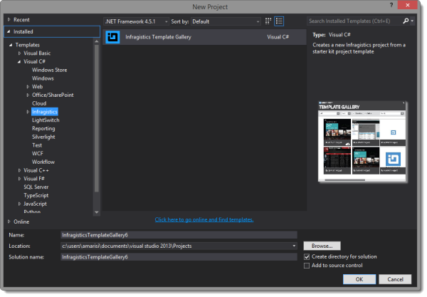

Note: In previous versions of %%ProductName%%, the starter templates were installed with the product installer. They are now accessible through the Infragistics Template Gallery.

### New theme (CTP)

A new theme named iOS 7 has been added. The theme is inspired by Apple’s
iOS 7 design.

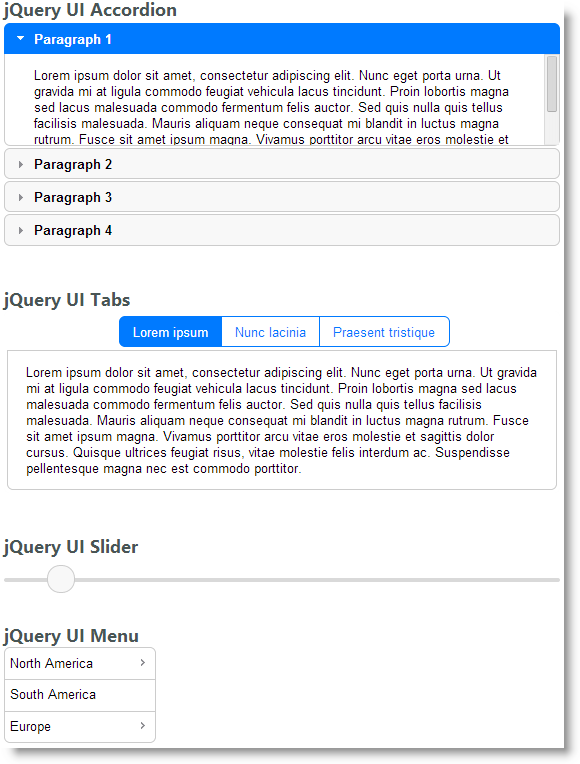

#### Related samples

-   [iOS 7 theme](%%SamplesUrl%%/themes/ios)

## Charts Common Features
### New default style

A new default style has been applied to the chart controls aiming to make the charts look more streamlined. (If necessary, you can revert the chart controls to the previous default style using the `legacy.css` style file.)

Old Default Style

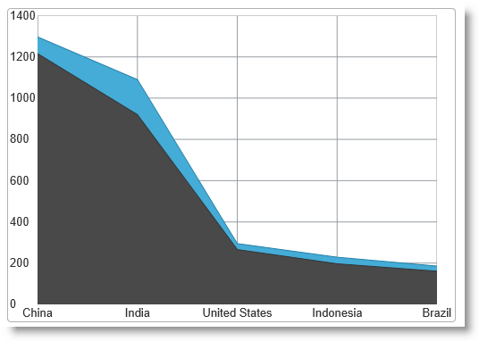

New Default Style

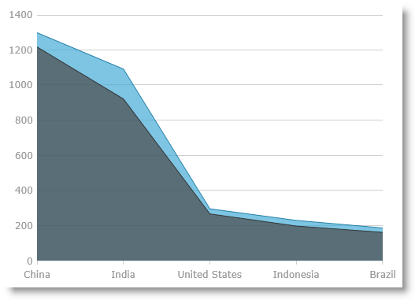

### Supported controls

-   igDataChart
-   igDoughnutChart
-   igFunnelChart
-   igPieChart

#### Related topic

-   [New Default Style](igDataChart-New-Default-Style.html)

## igColorPicker
### New control (CTP)

The `igColorPicker` control allows users to select pre-defined colors or to define their own color palettes.

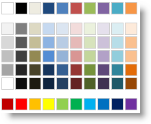

## igGrid
### Column Fixing works with hidden columns

Now you can have both fixed and hidden columns in the grid. (The Column Fixing feature is now integrated with Column Hiding feature.

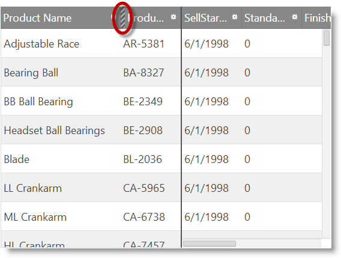

### Feature state persistence

Feature state persistence means persisting states of the grid features
between re-bindings.

### Supported features

-   Filtering
-   GroupBy
-   RowSelectors
-   Selection
-   Sorting

A new property – [persist](%%jQueryApiUrl%%/ui.iggridsorting#options) – has been added to those features. Feature state persistence is enabled by default.

### Related Topics

-   [Selection Overview](igGrid-Selection-Overview.html)
-   [Column Grouping Overview](igGrid-GroupBy-Overview.html)
-   [Filtering](igGrid-Filtering.html)
-   [Sorting Overview](igGrid-Sorting-Overview.html)

#### Related Samples

-   [Feature Persistence](%%SamplesUrl%%/grid/feature-persistence)

### Improved delete row on touch devices

The delete row user experience on touch-enabled devices has improved.

In Cell Edit mode, swiping to the left or to the right displays the Delete Row button.

In Row Edit mode, the Delete Row button is available along with the Cancel and Done buttons.

>**Note:** The Modernizr library is required for this feature to work.

#### Related Samples

-   [Basic Editing](%%SamplesUrl%%/grid/basic-editing)

## igHierarchicalGrid
### Feature state persistence

Feature state persistence means persisting states of the grid features
between re-bindings.

### Supported features

-   Filtering
-   GroupBy
-   RowSelectors
-   Selection
-   Sorting

A new property –
[persist](%%jQueryApiUrl%%/ui.iggridsorting#options)
– has been added to those features. Feature state persistence is enabled
by default.

#### Related Topics

-   [Selection Overview](igGrid-Selection-Overview.html)
-   [Column Grouping Overview](igGrid-GroupBy-Overview.html)
-   [Filtering](igGrid-Filtering.html)
-   [Sorting Overview](igGrid-Sorting-Overview.html)

#### Related Samples

-   [Feature Persistence](%%SamplesUrl%%/grid/feature-persistence)

### Improved delete row on touch devices

The delete row user experience on touch-enabled devices has improved.

In Cell Edit mode, swiping to the left or to the right displays the
Delete Row button.

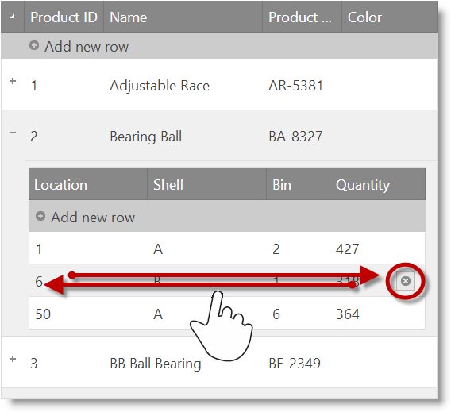

In Row Edit mode, the Delete Row button is available along with the
Cancel and Done buttons.

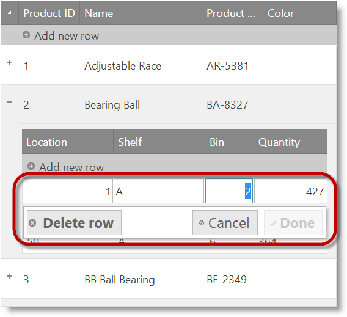

## igHtmlEditor
### New default style

The new default style provides `igHtmlEditor`‘s toolbar and buttons with a new look-and-feel.

Old Default Style

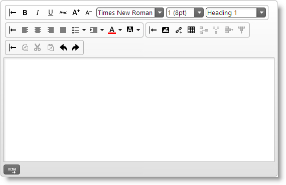

New Default Style

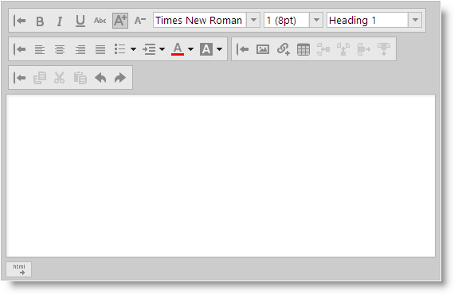

## igPivotGrid, igPivotDataSelector, igOlapXmlaDataSource
### KPIs support

The `igOlapXmlaDataSource` has now built-in support for displaying KPIs defined in a cube. The KPIs supplied by the data source are visualized in the `igPivotDataSelector` and `igPivotGrid`.

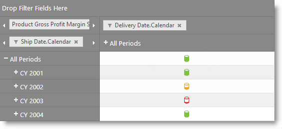

#### Related topics

-   [Key Performance Indicators Support (igPivotGrid, igPivotDataSelector, igOlapXmlaDataSource)](igPivotGrid-KPI-Support.html)

#### Related samples

-   [Binding to Xmla Data Source](%%SamplesUrl%%/pivot-grid/binding-to-xmla-data-source)

### Remote ADOMD.NET data provider support

The `igOlapXmlaDataSource` now supports one more remote configuration
where ADOMD.NET is used for communication with the SSAS server.

#### Related topics

-   [Data Provider Configuration Overview (igOlapXmlaDataSource)](igOlapXmlaDataSource-Data-Provider-Configuration-Overview.html)

#### Related samples

-   [Remote ADOMD.NET Provider](%%SamplesUrl%%/pivot-grid/remote-adomd-provider)

## igPopover
### New control (RTM)

The `igPopover` control, now RTM, adds tooltip-like functionality to DOM elements. `igPopover` is context-sensitive and displays dynamic content, detailed information, overlaid forms, or just about anything that should appear over a given element. The popover area is customizable and can be loaded on demand. You can configure its content, activation, and position.

#### Related topics

-   [igPopover](igPopover-LandingPage.html)

#### Related samples

-   [Basic Usage](%%SamplesUrl%%/popover/basic-popover)

## igRadialMenu
### New control (RTM)

The `igRadialMenu` control is a context menu presenting its items in a circular arrangement around a center button. The circular arrangement of the items speeds up items selection, because each item is equally positioned in relation to the center. The `igRadialMenu` supports different item types for choosing numerical values, color values, or performs actions. Sub-Items are also supported.

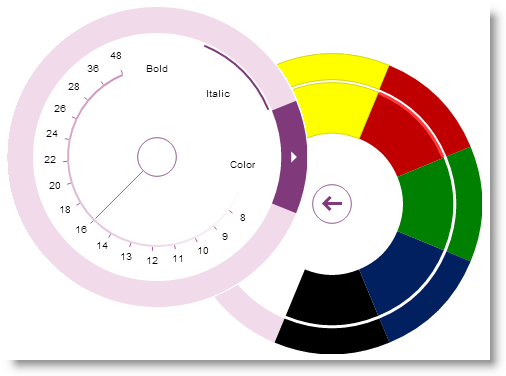

#### Related topics:

-   [igRadialMenu](igRadialMenu.html)

#### Related samples

-   [Button Items](%%SamplesUrl%%/radial-menu/button-items)

## igSplitButton
### New control (CTP)

The `igSplitButton` control is a drop-down button with which the user can select a default value bound to a primary button, or select from a list of values displayed in a drop-down list bound to a secondary button. It is useful when you want to provide a default action/command for a button but also need to supply other, secondary options.

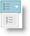

#### Related samples

-   [Split button basics](%%SamplesUrl%%/split-button/change-shapes)

## igToolbar
### New control (CTP)

The `igToolbar` control allows you to create custom toolbars like those in the `igHtmlEditor`.

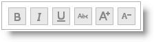

#### Related samples

-   [Standalone Toolbar](%%SamplesUrl%%/html-editor/standalone-toolbar)

## igUpload
### Support for Web Farms / Web Gardens

The `igUpload` control now supports Web Farm / Web Garden Internet Information Services (IIS) configurations. It has an application-wide `CustomDictionaryProvider` option which enables third-party provider for `igUpload`’s data structures. The value for the option is a type name implementing `ISafeDictionary<string, UploadInfo>` interface. Implementing a type allows for storing and reading the common data for the uploaded files from a single source.

 

 

