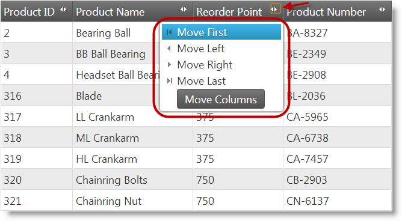

<!--
|metadata|
{
    "fileName": "whats-new-in-2013-volume1",
    "controlName": [],
    "tags": []
}
|metadata|
-->

# What's New in 2013 Volume 1

## Topic Overview
### Purpose

This topic provides an overview of the new features of %%ProductName%%® 2013 Volume 1 release.


## New Features
### New Features summary chart

The following table summarizes the new features for the %%ProductName%%® 2013 Volume 1 release. Additional details are available after the summary table.

<table class="table table-bordered">
	<thead>
		<tr>
            <th>
Control
			</th>

            <th>
Feature
			</th>

            <th>
Description
			</th>
        </tr>
	</thead>
	<tbody>
        

        <tr>
            <td>
igCombo™
			</td>

            <td>
[Knockout Support](igCombo-KnockoutJS-Support.html)
			</td>

            <td>
The support for the Knockout library in the `igCombo` control is intended to provide easy means for developers to use the Knockout library and its declarative syntax to instantiate and configure combo controls.
			</td>
        </tr>

        <tr>
            <td>
igDataChart™
			</td>

            <td>
[New Series](#igdatachart-new-series)
			</td>

            <td>
The `igDataChart` now supports over 40 chart types and has added 17 new chart types this release including point, various spline charts, area charts, and stacked charts.
			</td>
        </tr>

        <tr>
            <td>
igEditors™
			</td>

            <td>
[Knockout Support](#igeditors-knockout-support)
			</td>

            <td>
The support for the Knockout library in %%ProductName%% editor controls is intended to provide easy means for developers to use the Knockout library and its declarative syntax to instantiate and configure %%ProductName%% editors.
			</td>
        </tr>

        <tr>
            <td>
igFunnelChart™
			</td>

            <td>
[New Control](#igfunnelchart)
			</td>

            <td>
The `igFunnelChart`™ is a new funnel chart control that displays data in a funnel shape. It displays sections in a top-down composition each representing the data of slices ranging from largest value to the
                    smallest value.
			</td>
        </tr>

        <tr>
            <td rowspan="5">
igGrid™
			</td>

            <td>
[Column Moving feature is RTM](#iggrid-column-moving)
			</td>

            <td>
Column Moving feature for `igGrid`/`igHierarchicalGrid` is now RTM.
			</td>
        </tr>

        <tr>
            <td>
[Cell Merging is RTM](#cell-merging-rtm)
			</td>

            <td>
Cell Merging feature for `igGrid`/`igHierarchicalGrid` is now RTM.
			</td>
        </tr>

        <tr>
            <td>
[Responsive Web Design Mode](#responsive-web-design)
			</td>

            <td>
`igGrid` Responsive Web Design (RWD) Mode feature helps you in configuring `igGrid` in Responsive Web Design web sites.
			</td>
        </tr>

        <tr>
            <td>
[Column Fixing (CTP)](#column-fixing-ctp)
			</td>

            <td>
The `igGrid` Column Fixing feature allows you to pin the columns on the left or the right of the grid so that they are always visible.
			</td>
        </tr>

        <tr>
            <td>
[Knockout Support is RTM](#knockout-support)
			</td>

            <td>
The support for the Knockout library in %%ProductName%% `igGrid` controls is intended to provide easy means for developers to use the Knockout library and its declarative syntax to instantiate and configure %%ProductName%% grids.
			</td>
        </tr>

        <tr>
            <td rowspan="3">
igHierarchicalGrid™
			</td>

            <td>
[Column Moving feature is RTM](#hierarchicalgrid-column-moving-features-rtm)
			</td>

            <td>
Column Moving feature for `igHierarchicalGrid`™ is now RTM.
			</td>
        </tr>

        <tr>
            <td>
[Cell Merging is RTM](#hierarchicalgrid-cell-merging-rtm)
			</td>

            <td>
Cell Merging feature for `igHierarchicalGrid`™ is now RTM.
			</td>
        </tr>

        <tr>
            <td>
[Knockout Support is RTM](#hierarchicalgrid-knockout-support)
			</td>

            <td>
The support for the Knockout library in %%ProductName%% `igHierarchicalGrid`™ controls is intended to provide easy means for developers to use the Knockout library and its declarative syntax to instantiate and configure
                    %%ProductName%% grids.
			</td>
        </tr>

        <tr>
            <td>
igListView™
			</td>

            <td>
[Collapsible Grouping](#iglist-collapsible-grouping)
			</td>

            <td>
The `igListView`™ mobile list control now supports collapsible groups.
			</td>
        </tr>

        <tr>
            <td>
igOlapFlatDataSource™
			</td>

            <td>
[New Component](#igolapflatdatasource-new-component)
			</td>

            <td>
An OLAP data source component enabling OLAP-like data analysis on flat data collections.
			</td>
        </tr>

        <tr>
            <td>
igOlapXmlaDataSource™
			</td>

            <td>
[New Component](#igolapxmladatasource-new-component)
			</td>

            <td>
An OLAP data source component facilitating communication with an MS SSAS OLAP server.
			</td>
        </tr>

        <tr>
            <td>
igPivotDataSelector™
			</td>

            <td>
[New Control](#igpivotdataselector-new-control)
			</td>

            <td>
`igPivotDataSelector` is an interactive UI control (a jQuery UI widget) that enables users to select data slices, typically, when data is being visualized in an [igPivotGrid](igPivotGrid.html)™.
			</td>
        </tr>

        <tr>
            <td>
igPivotGrid™
			</td>

            <td>
[New Control](#igpivotgrid-new-component)
			</td>

            <td>
The `igPivotGrid` control is a data presentation control for displaying data in a pivot table. It enables users to perform complex analysis on the supplied data.
			</td>
        </tr>

        <tr>
            <td>
igPivotView™
			</td>

            <td>
[New Control](#igpivorview-new-control)
			</td>

            <td>
`igPivotView` is a control that provides all needed tools for manipulating multidimensional (OLAP data) in a pivot grid in one place.
			</td>
        </tr>

        <tr>
            <td>
igSparkline™
			</td>

            <td>
[New Control](#igsparkline-new-control)
			</td>

            <td>
The `igSparkline`™ is a new jQuery UI Sparkline control that has several visual elements and corresponding features through which these elements can be configured and customized.
			</td>
        </tr>

        <tr>
            <td>
igSplitter™
			</td>

            <td>
[New Control](#igsplitter-new-control)
			</td>

            <td>
The `igSplitter`™ is a container control for managing layouts in HTML5 Web applications and sites by dividing the layout into two separate panels.
			</td>
        </tr>

        <tr>
            <td>
igTree™
			</td>

            <td>
[Knockout Support](#igtree-knockout-support)
			</td>

            <td>
The support for the Knockout library in %%ProductName%% editor controls is intended to provide easy means for developers to use the Knockout library and its declarative syntax to instantiate and configure %%ProductName%% editors.
			</td>
        </tr>

        <tr>
            <td rowspan="3">
igUpload™
			</td>

            <td>
[General Improvements](#igupload-general-improvements)
			</td>

            <td>
In HTML 5 enabled browsers `igUpload`™ uses [XMLHttpRequest Level 2](http://www.w3.org/TR/XMLHttpRequest2/) to get the status of the uploading.
			</td>
        </tr>

        <tr>
            <td>
[Saving Files as MemoryStream](#saving-files-as-memorystream)
			</td>

            <td>
igUpload™ allows you to process files as MemoryStream object.
			</td>
        </tr>

        <tr>
            <td>
[Selecting multiple files at once for upload](#selecting-multiple-files)
			</td>

            <td>
`igUpload`™ allows to select multiple files at once either from the browser’s open file dialog or by drag and drop. This feature works for HTML 5 enabled browsers.
			</td>
        </tr>

        <tr>
            <td>
%%ProductName%% ASP.NET MVC Helpers
			</td>

            <td>
[Support for Adding Events](#support-adding-events)
			</td>

            <td>
You can now add client events to the %%ProductName%%® controls’ ASP.NET MVC helpers by using the `AddClientEvent` helper method. Provide an event name and function name to the helper and it renders the required
                    JavaScript on the client to handle the event.
			</td>
        </tr>

        <tr>
            <td>
TypeScript Definition File
			</td>

            <td>
[New Feature (CTP)](#typescript-new-feature)
			</td>

            <td>
TypeScript is a language for adding a typed layer to JavaScript aiding in the development of JavaScript applications. %%ProductName%% now includes a TypeScript definition file, `igniteui.d.ts`, providing type definitions for all controls.
			</td>
        </tr>

        <tr>
            <td>
igDoughnutChart™
			</td>

            <td>
[New Control (CTP)](#igDoughnutchart-new-control)
			</td>

            <td>
The `igDoughnutChart`™ control is similar to the `igPieChart` –proportionally illustrating the occurrences of a variable. The `igDoughnutChart` can display multiple variables in concentric rings, and provides built-in support for visualizing hierarchical data.
			</td>
        </tr>

        <tr>
            <td>
igLayoutManager™
			</td>

            <td>
[New Control (CTP)](#iglayoutmanager-new-control)
			</td>

            <td>
The `igLayoutManager`™ is a layout control for managing general layout in HTML Web applications. The control supports grid, column, flow, border and vertical layouts.
			</td>
        </tr>

        <tr>
            <td>
igTileManager™
			</td>

            <td>
[New Control (CTP)](#igtilemanager-newcontrol)
			</td>

            <td>
The `igTileManager`™ is a layout control for rendering and managing data into tiles. The tiles are displayed in a responsive grid layout.
			</td>
        </tr>

        <tr>
            <td>
igRadialGauge™
			</td>

            <td>
[New Control (CTP)](#igradialgauge-new-control)
			</td>

            <td>
The `igRadialGauge`™ control represents a range of values arranged in a circular fashion. The `igRadialGauge` control usually contains one or more scales that represent a specific range of values. The needles then move along the scale to indicate values.
			</td>
        </tr>
    </tbody>
</table>


## igCombo
### Knockout Support

The support for the Knockout library in the `igCombo` control is intended to provide easy means for developers to use the Knockout library and its declarative syntax to instantiate and configure combo controls.

The Knockout support is implemented as a Knockout extension which is invoked initially when Knockout bindings are applied to a page and during the page life (when external updates to the View-Model take place).

#### Related Topics

[Configuring Knockout Support (igCombo)](igCombo-KnockoutJS-Support.html)


## <a id="igdatachart-new-series"></a>igDataChart
### New Series

The `igDataChart` control now supports over 40 chart types. The following new chart types have been added to the `igDataChart`™ control:

-   Bar and Column Series
-   Stacked Bar
-   Stacked 100 Bar
-   Stacked Column
-   Stacked 100 Column
-   Category Series
-   Point
-   Stacked Area
-   Stacked Line
-   Stacked Spline
-   Stacked Spline Area
-   Stacked 100 Area
-   Stacked 100 Line
-   Stacked 100 Spline
-   Stacked 100 Spline Area
-   Polar Series
-   Polar Spline
-   Polar Spline Area
-   Radial Series
-   Radial Area
-   Scatter Series
-   Scatter Spline

#### Related Samples

-   [Category Series](%%SamplesUrl%%/data-chart/category-series)
-   [Polar Series](%%SamplesUrl%%/data-chart/polar-series)
-   [Radial Series](%%SamplesUrl%%/data-chart/radial-series)
-   [Scatter Series](%%SamplesUrl%%/data-chart/scatter-series)
-   [Stacked Series](%%SamplesUrl%%/data-chart/stacked-series)


## <a id="igeditors-knockout-support"></a>igEditors
### Knockout Support

The support for the Knockout library in %%ProductName%% editor controls is
intended to provide easy means for developers to use the Knockout
library and its declarative syntax to instantiate and configure Ignite
UI editors.

The Knockout support is implemented as a Knockout extension which is invoked initially when Knockout bindings are applied to a page and during the page life when external updates to the View-Model occur the Knockout support is implemented as a Knockout extension which is. You can specify any of the editor control options that have relevance for your business case in the data-bind attribute.

#### Related Topics

[Configuring Knockout Support](Configuring-Knockout-Support-%28Editors%29.html)


## <a id="igfunnelchart"></a>igFunnelChart
### New Control

The `igFunnelChart` is a data-bound control which displays data in sorted amounts to show the relationship between sizes of category data. The chart supports tooltips, Bezier curves, selection, a chart legend, and a full range of visual customization.


#### Related Topics

[igFunnelChart Overview](igFunnelChart-Overview.html)


## igGrid
### <a id="iggrid-column-moving"></a>Column Moving feature is RTM

Column Moving is a feature of the `igGrid`/`igHierarchicalGrid` that enables changing the position of a column in the grid and, in effect, reordering of the grid’s columns. This can be performed either by the user from the grid interface or programmatically through the API of the Column Moving feature. The user can move columns by either dragging them or through selecting the desire column position from a special column moving interface (invoked with a button in the column header). Dragging is not supported on touch-enabled devices.



#### Related Topics

[Column Moving Overview (igGrid)](igGrid-ColumnMoving-Overview.html)

### <a id="cell-merging-rtm"></a>Cell Merging is RTM

Cell Merging is a feature of `igGrid`/`igHierarchicalGrid` which allows users to merge the cells in the column visually when they have the same value (display text).


#### Related Topics

[**Cell Merging Overview (igGrid)**](igGrid-CellMerging-Overview.html)

### <a id="responsive-web-design"></a>Responsive Web Design Mode

The Responsive Web Design (RWD) Mode feature of the `igGrid` control adopts the concepts of [Responsive Web Design](http://alistapart.com/article/responsive-web-design) in order to improve the user experience on different devices. Responsive Web Design mode allows you to support multiple screen sizes and form factors with a single code base and design.

In RWD mode, the grid’s adaptation to the devices’ screen can be configured to be either:

-   Auto-hiding of columns

This is configured through the RWD mode feature’s column hiding functionality.

-   Any structural and formatting change that can be implemented through a grid template

To this end, the RWD Mode feature supports a set of pre-defined grid templates which replace the `igGrid` template once the RWD mode feature is enabled. Using templates allows for a wide scope of adaptations, including row hiding, using different fonts and font sizes, merging several rows/columns in one row/column, and many others.

#### Related Topics

[**Responsive Web Design (RWD) Mode Overview (igGrid)**](igGrid-Responsive-Web-Design-Mode-Overview.html)

### <a id="knockout-support"></a>Knockout Support is RTM

The support for the Knockout library in %%ProductName%% `igGrid` controls is
intended to provide easy means for developers to use the Knockout
library and its declarative syntax to instantiate and configure Ignite
UI grids.

The Knockout support is implemented as a Knockout extension which is invoked initially when Knockout bindings are applied to a page and during the page life when external updates to the View-Model happen. You can specify any of the editor control options that have relevance for your business case in the data-bind attribute.

#### Related

[**Grid Knockoutjs Integration**](igGrid-Configuring-Knockout-Support.html)

### <a id="column-fixing-ctp"></a>Column Fixing (CTP)

The `igGrid`™ Column Fixing feature allows you to pin the columns on the left or the right of the grid so that they are always visible.


#### Related Samples

[**Column Fixing (igGrid)**](%%SamplesUrl%%/grid/column-fixing)


## igHierarchicalGrid
### <a id="hierarchicalgrid-column-moving-features-rtm"></a>Column Moving feature is RTM

Column Moving is a feature of the `igHierarchicalGrid` that enables changing the position of a column in the grid and, in effect, reordering of the grid’s columns. This can be performed either by the user from the grid interface or programmatically through the API of the Column Moving feature. The user can move columns by either dragging them or through selecting the desire column position from a special column moving interface (invoked with a button in the column header). Dragging is not supported on touch-enabled devices.


#### Related Topics

[Column Moving Overview (igGrid)](igGrid-ColumnMoving-Overview.html)

### <a id="hierarchicalgrid-cell-merging-rtm"></a>Cell Merging is RTM

Cell Merging is a feature of `igHierarchicalGrid` which allows users to merge the cells in the column visually when they have the same value (display text).


#### Related Topics

[Cell Merging Overview (igGrid)](igGrid-CellMerging-Overview.html)

### Column Fixing (CTP)

The `igGrid`™ Column Fixing feature allows you to pin the columns on the
left or the right of the grid so that they are always visible.


#### Related Samples

[**Column Fixing (igGrid)**](%%SamplesUrl%%/grid/column-fixing)

### <a id="hierarchicalgrid-knockout-support"></a>Knockout Support is RTM

The support for the Knockout library in %%ProductName%% `igHierarchicalGrid` controls is intended to provide easy means for developers to use the Knockout library and its declarative syntax to instantiate and configure %%ProductName%% grids.

The Knockout support is implemented as a Knockout extension which is
invoked initially when Knockout bindings are applied to a page and
during the page life when external updates to the View-Model happen. You
can specify any of the editor control options that have relevance for
your business case in the data-bind attribute.

#### Related Samples

[**Hierarchical Grid Knockoutjs Integration**](%%SamplesUrl%%/hierarchical-grid/bind-hgrid-with-ko)


## igListView
### <a id="iglist-collapsible-grouping"></a>Collapsible Grouping

The `igListView` adds collapsible grouping to the default grouping functionality in this release. Users now can expand and collapse groups to view the sections of the data that are important to them.


#### Related Samples

[Custom Groups](%%SamplesUrl%%/mobile-list-view/custom-groups)


## <a id="igolapflatdatasource-new-component"></a>igOlapFlatDataSource
### New Component

The `igOlapFlatDataSource` component enables multi-dimensional (OLAP-like) analysis to be performed on flat data collections. Given a data collection or an [igDataSource](igDataSource-igDataSource.html)™ instance and based on the user configuration, `igOlapFlatDataSource` extracts the necessary metadata in order to create dimensions of hierarchies and measures.

#### Related Topics

[igOlapFlatDataSource Overview](igOlapFlatDataSource-Overview.html)


## <a id="igolapxmladatasource-new-component"></a>igOlapXmlaDataSource
### New Component

The `igOlapXmlaDataSource` component handles the communication between a JavaScript client application and a Microsoft® SQL Server Analysis Services (SSAS) server configured with the `msmdpump.dll` HTTP data provider. It exposes a user-friendly way for obtaining data from Microsoft SQL Server Analysis Services (MS SASS)

#### Related Topics

[igOlapXmlaDataSource Overview](igOlapXmlaDataSource-Overview.html)


## <a id="igpivotdataselector-new-control"></a>igPivotDataSelector
### New Control

`igPivotDataSelector` is an interactive UI control (a jQuery UI widget) that enables users to select data slices, typically, when data is being visualized in an [igPivotGrid](igPivotGrid.html)™.


#### Related Topics

[igPivotDataSelector Overview](igPivotDataSelector-Overview.html)


## <a id="igpivotgrid-new-component"></a>igPivotGrid
### New Control

The `igPivotGrid` control is a data presentation control for displaying data in a [pivot table](http://en.wikipedia.org/wiki/Pivot_table). It enables users to perform complex analysis on the supplied data. The `igPivotGrid` uses the Online Analytical Processing (OLAP) approach to present the results of multi-dimensional queries in an easy to comprehend manner. The `igPivotGrid` control uses an instance of either `igOlapFlatDataSource`™ or `igOlapXmlaDataSource`™ component as data source.


#### Related Topics

[igPivotGrid Overview](igPivotGrid-Overview.html)


## <a id="igpivorview-new-control"></a>igPivotView
### New Control

`igPivotView` is a two-panel control that combines a pivot grid and a data selector separated with a splitter. It is a construction of three individual components – [igPivotGrid](igPivotGrid.html)™, [igPivotDataSelector](igPivotDataSelector.html)™, and [igSplitter](igSplitter.html)™ – assembled together to provide in one place all needed tools for manipulating multidimensional (OLAP data) in a pivot grid.


#### Related Topics

[igPivotView Overview](igPivotView-Overview.html)


## <a id="igsparkline-new-control"></a>igSparkline
### New Control

The `igSparkline` is a new data-bound control used to embed data visualizations in line with text or tabular data. The control supports several different chart types, tooltips, normal range visualizations, markers, trend lines, and a full range of visual customization.


#### Related Topics

[igSparkline Overview](igSparkline-Overview.html)


## <a id="igsplitter-new-control"></a>igSplitter
### New Control

The `igSplitter` is a container control for managing layouts in HTML5 Web applications and sites by dividing the layout into two separate panels. The panels can be resized, collapsed or expanded.


#### Related Topics

[igSplitter Overview](igSplitter-Overview.html)


## <a id="igtree-knockout-support"></a>igTree
### Knockout Support

The support for the Knockout library in %%ProductName%% editor controls is
intended to provide easy means for developers to use the Knockout
library and its declarative syntax to instantiate and configure Ignite
UI editors.

The Knockout support is implemented as a Knockout extension which is
invoked initially when Knockout bindings are applied to a page and
during the page life when external updates to the View-Model happen. You
can specify any of the editor control options that have relevance for
your business case in the data-bind attribute.

#### Related Topics

[Configuring Knockout Support (igTree)](igTree-KnockoutJS-Support.html)


## <a id="igupload-general-improvements"></a>igUpload
### General Improvements

`igUpload` uses [XMLHttpRequest Level 2](http://www.w3.org/TR/XMLHttpRequest2/) to get the status of the uploading file on browsers which implement this specification. HTTP Handler is not used in this case.

### <a id="saving-files-as-memorystream"></a>Saving Files as MemoryStream

A new application wide option `FileSaveType` is added for the `igUpload` MVC Wrapper. This option accepts 2 values: filestream and memorystream. By default, the option is set to filestream. This mode enables the functionality available so far in the `igUpload` MVC Wrapper.

The new memorystream option enables saving a file as memory stream functionality. In this mode, you can process the uploaded files as `MemoryStream` objects by handling the `FileUploading` event.

#### Related Topics

[Saving Files as Stream (igUpload)](igUpload-Saving-Files-as-Stream.html)

### <a id="selecting-multiple-files"></a>Selecting multiple files at once for upload

You can configure whether users, when selecting the files to upload, will be able to select multiple files or only one file at a time. This functionality is managed by the file selection mode of `igUpload`. The file selection mode can be either Single File (users can select only one file at one pass) or Multiple Files (users can select multiple files at one pass).

Multiple files selection leverages the [HTML 5 multiple attribute](http://www.w3.org/TR/html-markup/input.file.html#input.file.attrs.multiple) of the input element.

User can add multiple files to `igUpload` in two ways:

-   From an “Open file” dialog
-   By drag-and-drop on the `igUpload` control

The functionality is available only in the browsers which support multiple attribute of the input element.


#### Related Topics

[Configuring igUpload](igUpload-Configuring-igUpload.html)


## %%ProductName%% ASP.NET MVC Helpers
### <a id="support-adding-events"></a>Support for Adding Events

You can now add events to %%ProductName%% controls by adding them to the ASP.NET MVC helper. Use the `AddClientEvent` method to supply the event name and a handler function name. The helper will render to the appropriate instantiation JavaScript on the client to fire the event.

**In ASPX:**

```csharp
<%= Html.Infragistics().Combo()
    .DataSource(Model)
    .TextKey("DisplayText")
    .ValueKey("Value")
    .AddClientEvent("selectionChanged", "comboSelectionChanged")
    .Render()
%>
```

Note: `igUpload`, `igGrid`/`igHierarchicalGrid` and their features will get this functionality in the first service release for 13.1.


## <a id="typescript-new-feature"></a>TypeScript Definition File
### New Feature (CTP)

TypeScript is a language for adding a typed layer to JavaScript aiding
in the development of JavaScript applications. %%ProductName%% now includes a
TypeScript definition file, `igniteui.d.ts`, providing type definitions
for all controls.

You can find the definition file in the %%ProductName%% installation directory under `{Installation Directory}typingsigniteui.t.ds.` Refer to the following articles for additional information.

### Related Articles

-   [Download TypeScript](http://www.typescriptlang.org/#Download)
-   [Introducing TypeScript Support for %%ProductName%%](http://www.infragistics.com/community/blogs/angel_todorov/archive/2012/10/27/introducing-typescript-support-for-ignite-ui.aspx)
-   [TypeScript Tutorial](http://www.typescriptlang.org/Tutorial/)
-   [TypeScript: Add Productivity and Manageability to your JavaScript Apps – Part 2](http://msdn.microsoft.com/en-us/magazine/jj983351.aspx)


## <a id="igDoughnutchart-new-control"></a>igDoughnutChart
### New Control (CTP)

Released as CTP in this version, the `igDoughnutChart` displays data similar to a pie chart and can display multiple sets of data around a common center.


#### Related Samples

-   [Bind to JSON](%%SamplesUrl%%/doughnut-chart/bind-json)
-   [Bind to Collection](%%SamplesUrl%%/doughnut-chart/bind-to-collection)


## <a id="iglayoutmanager-new-control"></a>igLayoutManager
### New Control (CTP)

The `igLayoutManager` is a layout control for managing general layout in HTML Web applications. The control supports grid, column, flow, border and vertical layouts. The control will position containers in the corresponding application according to the desired layout.


#### Related Samples

-   [Border Layout from HTML Markup](%%SamplesUrl%%/layout-manager/border-layout-markup)
-   [Responsive Column Layout](%%SamplesUrl%%/layout-manager/column-layout-markup)
-   [Responsive Flow Layout](%%SamplesUrl%%/layout-manager/flow-layout)
-   [Responsive Vertical Layout](%%SamplesUrl%%/layout-manager/vertical-layout)
-   [Grid Layout with Column Spans and Row Spans](%%SamplesUrl%%/layout-manager/grid-layout)


## <a id="igtilemanager-newcontrol"></a>igTileManager
### New Control (CTP)

The `igTileManager` is a layout control for rendering and managing data into tiles. The tiles are displayed in a responsive grid layout, and the control provides corresponding layout configurations for each tile in terms to position (row and column spans) and dimensions (row and column position).


#### Related Samples

-   [Binding to JSON](%%SamplesUrl%%/tile-manager/bind-json)
-   [ASP.NET MVC Basic Usage](%%SamplesUrl%%/tile-manager/aspnet-mvc-helper)
-   [Item Configurations](%%SamplesUrl%%/tile-manager/item-configurations)


## <a id="igradialgauge-new-control"></a>igRadialGauge
### New Control (CTP)

The `igRadialGauge`, released as CTP, is a gauge control to show numerical values along a scale. It has a wide range of visual customization and supports a motion framework to dynamically change the control’s rendering with fluid animations.


#### Related Samples

-   [MVC Initialization](%%SamplesUrl%%/radial-gauge/mvc-initialization)
-   [Gauge Animation](%%SamplesUrl%%/radial-gauge/motion-framework)


##Related Content

###Topics

The following topics provide additional information related to this topic.

- [Configuring Knockout Support (igCombo)](igCombo-KnockoutJS-Support.html): This topic explains how to configure the `igCombo`™ control to bind it to View-Model objects managed by the Knockout library.

- [Configuring Knockout Support (igEditors)](Configuring-Knockout-Support-%28Editors%29.html): This topic explains how to configure %%ProductName%%® editor controls to bind to View-Model objects using the Knockout library.

- [igFunnelChart Overview](igFunnelChart-Overview.html): This topic provides conceptual information about the `igFunnelChart`™ control including its main features, minimum requirements, and user functionality.

- [Column Moving Overview (igGrid)](igGrid-ColumnMoving-Overview.html): This topic explains conceptually the Column Moving feature of the `igGrid`™ and the functionalities this feature provides.

- [Cell Merging Overview (igGrid)](igGrid-CellMerging-Overview.html): This topic explains the `igGrid`™ control’s Cells Merging feature and its functionality. It contains code examples demonstrating how to enable and configure cell merging in the `igGrid`.

- [Responsive Web Design (RWD) Mode Overview (igGrid)](igGrid-Responsive-Web-Design-Mode-Overview.html): This topic explains conceptually the Responsive Web Design (RWD) Mode feature of the `igGrid`™ control and the functionalities this feature provides.

- [igOlapFlatDataSource Overview](igOlapFlatDataSource-Overview.html): This topic provides an overview of the `igFlatDataSource`™ component and its main features.

- [igOlapXmlaDataSource Overview](igOlapXmlaDataSource-Overview.html): This topic provides an overview of the `igXmlaDataSource`™ component and its main features.

- [igPivotDataSelector Overview](igPivotDataSelector-Overview.html): This topic provides conceptual information about the `igPivotDataSelector`™ control including its main features, minimum requirements, and user functionality.

- [igPivotGrid Overview](igPivotGrid-Overview.html): This topic provides conceptual information about the `igPivotGrid`™ control including its main features, minimum requirements, and user functionality.

- [igPivotView Overview](igPivotView-Overview.html): This topic provides conceptual information about the `igPivotView`™ control including its main features, minimum requirements, and user functionality.

- [igSparkline Overview](igSparkline-Overview.html): This topic provides an overview of the `igSparkline`™ control, its benefits, and the supported chart types.

- [igSplitter Overview](igSplitter-Overview.html): This topic provides conceptual information about the `igSplitter`™ control including its features and user functionality.

- [Configuring Knockout Support (igTree)](igTree-KnockoutJS-Support.html): This topic explains how to configure the `igTree`™ control to bind to View-Model objects managed by the Knockout library.

- [Saving Files as Stream (igUpload)](igUpload-Saving-Files-as-Stream.html): This topic explains how to process and save upload files as either file or memory streams. A detailed procedure is provided on saving files as memory stream by individual processing of each uploaded file chunk.

- [Configuring igUpload](igUpload-Configuring-igUpload.html): This topic explains, with code examples, how to configure the `igUpload`™ control.


 

 


