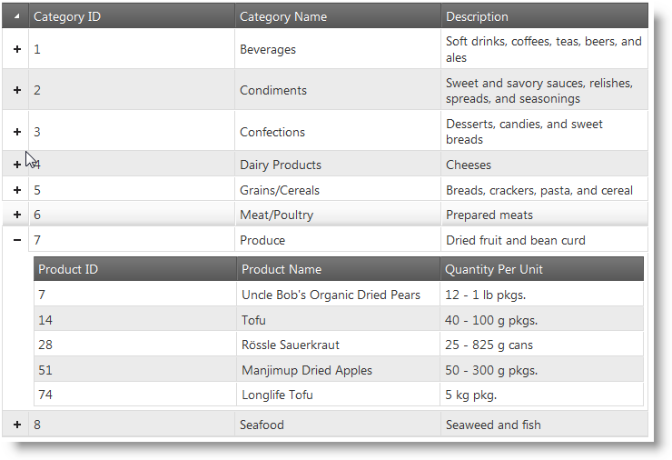
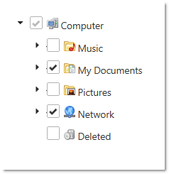
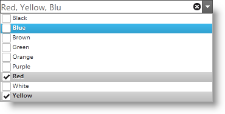
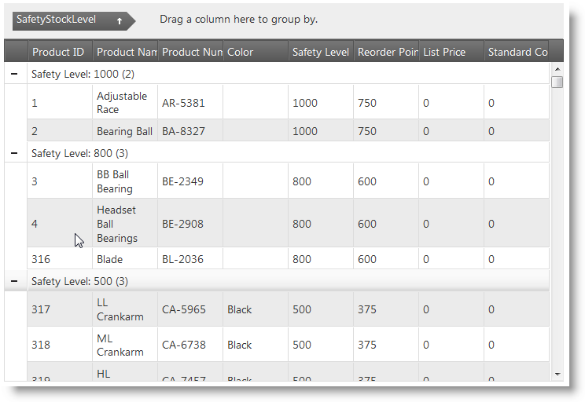
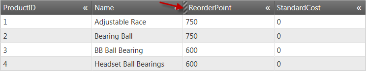
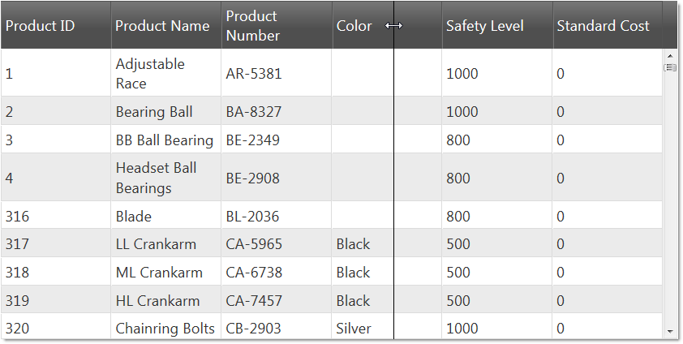
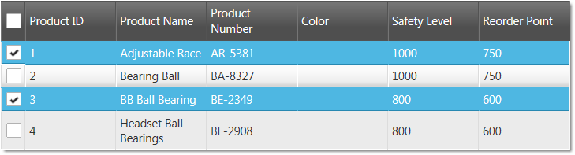
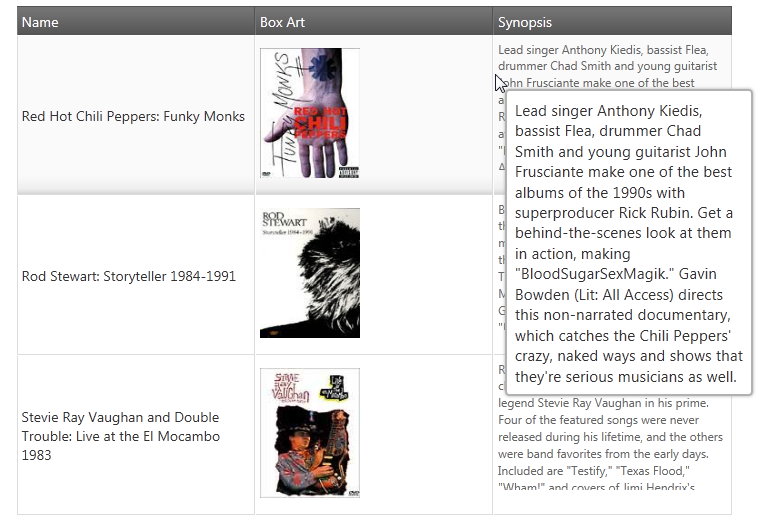
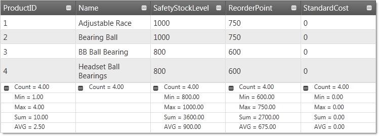

<!--
|metadata|
{
    "fileName": "whats-new-in-2011-volume2",
    "controlName": [],
    "tags": []
}
|metadata|
-->

# What's New in 2011 Volume 2

## Topic Overview
This topic provides an overview of the new functionalities and components introduced with the Ignite UI™ 2011 Volume 2.

### In this topic
This document contains the following sections:

-   [New Functionalities and Components](#new-functionalities)
-   [igHierarchicalGrid (New Control)](#ighierarchicalgrid)
-   [igTree (New Control)](#igtree)
-   [igComboBox (New Control)](#igcombobox)
-   igGrid (New Features)
    -   [igGrid - Updating](#updating)
    -   [igGrid - Outlook GroupBy](#groupby)
    -   [igGrid - Column Hiding](#column-hiding)
    -   [igGrid - Column Resizing](#column-resizing)
    -   [igGrid - Row Selectors](#row-selectors)
    -   [igGrid - Tooltips](#tooltips)
    -   [igGrid - Column Summaries](#column-summaries)
    -   [igGrid Model Metadata enhancement](#metadata)

 

##<a id="new-functionalities"></a> New Functionalities and Components 
###<a id="ighierarchicalgrid"></a> igHierarchicalGrid™ 
The `igHierarchicalGrid` control is a new grid control used to render hierarchical data and internally uses the flat `igGrid`™ control. As you expand a grid row, an instance if the `igGrid` is created for the child layout. In order to optimize performance, the `igHierarchicalGrid` control never creates instances of child grids before a row is expanded. To learn more about how to configure the `igHierarchicalGrid` control, read the Getting Started with `igHierarchicalGrid` topic.



#### Related Topics
[Initializing the igHierarchicalGrid](igHierarchicalGrid-Initializing.html)

### <a id="igtree"></a>igTree™ 
The Ignite UI 2011 Volume 2 release now features a tree control. The `igTree` control comes equipped with a number of valuable features. The control supports load-on-demand to enable an optimized performance profile. Multiple selection scenarios are supported including bi-state and tri-state selection. The Selection feature is driven by a configurable set of selection options including checkboxes, keyboard input and individual selection. Node images are customizable and you have the option of configuring image through CSS, directly through bindings or by providing explicit URL paths to an image. The control may be created and managed through a pure JavaScript context or via the ASP.NET MVC helper.



#### Related Topics
[Getting Started with igTree](igTree-Getting-Started.html)

###<a id="igcombobox"></a> igCombo™ 
The Ignite UI 2011 Volume 2 release now features a combo control. The `igCombo` control comes equipped with a number of valuable features. User interface virtualization support includes the ability of the control to only create HTML elements for data items that are within the viewable area of the control. As additional data is required beyond what is visible, the control reuses existing HTML elements and keeps the scrollbar position in sync with the relative data position. The auto-complete feature allows users to begin typing in the combo box and matching selections begin to appear within the entry box to allow for easy selection. The auto-suggest feature allows users to begin typing in the entry box and the control will return a list of possible matches based on the entered text for selection. The selection features allow users to select single or multiple items via checkboxes, keyboard input or standard click-selection.



#### Related Topics
[Getting Started with igCombo](igCombo-Getting-Started.html)

###<a id="updating"></a> igGrid™ – Updating 
The `igGrid` control Updating feature includes three separate behaviors: editing, adding new row, deleting row. Editing is available for whole rows or individual cells. If row editing is enabled, then all cells in a row enter edit mode. To discard changes to grid data, the cancel-key ends edit mode and the grid is not updated. If edit mode is ended by the Enter key, then grid is updated and next row (or cell) enters edit mode. If editing mode is “cell”, then the edit mode can be ended by the Tab key. When the Tab key is used to end editing, the cell on the right enters edit mode. If the previously edited cell is last in the row, then first cell in next row enters edit mode.

#### Related Topics
[igGrid Updating](igGrid-Updating.html)

### <a id="groupby"></a>igGrid - Outlook GroupBy 
The `igGrid` Group By feature allows you to group a series of columns. The grid allows you do drag and drop a column to group by into the “group by” area of the grid. When the column is dropped into the group area, the grid is rearranged with as many row groups as there are distinct values in the grouped column. You can have multiple groups, where nested groups appear under the primary group. You can also customize the grouping feature by defining a custom grouping method. To learn more about grouping read the topic Grid Group By Getting Started.



#### Related Topics
[Enabling igGrid Outlook GroupBy](igGrid-Enabling-GroupBy.html)

### <a id="column-hiding"></a>igGrid Column Hiding 
The Ignite UI 2011 Volume 2 release now includes `igGrid` control column hiding. With this feature, you can hide columns from users before and after the grid is rendered. Further, columns can be hidden either programmatically or using UI elements in the column header. The image below depicts an `igGrid` control with a hidden column. The red arrow is pointing to the hidden column indicator:



#### Related Topics
[Enabling Column Hiding](igGrid-Column-Hiding-Enabling-Column-Hiding.html)

### <a id="column-resizing"></a>igGrid Column Resizing 
The Ignite UI 2011 Volume 2 release now includes `igGrid` column resizing. The column resizing feature enables users to change the width of the columns in the grid. The effect of the resizing action can be applied to the grid either after the resize action has finished or simultaneously as it happens. The column resizing functionality has several features that are available for configuration in code including the levels at which resizing is allows– for the entire grid and for individual columns. The image below depicts a grid where the Color column is being resized by the user.



#### Related Topics
[igGrid Column Resizing](igGrid-Column-Resizing.html)

### <a id="row-selectors"></a>igGrid Row Selectors 
The Ignite UI 2011 Volume 2 release now includes `igGrid` row selectors. The row selectors feature exposes options to enable checkboxes, row numbering and combine with the multiple selection feature of `igGrid` control (see the image below):



#### Related Topics
[Enabling Row Selectors](igGrid-Enabling-Row-Selectors.html)

### <a id="tooltips"></a>igGrid Tooltips 
The Ignite UI 2011 Volume 2 release now includes `igGrid` tooltips. This feature enables tooltips to appear over grid cells. The purpose of the tooltips is to make the whole cell content visible and enable users to select and copy the text that is inside the tooltip container.



#### Related Topics
[Enabling igGrid Tooltips](igGrid-Enabling-Tooltips.html)

### <a id="column-summaries"></a>igGrid Column Summaries 
The Ignite UI 2011 Volume 2 release now includes `igGrid` column summaries. The column summaries feature exposes the option to calculate summaries based on column data. The grid includes a number of default summary functions, as well as giving you the ability to define custom functions to calculate the summaries. Further, options exist which allow you to choose whether summaries are calculated remotely or local. The following image depicts a grid with summaries enabled.



#### Related Topics
[Enabling Column Summaries](igGrid-Enabling--Column-Summaries.html)

### <a id="metadata"></a>igGrid Model Metadata enhancement 
The Ignite UI 2011 Volume 2 release now includes the ability of the `igGrid` MVC helper to recognize the `DisplayName` attribute. Use of the `DisplayName` attribute allows the MVC helper to automatically use this attribute as `headerText` for a specified column. Keep in mind that if `headerText` is set explicitly in the grid, the value from the `DisplayName` is overwritten. The following example shows simple model and `igGrid` which automatically binds the `headerText` to the `DisplayName` attribute value.

 

**MVC Model:**

```csharp
class Customer
    {
        [DisplayName("First Name")]
        public string FirstName { get; set; }
        [DisplayName("Family Name")]
        public string FamilyName { get; set; }
    }
```

 

**MVC ASPX View:**

```csharp
<%= Html.Infragistics().Grid(Model).ID("grid").Columns(column => {
         column.For(c => c.FirstName);
         column.For(c => c.FamilyName);
         })
     %>
```

 

 


