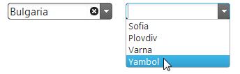
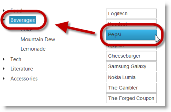
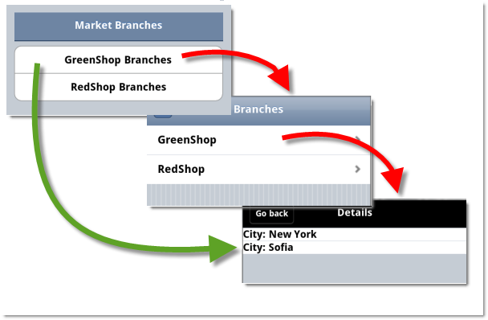
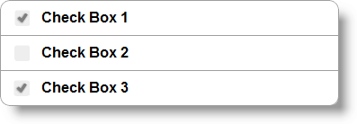
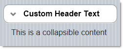
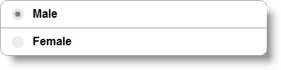

<!--
|metadata|
{
    "fileName": "whats-new-in-2012-volume2",
    "controlName": [],
    "tags": []
}
|metadata|
-->

# What's New in 2012 Volume 2

## New Features
### Features overview

The following table summarizes the new features for the %%ProductName%%™ 2012 Volume 2 release. Additional details are available after the summary table.

- [igHtmlEditor control](#ightmleditor-control): The new `igHtmlEditor`™ is a jQuery WYSIWYG control and provides HTML editing capabilities in the web browser.

- [igDialog control](#igdialog-control):  The Infragistics® `igDialog`™ is a widget based on jQuery UI that provides a robust dialog layout for your application.

- [Cascading igCombo](#cascading-igcombo): The cascading functionality of the `igCombo`™ control requires configuring at least two instances of the control bound together in parent-child relationships. When a value from the parent `igCombo` is selected, then the values in the child are filtered.

- [Adding and Removing Nodes from igTree](#add-remove-nodes-igtree): The Adding and Removing features of the `igTree`™ control enables users to add and remove tree nodes.

- [Drag-and-Drop for igTree](#drag-drop-tree): The Drag-and-Drop feature of the `igTree` control enables users to drag-and-drop tree nodes. Dragging and dropping can be performed within the same tree or between two different trees.

- [Multi-Column Headers](#multi-column-headers): Multi-Column Headers feature is available for the `igGrid` and `igHierarchicalGrid`™.

- [REST Support](#rest-support): Binding to REST Services is available for the `igGrid` and `igHierarchicalGrid`

- [Column moving (CTP)](#column-moving-ctp): Column moving allows you to reorder columns.

- [DataTable and DataSet binding for igGrid and igHierarchicalGrid](#datatable-dataset-binding): Binding to a DataTable or DataSet is available for the `igGrid` and `igHierarchicalGrid`

- [Unbound columns](#unbound-columns): The unbound column provides a way to define a column in the `igGrid` and `igHierarchicalGrid` which is not bound to a data source and can be used for rendering calculated or otherwise custom values

- [Row Edit Template](#row-edit-template): Starting with version 12.2, the updating feature of the `igGrid` provides Row Edit Template and allows the user to edit records in a pop up dialog, as compared to inline editing.

- [Grouping Dates](#grouping-dates): The grid’s grouping feature now supports richer functionality when grouping date values.

- [ExcelNavigationMode & HorizontalMoveOnEnter](#excel-navigation-mode): In the `igGrid` and `igHierarchicalGrid` `updating` feature provides two new properties. `ExcelNavigationMode` allows you to position the cursor inside the edited cell using the arrows keys. `HorizontalMoveOnEnter` enables moving to the next cell when pressing the Enter key while editing a cell.

- [igMap Control is RTM](#igmap-rtm): The `igMap`™ control is released for displaying geographic maps.

- [Financial indicators added to the igDataChart control](#financial-indicators): The `igDataChart`™ control now supports 35 new financial series for displaying different financial indicators about stock prices.

- [Hover and Null Support for igRating (Mobile)](#hover-null-support-igrating): It’s possible to set the value of the `igRating`™ Mobile control to null, if the control has been rated previously. When you use the `igRating`™ Mobile control in a Desktop Browser, the rating displays a mouse hover style.

- [Generating Direct Links to Child Layouts in igListView](#generating-direct-links): The `igListView`™ control contains new functionality allowing you to generate static links for its child layouts

- [Mobile Button](#mobile-button): The Button ASP.NET MVC helper is a server-side helper that renders the widget.

- [Mobile CheckBox](#mobile-checkbox): The CheckBox ASP.NET MVC helper is a server-side helper that renders the widget.

- [Mobile CheckBoxGroup](#mobile-checkbox-group): The CheckBoxGroup ASP.NET MVC helper allows you to combine several individual check boxes under one context.

- [Mobile Collapsible](#mobile-collapsible): The Collapsible ASP.NET MVC helper produces a collapsible block of content.

- [Mobile CollapsibleSet](#mobile-collapse-set): The Collapsible Set ASP.NET MVC helper produces a collapsible block of content which consist of collapsible controls inside.

- [Mobile Link](#mobile-link): The Link ASP.NET MVC helper is used to render a HTML reference. It has several additional methods for customizing the Link.

- [Mobile NavBar](#mobile-navbar): The NavBar ASP.NET MVC helper defines a menu of items that reference external pages or internal page blocks.

- [Mobile Page, PageContent, PageFooter, PageHeader](#mobile-page): The ASP.NET MVC helpers allow you to create jQuery Mobile pages using Razor or ASPX syntax.

- [Mobile Popup](#mobile-popup): Popup is a widget that allows you to display HTML content in a popup window.

- [Mobile RadioButtonGroup](#mobile-radio-button): The RadioButtonGroup ASP.NET MVC helper renders a set of options but only allows you to select one of them.

- [Mobile SelectMenu](#mobile-select-menu): The SelectMenu ASP.NET MVC helper produces a jQuery Mobile selectmenu widget based on a native select element.

- [Mobile Slider](#mobile-slider): The Slider ASP.NET MVC helper is used to render a jQuery Mobile slider widget in an ASP.NET view.

- [Mobile TextBox](#mobile-textbox): The TextBox ASP.NET MVC helper renders standard HTML inputs.

- [Mobile ToggleSwitch](#mobile-toggle-switch): The Toggle Switch ASP.NET MVC helper produces a binary “flip switch” that is used for on/off or true/false data input.


## <a id="ightmleditor-control"></a>igHtmlEditor control

The `igHtmlEditor` control is a jQuery HTML editor control that features standard HTML editing capabilities. Formatting options include font face, font size, text and image alignment and link and table support. Further information regarding the classes, options, events, methods and themes of this API are available under the associated tabs above.


###Related Topics:

-   [igHtmlEditor Overview](igHtmlEditor-Overview.html)

## <a id="igdialog-control"></a>igDialog control

Infragistics `igDialog` is a widget based on jQuery UI that provides the ability to show target elements as the content of a dialog. The content of the `igDialog` can be any valid HTML code as well as other dialog windows. The `igDialog` widget is applied on a HTML DIV or IFRAME element and the content that is inside that DIV/IFRAME will be the content of the dialog window.

**In HTML:**

```html
<div id="dialog">
    igDialog Content
</div>
```


### Related Topics:

-   [igDialog Overview](igDialog-Overview.html)

## <a id="cascading-igcombo"></a>Cascading igCombo

The cascading functionality of the `igCombo` control requires configuring at least two instances of the control bound together in parent-child relationships. When a value from the parent `igCombo` is selected, then the values in the child are filtered. This is functionality that the `igCombo` delivers “out of the box”: all you need is to configure parent and child `igCombos` and their data sources.



## <a id="add-remove-nodes-igtree"></a>Adding and Removing Nodes from igTree

The Adding and Removing feature of `igTree` control enables users to add and remove tree nodes.




### Related Topics:

-   [Adding and Removing Nodes Overview and Examples (igTree)](igTree-Adding-Removing-Nodes-Overview-Examples.html)

## <a id="drag-drop-tree"></a>Drag-and-Drop for igTree

Dragg-and-drop can be performed within the same `igTree` control or between two `igTree` controls. The latter is configured in addition to the “normal” (within the same tree) drag-and-drop. You can specify the way in which you want the Drag-and-Drop feature to operate. This is managed by configuring one of the several supported [Drag-and-Drop modes](igTree-Drag-and-Drop-Overview.html#drag-drop-modes).


### Related Topics:

-   [Drag-and-Drop Overview (igTree)](igTree-Drag-and-Drop-Overview.html)

## <a id="multi-column-headers"></a>Multi-Column Headers

The `igGrid` and `igHierarchicalGrid` now feature multi-column headers. The multi-column headers feature provides header grouping and it’s well integrated with Hiding, Resizing and Column Moving features.


### Related Topics:

[Multi-Column Headers (igGrid)](igGrid-MultiColumnHeaders-LandingPage.html)

[Multi-Column Headers (igHierarchicalGrid)](igHierarchicalGrid-MultiColumnHeaders-Configuring.html)

## <a id="rest-support"></a>REST Support

The new type `$.ig.RESTDataSource` which inherits from `$.ig.DataSource` provides REST support. The `igGrid` and `igHierarchicalGrid` support REST binding using the `$.ig.RESTDataSource` internally. They inherit all `$.ig.RESTDataSource` options, meaning these options can be set directly on the grid.


### Related Topics:

[REST Updating (igGrid)](igGrid-REST-Updating.html)

[Binding igHierarchicalGrid to REST Services](igHierarchicalGrid-Binding-to-REST-Services.html)

## <a id="column-moving-ctp"></a>Column moving (CTP)

Column moving allows you to reorder columns. It has two modes.

Immediate mode moves the column header while you are dragging it and animatedly swaps the other column. Actual moving of the column contents is performed when you drop the column header.

Deferred mode shows arrows which show the position where the column will be placed if you drop it.

In the screenshot below you can see the column moving feature woring in immediate mode.


### Related Samples:

[Column moving (igGrid)](%%SamplesUrl%%/grid/column-moving)

## <a id="datatable-dataset-binding"></a>DataTable and DataSet binding for igGrid and igHierarchicalGrid

Binding to ADO.NET DataTable and DataSet is available for `igGrid` and `igHierarchicalGrid`. There is a new property introduced the `igGrid` ASP.NET MVC helper: `DataMember`. When set, the grid looks for the name of the DataTable matching the `DataMember` value from the DataSet to which the grid is bound. The property is useful when `AutoGenerateLayouts` is False and the layouts are defined manually.

Another change made in v12.2 is that `AutogenerateLayouts` is false by default.


###Related Topics:

[Binding igGrid to DataTable (igGrid)](igGrid-Binding-to-DataTable.html)

[Binding igHierarchialGrid to DataSet (igHierarchialGrid)](igHierarchicalGrid-Binding-to-DataSet.html)

## <a id="unbound-columns"></a>Unbound columns

The unbound column provides a way to define a column in the `igGrid` and `igHierarchicalGrid` which is not bound to a data source and can be used for rendering calculated or otherwise custom values. There is a new property introduced the `igGrid` : `MergeUnboundColumns`. It defines how the unbound columns are sent to the client when the type of the data source is remote.

When `MergeUnboundColumns` is true then the unbound values are merged into the data rows inside JSON response. Otherwise the unbound values are saved in the metadata property of the JSON response.

When `MergeUnboundColumns` =true and you haven’t set unbound values through `SetUnboundValues` then the whole data source is traversed and all values are set with the default value (null value) for the unbound columns.


### Related Samples:

[Unbound Columns(igGrid)](%%SamplesUrl%%/grid/unbound-column)

[Unbound Columns(igHierarchicalGrid)](%%SamplesUrl%%/hierarchical-grid/unbound-column)

## <a id="row-edit-template"></a>Row Edit Template

Starting with version 12.2, the updating feature of the `igGrid` provides Row Edit Templates and allows the end user to edit records in a pop up dialog, as compared to inline editing.

The feature is implemented as part of grid updating. The `editMode` option has a new value added: “`rowEditTemplate`”, apart from the “row” and “cell” which exist currently.

When the row edit template is automatically generated, it is based on the data types of the columns. It uses the columnSettings for updating feature in order to determine what kind of editor will be rendered.

You can define a row edit template also by specifying as a template string using `rowEditDialogRowTemplate` option or referencing a template element using `rowEditDialogRowTemplateID` option. These options can be used to format and style the row edit dialog.

There is validation integration in the row edit template.


### Related Topics:

[Row Edit Template(igGrid)](igGrid-Updating-RowEditTemplate.html)

[Configure Row Edit Template(igGrid)](igGrid-Updating-RowEditTemplate-Configuring.html)

## <a id="grouping-dates"></a>Group by Dates

The `groupBy` feature now allows the user to group by dates, taking into account the format. The improvement applies to both remote and local grouping.

With this new functionality, the date appears using the format “*yyyy/dd/mm*” and it is grouped by comparing the year, day, and month. If the date is formatted as “*yyyy/dd/mm hh:mm*”, it will be compared using those values and grouped accordingly.

## <a id="excel-navigation-mode"></a>ExcelNavigationMode & HorizontalMoveOnEnter

In the `igGrid` and `igHierarchicalGrid` updating feature provides two new options. ExcelNavigationMode allows you to position the cursor inside the edited cell using the arrows keys. Its default value is “false”.

HorizontalMoveOnEnter enables moving to the next editable cell when pressing the Enter key while editing a cell. Its default value is “false”.

## <a id="igmap-rtm"></a>igMap Control is RTM

The `igMap` control for displaying geographic maps is released. It facilitates drawing maps with custom overlays in HTML5 web applications and sites. It uses the Canvas tag in HTML5 to plot the actual maps and visualize data on the maps. The control allows various geographic visualizations by providing five geographic series types:

-   Geographic Symbol series
-   Geographic Shape series
-   Geographic Polyline series
-   Geographic Scatter Area series
-   Geographic Contour Line series

The following is an example of a geographic map showing the World with all countries colored depending on their population size using a Geographic Shape series.


### Related Topics:

-   [igMap Overview ](Overview-igMap.html)

## <a id="financial-indicators"></a>Financial indicators added to the igDataChart control

The `igDataChart` control now supports 35 new financial series for displaying different financial indicators.. The financial indicator series accepts data in the same format as the existing financial series, i.e. records have properties like Open, Close, High and Low [price] for depicting a stock price during a certain period of time. Financial indicators show different characteristics of price changes and provide additional information and insight to financial analysts.

The followingis a picture of a regular financial chart along with a chart displaying on of the new supported financial indicators.


### Related Samples:

-   [Financial Indicators](igDataChart-DataBinding.html)

## <a id="hover-null-support-igrating"></a>Hover and Null Support for igRating (Mobile)

It’s possible to set the value of the `igRating` Mobile control to null if the control has been rated before. This can be achieved by using the swipe events. If you swipe by starting from the current value and ending at the beginning of the control, the rating value will be set to null. This is not achievable under the desktop environment, when the mouse is used.

When you use the `igRating`™ Mobile control in a Desktop Browser, the
rating displays a mouse hover style.

### Related Topics:

-   [igRating Overview ](igRating-Overview.html)

## <a id="generating-direct-links"></a>Generating Direct Links to Child Layouts in igListView

The `igListView` control enables you to generate static links for its child layouts. Having static links for child layouts makes it possible to navigate directly to them from some external web page.



### Related Topics:

-   [Generating Direct Links to Child Layouts](igListView-Generating-Direct-Links-to-Child-Layouts.html)

## <a id="mobile-button"></a>Mobile Button

The Button ASP.NET MVC helper is a server-side helper that renders the control. It allows you to add a button into your ASP.NET MVC application and configure its state either on the client or on the server.


## <a id="mobile-checkbox"></a>Mobile CheckBox

The CheckBox ASP.NET MVC helper is a server-side helper that renders the control. It allows you to add a check box in your ASP.NET MVC application and configure its state either on the client or on the server. This means that you can use the jQuery Mobile plugin to dynamically modify the checkbox.


## <a id="mobile-checkbox-group"></a>Mobile CheckBoxGroup

The CheckBoxGroup ASP.NET MVC helper allows you to combine several individual check boxes under one context. This means that you can use the jQuery Mobile plugin to dynamically modify the checkboxes. For more information about configuring and using the individual check box, review the [CheckBox](CheckBox.html) topic.



## <a id="mobile-collapsible"></a>Mobile Collapsible

The Collapsible ASP.NET MVC helper produces a collapsible block of
content.



There is an option to set the header of the collapsible block to look like a clickable button. The content of the collapsible block can contain any HTML content.

## <a id="mobile-collapse-set"></a>Mobile CollapsibleSet

The CollapsibleSet ASP.NET MVC helper produces a collapsible layout container. It groups the collapsible controls and allows only one collapsible of the group to be expanded at one time. If a collapsed item isexpanded, the previous one gets collapsed automatically.

## <a id="mobile-link"></a>Mobile Link

The Link ASP.NET MVC helper is used to render an HTML hyperlink. It has several additional methods that allow configuring the Link and customizing it.


## <a id="mobile-navbar"></a>Mobile NavBar

The NavBar ASP.NET MVC helper defines a menu of items that are a reference to external pages or internal page blocks. The control has an API for configuring and styling individual items as well as the NavBar as a whole. The NavBar helper renders a jQuery Mobile widget.


## <a id="mobile-page"></a>Mobile Page, PageContent, PageFooter, PageHeader

The Page ASP.NET MVC helper is used to define the container for a single Page in the context of . Between the opening and closing fragments of the Page wrapper, you can define the Page HTML content, as well as define [Page Content](PageContent.html), [Page Footer](PageFooter.html), [Page Header](PageHeader.html) or other jQuery mobile controls. You can define several pages in a MVC View, but only the first one will be active. If you want to change the page you will need to do this manually. The Page MVC helper renders a jQuery Mobile [Page](Page.html) widget. For more information about page anatomy and page transition, please review this [list of tutorials](http://jquerymobile.com/demos/1.1.1/docs/pages/index.html), provided by jQuery Mobile.

## <a id="mobile-popup"></a>Mobile Popup

The Popup is a widget that allows you to display HTML content in a popup window. The content can be any HTML content. You can use HTML anchors to easily open the popup and it has a set of features that can be used right out of the box.


## <a id="mobile-radio-button"></a>Mobile RadioButtonGroup

The RadioButtonGroup ASP.NET MVC helper renders a set of options but only allows you to select one of them. Similar to some other controls, the RadioButtonGroup ASP.NET MVC helper uses a standard HTML input element and then adds additional markup and functionality to support a touch environment. For example, rather than the normal vertical positioning of all the radio buttons, RadioButtonGroup ASP.NET MVC helper allows you to have a horizontal list of buttons as well. You can also access any of the radio buttons using the jQuery Mobile widget.



## <a id="mobile-select-menu"></a>Mobile SelectMenu

The SelectMenu ASP.NET MVC helper produces a jQuery Mobile selectmenu
widget based on a native select element.

## <a id="mobile-slider"></a>Mobile Slider

The Slider ASP.NET MVC helper is used to render a jQuery Mobile slider widget in an ASP.NET view. A slider is a common UI element on mobile devices used for numeric data input. The following screenshot shows a slider with default options and values:


## <a id="mobile-textbox"></a>Mobile TextBox

The TextBox ASP.NET MVC helper renders standard HTML inputs. Once rendered, jQuery Mobile optimizes them for mobile and touch devices. This means that you can use the jQuery Mobile plugin to dynamically modify the inputs.


## <a id="mobile-toggle-switch"></a>Mobile ToggleSwitch

The Toggle Switch ASP.NET MVC helper produces a binary “flip switch” that is used for on/off or true/false data input. Such virtual switches are common User Interface (UI) elements in mobile devices. The Toggle Switch is a track slider with two alternative positions (left and right) representing the two states of the “switch” (Enabled and Disabled). There is also a label indicating the current state and different color schemes for each of the states.


 

 


