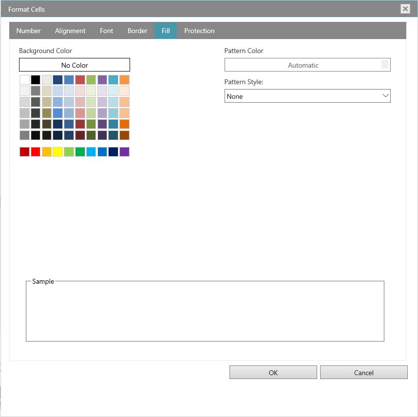
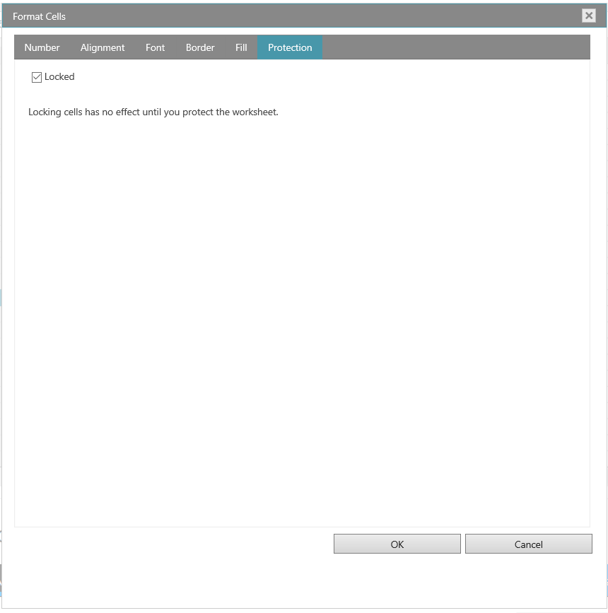

<!--
|metadata|
{
    "fileName": "whats-new-in-2018-volume2",
    "controlName": [],
    "tags": []
}
|metadata|
-->

# What's New in 2018 Volume 2

This topic presents the controls and the new and enhanced features for the Ignite UI™ 2018 Volume 2 release.

### Overview

The following table summarizes what’s new in 2018 Volume 2 and additional details follow.

### igGrid
Feature | Description
---|---
[Time Column](#TimeColumn) | New Time Column in igGrid
[Custom Editor Provider for Filter Cell](#FilteringCustomProvider) | Custom editor provider can be implemented for the filter cell in igGrid

### igSpreadsheet
Feature | Description
---|---
[FormatCells Dialog](#FormatCellsDialog)| Spreadsheet FormatCells Dialog

## Time Column in igGrid
###  Time Column

A new column type is added to the igGrid control - time column. In order to use it, it is necessary to set the column `dataType` to `time`. In this way, you can filter and update time data using the build-in time picker editor.

## Related Content
### Sample
[Filtering](%%SamplesUrl%%/grid/simple-filtering)

## Custom Editor Provider for the Filter Cell in igGrid
###  Custom Editor Provider for the Filter Cell

Now, it is possible to create custom editor provider for the filter cell. This means that you can extend the igEditorProvider class and set your own editor to filter the igGrid content. For more information, check the sample below.

## Related Content
### Sample
[Excel-style Filtering](%%SamplesUrl%%/grid/filtering-combo-editor-provider)

## FormatCellsDialog

###  Spreadsheet FormatCellsDialog

The igSpreadsheet lets you change many of the ways it displays data in a cell. For example, you can specify the number of digits to the right of a decimal point, or you can add a pattern and border to the cell. You can access and modify the majority of these settings in the Format Cells dialog box (right-click the cell and select Format Cells).

- Number Tab

By default, all worksheet cells are formatted with the General number format. With the General format, anything you type into the cell is usually left as-is. For example, if you type 36526 into a cell and then press ENTER, the cell contents are displayed as 36526. This is because the cell remains in the General number format. However, if you first format the cell as a Currency, then the number 36526 will be displayed as $36,526.00.

- Alignment Tab

You can position text and numbers, change the orientation and specify text control in cells by using the Alignment tab

- Font Tab

The term font refers to a typeface (for example, Arial), along with its attributes (point size, font style, underlining, color, and effects). Use the Font tab in the Format Cells dialog box to control these settings. You can see a preview of your settings by reviewing the Preview section of the dialog box.

- Border Tab

In Excel, you can put a border around a single cell or a range of cells. You can also have a line drawn from the upper-left corner of the cell to the lower-right corner, or from the lower-left corner of the cell to the upper-right corner. You can customize these cells' borders from their default settings by changing the line style, line thickness or line color.

- Fill Tab

Use the Fill tab in the Format Cells dialog box to set the background color of the selected cells. You can also use the Pattern list to apply two-color patterns or shading for the background of the cell.

- Protection Tab

The Protection tab allows you to lock your worksheet to protect your data and formulas. This option does not take effect unless you also protect your worksheet.

#### Related Topics
[igSpreadsheet FormatCell Dialog](igspreadsheet-FormatCell-Dialog.html)

