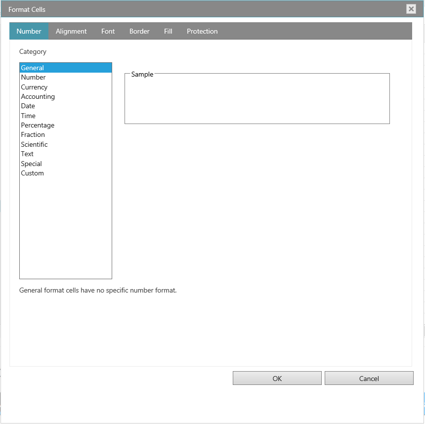
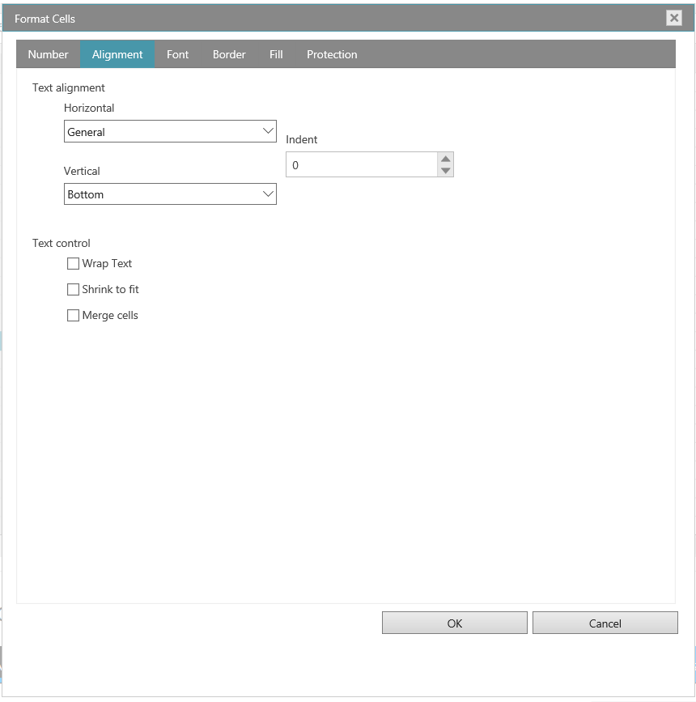

<!--
|metadata|
{
    "fileName": "whats-new-in-2018-volume2",
    "controlName": [],
    "tags": []
}
|metadata|
-->

# What's New in 2018 Volume 2

This topic presents the controls and the new and enhanced features for the Ignite UI™ 2018 Volume 2 release.

### Overview

The following table summarizes what’s new in 2018 Volume 2 and additional details follow.

### Infragistics Javascript Excel Library
Feature | Description
---|---
[Chart Support](#ChartSupport) | 70 new chart types
[Sparkline Support](#SparklineSupport) | 3 different types

### igGrid
Feature | Description
---|---
[Time Column](#TimeColumn) | New Time Column in igGrid
[Custom Editor Provider for Filter Cell](#FilteringCustomProvider) | Custom editor provider can be implemented for the filter cell in igGrid

### igSpreadsheet
Feature | Description
---|---
[Custom Sort Dialog](#SortDialog)| Add sort conditions to tables, worksheets and filter regions.
[Top 10 Filter Dialog](#Top10Dialog)| Filter list of numbers for top percentage.  
[Filtering and Sorting Improvements](#FilteringandSortingImprovements)| New AutoFilter dropdown 
[Filtering Menu](#FilteringMenu)| New Filter Context Menu
[Sorting Menu](#SortingMenu)| New Sorting Context Menu
[Deselect A Selection](#Deselect)| Deselect a range of cells.
[FormatCells Dialog](#FormatCellsDialog)| Spreadsheet FormatCells Dialog

### igFinancialChart
Feature | Description
---|---
[New Legend](#NewLegend)| New legend displays between the toolbar and plotting area.
[X-Axis Scale Breaks](#ScaleBreaks)| Exclude custom ranges of data.
[Callouts Annotation](#CalloutsAnnotationFinancial)| Annotate important data points.
[Crosshairs Layer](#CrosshairsLayerFinancial)| Display horizontal or vertical lines along the plot area at the location of the mouse cursor.
[Final Value Annotation](#FinalValueAnnotationFinancial)| Annotate the last data point in your data source(s).
[Tooltip Types](#TooltipTypesFinancial)| Category Tooltip & Item Tooltip

### igCategoryChart
Feature | Description
---|---
[Highlight Annotation](#HighlightAnnotationCategory)| Category Highlight Layer & Item Highlight Layer
[Callouts Annotation](#CalloutsAnnotationCategory)| Annotate important data points.
[Crosshairs Layers](#CrosshairsLayerCategory)| Display horizontal or vertical lines along the plot area at the location of the mouse cursor.
[Final Value Annotation](#FinalValueAnnotationCategory)| Annotate the last data point in your data source(s).
[Tooltip Types](#TooltipTypesCategory)| Category Tooltip & Item Tooltip

### igDataChart
Feature | Description
---|---
[Callouts Annotation](#CalloutsAnnotationDataChart)| Annotate important data points.
[Crosshairs Layers](#CrosshairsLayersDataChart)| Display horizontal or vertical lines along the plot area at the location of the mouse cursor.
[Final Value Annotation](#FinalValueAnnotationDataChart)| Annotate the last data point in your data source(s).

## Infragistics Javascript Excel Library

### 

Time to bring out your inner executive with the addition of charting support in the Excel Library. With support for 70 different chart types, you can now create dashboard reports that visualize data in a clear and easily digestible manner. This brand-new Excel Charting API gives you complete control over how your charts are rendered with the ability to include a legend, a title, axis titles, and a vast number of options for styling such as gridlines, tick marks, colors and more. You have the full power of Excel charts at the tips of your fingers. The best part, you don’t even need to have MS Excel installed!

Adding a chart to an Excel document is easy. Using the Infragistics Excel Library, create or get an instance of the Worksheet object, and then simply call the AddChart method on the Shapes collection. Supply the type of chart you wish to create (choose from 70), provide the size and location of the chart, and then provide the data and any other formatting settings you want to apply to the chart.

#### Related Topic
-   [Adding a Chart to a Worksheet](javascript-excel-library-worksheet-charts.html)

###  Sparkline Support

A sparkline is a tiny chart in a worksheet cell that provides a visual representation of data. Sparklines are used to show trends in a series of values, such as seasonal increases or decreases, economic cycles, or to highlight maximum and minimum values.  Showing trends in your worksheet data can be useful, especially when you’re sharing your data with other people.

Once you have an instance of the Infragistics Worksheet, simply call the Add method on the SparklineGroups collection. Supply the type of sparkline you wish to create (Column, Line, or Stacked), provide the cell you wish to insert the sparkline, and then provide the range of cells that represent the data the sparkline will use.

After you have created your sparkline, the Infragistics Excel Library gives you an intuitive API that you can use to style various aspects of the sparkline to meet your visualization requirements. The API allows you to enable and control the colors of high and low points, negative points, the first point, the last point, and all markers to name a few.

A new column type is added to the igGrid control - time column. In order to use it, it is necessary to set the column `dataType` to `time`. In this way, you can filter and update time data using the build-in time picker editor.

#### Related Topic
-   [Working with Sparklines](javascript-excel-library-adding-a-sparkline-to-an-excel-worksheet.html)

## igGrid

###  Time Column

###  Custom Editor Provider for the Filter Cell

Now, it is possible to create custom editor provider for the filter cell. This means that you can extend the igEditorProvider class and set your own editor to filter the igGrid content. For more information, check the sample below.

### Sample
[Excel-style Filtering](%%SamplesUrl%%/grid/filtering-combo-editor-provider)

## igSpreadsheet

###  Custom Sort Dialog

Since sorting is so important in any Excel document, we added the very useful Custom Sort Dialog to give you full control over how you want to sort your Excel data.  For example, if you have a Department column and an Employee column, you can first sort by Department (to group all the employefes in the same department together), and then sort by name (to put the names in alphabetical order within each department). 

For more information about the Sort Dialog in the igSpreadsheet, please see the following topic: 

#### Related Topic
-   [Custom Sort Dialog](igspreadsheet-sort-dialog)

###  Top 10 Filter Dialog

When you filter a list using the Top 10 feature, only the top number or the top percent of records remain. You can also filter to display the bottom number or the bottom percent of records. For example, if you want to list the top wage earners in the company, you can filter the Salary column to display only those records with the top ten salaries. If you filter for the top ten percent of wage earners, however, your list would include only those personnel whose salaries together equaled ten percent of the total. 

Although called Top 10, you can filter for any number or percentage of items you desire. 

###  Filtering and Sorting Improvements

In 18.1, we added the AutoFilter dropdown to the spreadsheet. The dropdown had menu items for sorting ascending/descending, clearing a filter applied to the column and to apply a numeric/date/text filter. However, it didn’t have a way to apply a sort or filter based on the forecolor, fill or icon.  In 18.2, that dropdown contains items to allow filtering or sorting based on the foreground, fill or icon of the cells within that column.  

###  Filtering Menu 

###  Sorting Menu

###  Deselect a Selection

Sometimes when you're selecting multiple cells or ranges in Excel, you accidentally select one or more that you didn't intend. Now you can deselect any cells within the selected range with the Deselect Feature. Pressing the Ctrl key, you can click, or click-and-drag, to deselect any cells or ranges within a selection. If you need to reselect any of those cells, continue holding the Ctrl key and reselect those cells. 

###  FormatCellsDialog

The igSpreadsheet lets you change many of the ways it displays data in a cell. For example, you can specify the number of digits to the right of a decimal point, or you can add a pattern and border to the cell. You can access and modify the majority of these settings in the Format Cells dialog box (right-click the cell and select Format Cells).

- Number Tab

By default, all worksheet cells are formatted with the General number format. With the General format, anything you type into the cell is usually left as-is. For example, if you type 36526 into a cell and then press ENTER, the cell contents are displayed as 36526. This is because the cell remains in the General number format. However, if you first format the cell as a Currency, then the number 36526 will be displayed as $36,526.00.

- Alignment Tab

You can position text and numbers, change the orientation and specify text control in cells by using the Alignment tab

- Font Tab

The term font refers to a typeface (for example, Arial), along with its attributes (point size, font style, underlining, color, and effects). Use the Font tab in the Format Cells dialog box to control these settings. You can see a preview of your settings by reviewing the Preview section of the dialog box.

- Border Tab

In Excel, you can put a border around a single cell or a range of cells. You can also have a line drawn from the upper-left corner of the cell to the lower-right corner, or from the lower-left corner of the cell to the upper-right corner. You can customize these cells' borders from their default settings by changing the line style, line thickness or line color.

- Fill Tab

Use the Fill tab in the Format Cells dialog box to set the background color of the selected cells. You can also use the Pattern list to apply two-color patterns or shading for the background of the cell.

- Protection Tab

The Protection tab allows you to lock your worksheet to protect your data and formulas. This option does not take effect unless you also protect your worksheet.

## igFinancialChart

###   New Legend  

The Financial Chart now comes built-in with a new legend displayed between the toolbar and plotting area. This legend show titles of the data sources and it also shows the last value and percentage change between first data item and the last data item. 

###   Callouts Annotation  

With the Callouts Annotation, you can annotate important data points in Financial Chart or even customize values in callout boxes based on your logic. For example, show stock split, dividends, or calculate maximum price in your data source.

#### Related Topic
-   [Annotation and Interaction Layers](financial-chart-annotation-and-interaction-layers.html#CalloutLayer)

###   Crosshairs Layer 

You can configure crosshairs to display as a horizontal line, vertical line or both lines at the location of the mouse cursor. In addition, the Crosshairs Annotation can show values of data points at location of mouse cursor and render these values in colored boxes over the X-Axis and Y-Axis labels. 

#### Related Topic
-   [Annotation and Interaction Layers](financial-chart-annotation-and-interaction-layers.html#CrosshairLayer)

###   Final Values

In Financial Chart, you can use the Final Values annotation to show values of the last data point in your data source(s). This annotation is rendered as a colored box for each data source over the Y-Axis label. 

#### Related Topic
-   [Annotation and Interaction Layers](financial-chart-annotation-and-interaction-layers.html#FinalValueLayer)

###  Tooltip Types

The Financial Chart has a new ToolTipType property that adds two new types of tooltips:  

*  Category Tooltip which renders combined tooltips for all series at a given date 

*  Item Tooltip which renders an individual tooltip for each series at a given date        

#### Related Topic
-   [Annotation and Interaction Layers](financial-chart-annotation-and-interaction-layers.html#CategoryTooltipLayer) 

###  X-Axis Scale Breaks 

In Financial Chart, you can define scale breaks on X-Axis to exclude custom ranges in your data source or any day of week. For example, exclude all data items that fall on weekends. 

#### Related Topic
-   [Configuring XAxis Scale Breaks](financial-chart-configuring-axis-scale-breaks.html) 

## igCategoryChart

###  Highlight Layer

The Category Chart can display two new highlight layers when a user hovers over plotted data points.  

*  Category Highlight Layer renders a vertical rectangle that stretches from the start to end of the category that is closest to the mouse cursor. This rectangle is filled with semi-transparent gray color by default.  

*  Item Highlight Layer renders a vertical rectangle for each data item in a category that is closest to the mouse cursor. This rectangle is filled with semi-transparent color that matches color of the series by default.

#### Related Topics
-   [Category Highlight Layer](igcategorychart-category-highlight-layer.html) 
-   [Item Highlight Layer](igcategorychart-item-highlight-layer.html)

###   Callouts Annotation  

With the Callouts Annotation, you can annotate important data points in Category Chart or even customize values in callout boxes based on your logic. For example, calculate maximum values in your data source. 

#### Related Topic
-   [Callouts Layer](igcategorychart-callouts-layer.html) 

###   Crosshairs Layer

You can configure crosshairs to display as horizontal line, vertical line or both lines at the location of the mouse cursor. In addition, the Crosshairs Annotation can show values of data points at the location of the mouse cursor and render these values in colored boxes over the X-Axis and Y-Axis labels. 

#### Related Topic
-   [Crosshairs Layer](igcategorychart-crosshairs-layer.html) 

###   Final Values 

In Category Chart, you can use the Final Values annotation to show values of the last data point in your data source(s). This annotation is rendered as a colored box for each data source over the Y-Axis labels. 

#### Related Topic
-   [Final Value Layer](igcategorychart-final-value-layer.html) 

###   Tooltip Types

The Category Chart has a new ToolTipType property that adds two new types of tooltips:  

*  Category Tooltip which renders the combined tooltips for all series in data category 

*  Item Tooltip which renders individual tooltip for each series in data category   

#### Related Topics
-   [Category ToolTip Layer](igcategorychart-category-tooltip-layer.html)
-   [Item ToolTip Layer](igcategorychart-item-tooltip-layer.html)

## igDataChart

###   Callouts Annotation  

Callouts Layer is a new feature of Data Chart that you can use to annotate important data points or display their values. Callouts Layer can target multiple data series or individual data series. Also, you can customize appearance of these callout layers and bind callout labels to data items or calculate changes between consecutive data points. 

#### Related Topic
-   [Callouts Layer](hoverinteractions-callout-layer.html) 

###   Crosshairs Layer  

In Crosshair Layer has a new annotation feature can now show values of data points at the location of the mouse cursor and render these values in colored boxes over the X-Axis and Y-Axis labels. 

#### Related Topic
-   [Crosshair Layer](hoverinteractions-crosshair-layer.html) 

###   Final Values Annotation  

Final Values Layer is a new annotation layer that shows values of the last data point in your data source(s). This annotation is rendered as a colored box for each data source over the Y-Axis labels

#### Related Topic
-   [Final Value Layer](hoverinteractions-final-value-layer.html) 