<!--
|metadata|
{
    "fileName": "whats-new-in-2013-volume2",
    "controlName": "",
    "tags": []
}
|metadata|
-->

# What's New in 2013 Volume 2

## Topic Overview
### Purpose

This topic provides an overview of the new features of %%ProductName%%™ 2013 Volume 2 release.

## New Features
### New features summary chart

The following table summarizes the new features for the %%ProductName%% 2013 Volume 2 release. Additional details are available after the summary table.

<table class="table table-bordered">
	<thead>
		<tr>
            <th>
Control
			</th>

            <th>
Feature
			</th>

            <th>
Description
			</th>
        </tr>
	</thead>
	<tbody>
        

        <tr>
            <td>
%%ProductName%%
			</td>

            <td>
Custom downloads
			</td>

            <td>
A new tool for creating custom downloads is available. Select the controls you want to use and the tool creates a download package containing a customized, combined, and minified JavaScript file and theme files. Find out more on [the download page](%%SamplesUrl%%/download).
			</td>
        </tr>

        <tr>
            <td>
[igBulletGraph](#igbulletgraph)
			</td>

            <td>
[New control](#igbulletgraph-new-control)
			</td>

            <td>
The `igBulletGraph` control is a data visualization control for visualizing data in the form of a bullet graph.
			</td>
        </tr>

        <tr>
            <td rowspan="11">
[igDataChart](#igdatachart)
			</td>

            <td>
[Title and subtitle](#title-subtitle)
			</td>

            <td>
You can now add a title and/or subtitle to the top section of the chart.
			</td>
        </tr>

        <tr>
            <td>
[Axis title and subtitle](#axis-title-subtitle)
			</td>

            <td>
You can now add title and/or subtitle to the x- and y-axes of the control.
			</td>
        </tr>

        <tr>
            <td>
[Series highlighting](#series-highting)
			</td>

            <td>
You can now highlight an entire series or some individual items within the series.
			</td>
        </tr>

        <tr>
            <td>
[Animated transitions](#animation-transition)
			</td>

            <td>
The series can now appear with animation effect when the chart is initially loaded.
			</td>
        </tr>

        <tr>
            <td>
[Hover interactions](#hover-interactions)
			</td>

            <td>
Hover interactions  enable you to  display annotations over the series of the chart. These  annotations are implemented through configurable hover                     interaction layers  that are dependent on the cursor position.
			</td>
        </tr>

        <tr>
            <td>
[Axis ticks](#axis-ticks)
			</td>

            <td>
You can now display tick marks for the labels of vertical and horizontal axes.
			</td>
        </tr>

        <tr>
            <td>
[Color gradients](#color-gradients)
			</td>

            <td>
You can now use gradient colors in the chart.
			</td>
        </tr>

        <tr>
            <td>
[Default tooltips](#default-tooltips)
			</td>

            <td>
Default tooltips are now available meaning that a tooltip is displayed for the series without any additional configuration being necessary.
			</td>
        </tr>

        <tr>
            <td>
[Drop shadow](#drop-shadow)
			</td>

            <td>
Drop-shadow effect can be now applied to the series’ visual.
			</td>
        </tr>

        <tr>
            <td>
[New CSS style](#new-css-style)
			</td>

            <td>
There is a new CSS style for the `igDataChart` control. The style features multiple visual changes making the chart look better.
			</td>
        </tr>

        <tr>
            <td>
[Knockout support](#knockout-support)
			</td>

            <td>
You have now support for the Knockout library in the `igDataChart` control.
			</td>
        </tr>

        <tr>
            <td>
igDataSource
			</td>

            <td>
oData filtering by date
			</td>

            <td>
When bound to an oData service, the `igDataSource` is able to filter date columns.
			</td>
        </tr>

        <tr>
            <td>
[igDoughnutChart](#igdoughnutchart)
			</td>

            <td>
[New control](#igdoughnutchart-new-control)
			</td>

            <td>
The `igDoughnutChart` is a data visualization control for displaying data in the form of a doughnut chart.
			</td>
        </tr>

        <tr>
            <td rowspan="5">
[igGrid](#iggrid)
			</td>

            <td>
[Column fixing](#iggrid-column-fixing)
			</td>

            <td>
Previously CTP, the Column Fixing feature has now been released to the market and is fully documented. This feature enables fixing a column on the left or on the right of the grid, so that it cannot get out of user view when scrolling
                    horizontally.
			</td>
        </tr>

        <tr>
            <td>
[jsRender integration](#jsrender-integration)
			</td>

            <td>
The  `igGrid` control now supports the jsRender templating engine.
			</td>
        </tr>

        <tr>
            <td>
[RWD Mode Vertical Column Rendering](#vertical-column-rendering)
			</td>

            <td>
Vertical Column Rendering is a new feature that renders the grid in two columns as a Responsive Web Design (RWD) to changing the width of the browsers viewport. The first column displays the column captions, and the second column – the
                    data.
			</td>
        </tr>

        <tr>
            <td>
[New design of the Feature Chooser](#feature-chooser-new-design)
			</td>

            <td>
The Feature Chooser has now a new design that provides better support for touch-enabled devices.
			</td>
        </tr>

        <tr>
            <td>
[Load-on-Demand (CTP)](#load-on-demand)
			</td>

            <td>
With the `igGrid` Load-on-Demand feature, currently in CTP, the data is not loaded to the grid until the requested data is needed in view. This greatly improves the grid performance with large data sets.
			</td>
        </tr>

        <tr>
            <td>
[igLayoutManager](#iglayoutmanager)
			</td>

            <td>
[New control](#iglayoutmanager-new-control)
			</td>

            <td>
igLayoutManager is now RTM.
			</td>
        </tr>

        <tr>
            <td>
[igLinearGauge](#iglineargauge)
			</td>

            <td>
[New control](#iglineargauge-new-control)
			</td>

            <td>
The `igLinearGauge` control visualizes data in the form of a linear gauge. It provides a simple and concise view of a performance value compared against a scale and one or more comparative ranges.
			</td>
        </tr>

        <tr>
            <td>
[igMap](#igmap)
			</td>

            <td>
[High density scatter series](#high-density-scatter-series)
			</td>

            <td>
The new geographic High-Density Scatter series allows you to bind and show scatter data ranging from hundreds to millions of data points requiring exceedingly little loading time.
			</td>
        </tr>

        <tr>
            <td>
[igPieChart](#igpiechart)
			</td>

            <td>
[Curved label callout lines](#curved-label)
			</td>

            <td>
You can now add two types of curves to the lines in the label callouts in the `igPieChart`.
			</td>
        </tr>

        <tr>
            <td>
[igPopover](#igpopover)
			</td>

            <td>
[New control (CTP)](#igpopover-new-control)
			</td>

            <td>
The  `igPopover`  control, currently in CTP,  adds tooltip-like functionality to the  DOM elements.
			</td>
        </tr>

        <tr>
            <td>
[igQRCodeBarcode](#qrcode)
			</td>

            <td>
[New control](#qrcode-new-control)
			</td>

            <td>
The `igQRCodeBarcode` control generates QR (Quick Response) barcode images for use in your web application.
			</td>
        </tr>

        <tr>
            <td>
[igRadialGauge](#igradialgauge)
			</td>

            <td>
[New control](#igradialgauge-new-control)
			</td>

            <td>
`igRadialGauge` is a data visualization control for displaying a gauge containing a number of visual elements, such as a scale with tick marks and labels, a needle, and a number of ranges.
			</td>
        </tr>

        <tr>
            <td>
[igTileManager](#igtilemanager)
			</td>

            <td>
[New control](#igtilemanager-new-control)
			</td>

            <td>
Previously CTP, the `igTileManager` control has now been released to the market and is fully documented. The `igTileManager` is a layout control for rendering and managing data into tiles.
			</td>
        </tr>

        <tr>
            <td>
[igZoombar](#igzoom)
			</td>

            <td>
[New control](#igzoom-new-control)
			</td>

            <td>
`igZoombar` control adds zooming functionality to range enabled controls like `igDataChart`.
			</td>
        </tr>
    </tbody>
</table>

## igBulletGraph
### New control

The `igBulletGraph` control is a data visualization control for visualizing data in the form of a bullet graph. Linear by design, it provides a simple and concise view of a performance bar compared against a scale and, optionally, some other measures.

#### Related Topic

-   [igBulletGraph](igBulletGraph.html)

#### Related Sample

-   [Basic Configuration](%%SamplesUrl%%/bullet-graph/basic-configuration)

## igDataChart
### Title and subtitle

You can now add a title and/or subtitle to the top section of the chart. When a title/subtitle is added, the content of the chart is re-sized automatically to allow for the title/subtitle content.

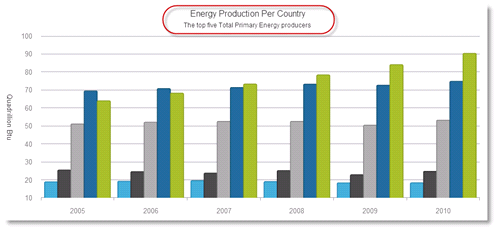

#### Related Topic

-   [**Configuring the Chart Title and Subtitle (igDataChart)**](igDataChart-Chart-Titles-and-Subtitles.html)

#### Related Sample

-   [Title and Subtitle](%%SamplesUrl%%/data-chart/chart-title)

### Axis title and subtitle

You can now add a title and/or subtitle to the x- and y-axes of the control.

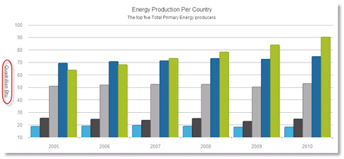

#### Related Topic

-   [**Configuring the Axis Title (igDataChart)**](igDataChart-Axis-Title.html)

#### Related Sample

-   [Axis Title and Subtitle](%%SamplesUrl%%/data-chart/axis-title)

### Series highlighting

You can now highlight an entire series or some individual items within
the series.

The highlighting capabilities are series-specific. With single-shape series, such as Line, series the entire line is highlighted, while with series consisting of multiple shapes, such as Column series, each individual shape (column) can be highlighted. In all supported series, individual markers can be highlighted.

Highlighting is supported with the mouse only.

Series highlighting is supported for the following series types:

-   Category Series
-   Range Category Series
-   Financial Price Series
-   Financial Indicators

#### Related Topic

-   [Configuring the Series Highlighting (igDataChart)](igDataChart-Series-Highlighting.html)

#### Related Sample

-   [Series Highlighting](igDataChart-Series-Highlighting.html#series-highlighting-examples)

### Animated transitions

This feature allows the series to animate during the initialization of the `igDataChart` control.

#### Related Topic

-   [Transitions In Animations](igChart-Transitions-In-Animations.html)

#### Related Samples

-   [Transition Animations](%%SamplesUrl%%/data-chart/transition-animation)
-   [Transition Animations (Financial)](igchart-transitions-in-animations.html#transition-example)

### Hover interactions

Hover interactions enable you to display annotations over the series of the chart. These annotations are implemented through configurable hover interaction layers that are dependent on the cursor position.

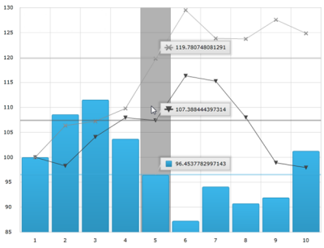

Hover interaction layers are actually series that are added to the series collection and are dependent on the cursor position. Adding hover interaction layers to the `igDataChart` control disables the default behavior of the crosshairs, tooltips, or both (depending on which type of layer is added).

#### Related Topic

-   [**Configuring Hover Interactions (igDataChart)**](HoverInteractions-Hover-Interactions.html)

#### Related Samples

-   [**Category Highlight Layer**](HoverInteractions-Crosshair-Layer.html#example)
-   [**Category Item Highlight Layer**](HoverInteractions-Category-Item-Highlight-Layer.html#example)
-   [**Category Tooltip Layer**](HoverInteractions-Category-Tooltip-Layer.html#example)
-   [**Crosshair Layer**](HoverInteractions-Item-Tooltip-Layer.html#example)
-   [**Item Tooltip Layer**](HoverInteractions-Crosshair-Layer.html#example)

### Axis ticks

You can now display axis tick marks outside the chart plot area. This allows displaying ticks for each of the labels and may serve for simplifying the chart look by replacing the axes gridlines with ticks.

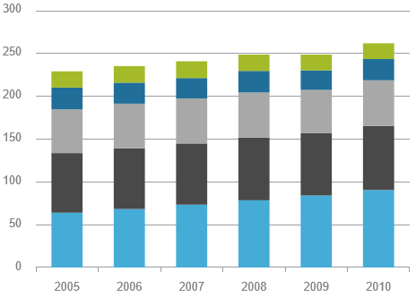

#### Related Topic

-   [Configurable Visual Elements](igDataChart-Visual-Elements.html)

### Color gradients

You can now use gradient colors in the chart.

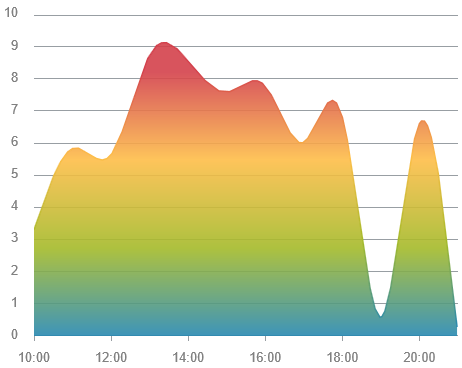

#### Related Topic

-   [Using Gradient Colors in Data Visualizations](Using-Gradient-Colors-in-Data-Visualizations.html)

#### Related Sample

-   [Color Gradients](%%SamplesUrl%%/data-chart/chart-fill-gradients)

### Default tooltips

Default tooltips are now available meaning that a tooltip is displayed for the series without any additional configuration being necessary. The default tooltip templates are different for the different series types in order to present information optimally.

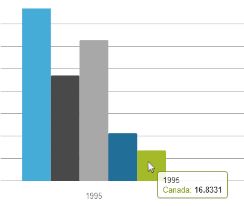

#### Related Topic

-   [**Configurable Visual Elements**](igDataChart-Visual-Elements.html)

#### Related Sample

-   [Series Tooltips](igDataChart-Visual-Elements.html#samples)

### Drop shadow

Drop-shadow effect can be applied to the series’ visual.

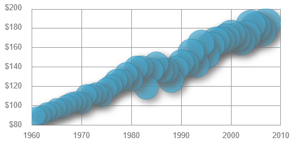

#### Related Topic

-   [Styling the Chart Series (igDataChart)](igDataChart-Styling-the-Chart-Series.html)

### New CSS style

There is a new CSS style for the `igDataChart` control. The style features multiple visual changes and settings to improve the overall chart look and feel.

### Old Style

### New Style

#### Related Topic

-   New Default Style (`igDataChart`)

### Knockout support

You have now support for the Knockout library in the `igDataChart` control. This makes it easier to use the Knockout library and its declarative syntax to instantiate and configure `igDataChart`.

#### Related Topic

-   [**Configuring Knockout Support (igDataChart)**](igDataChart-KnockoutJS-Support.html)

## igDoughnutChart
### New control

The `igDoughnutChart` is a data visualization control for displaying data in the form of a doughnut chart. It allows for proportionally illustrating the occurrences of a variable. The inner radius of the control is configurable, and the Doughnut Chart’s series provides a built-in support for selecting and exploding its slices.

Visualizing the occurrence of multiple variables (adding multiple series) is possible, using concentric rings. The chart can be styled by configuring its properties or applying themes.

#### Related Topic

-   [igDoughnutChart](igDoughnutChart.html)

#### Related Sample

-   [Doughnut Chart](%%SamplesUrl%%/doughnut-chart/overview)

## igGrid
### Column fixing

Previously CTP, the Column Fixing feature has now been released to the market and is fully documented. This feature enables fixing a column on the left or on the right of the grid, so that it cannot get out of user view when scrolling horizontally. This can be performed either by the user from the grid interface or programmatically through the API of the Column Fixing feature. When Column Fixing is activated, the fixed/fixable columns are indicated with a pin button in their headers.

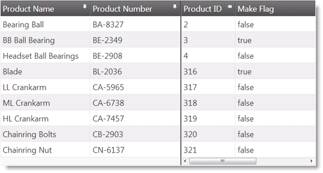

#### Related Topic

-   [**Column Fixing Overview (igGrid)**](igGrid-ColumnFixing-Overview.html)

#### Related Sample

-   [Column Fixing](%%SamplesUrl%%/grid/column-fixing)

### jsRender integration

The `igGrid` control now supports the jsRender templating engine.

#### Related Topic

-   [**jsRender Integration (igGrid)**](igGrid-jsRender-Integration.html)

#### Related Sample

-   [**jsRender integration**](%%SamplesUrl%%/grid/jsrender-integration)

### RWD Mode Vertical Column Rendering

Vertical Column Rendering is a new feature that renders the grid in two columns as a Responsive Web Design (RWD) to changing the width of the browsers viewport. The first column is the header column where the column captions reside. The second column contains row data.

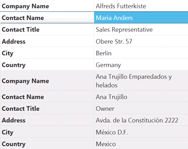

#### Related Topic

-   [**Configuring Vertical Column Rendering (RWD Mode, igGrid)**](igGrid-Responsive-Web-Design-Mode-Configuring-Vertical-Column-Rendering.html)

#### Related Sample

-   [**Responsive Vertical Rendering**](%%SamplesUrl%%/grid/responsive-vertical-rendering)

### New design of the Feature Chooser

The Feature Chooser has now a new design that provides better support
for touch-enabled devices.

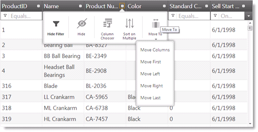

#### Related Topic

-   [Feature Chooser](igGrid-Feature-Chooser.html)

#### Related Sample

-   [Feature Chooser](%%SamplesUrl%%/grid/feature-chooser)

### Load-on-Demand (CTP)

With the `igGrid` Load-on-Demand feature, currently in CTP, the data is not loaded to the grid until the requested data is needed in view. This greatly improves the grid performance with large data sets. Load-on-Demand can operate in two alternative modes: Automatic and Manual.

-   In Automatic mode, the data is appended as needed when the user scrolls down the grid.
-   In Manual mode, the data is appended when the user presses the Load more data button located at the bottom of the grid.

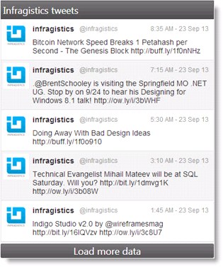

#### Related Sample

-   [Load-on-Demand](%%SamplesEmbedUrl%%/grid/append-rows-on-demand)

## igLayoutManager
### New control

The `igLayoutManager` is a layout control for managing the overall HTML page layout in Web applications by arranging the page elements in pre-defined (but customizable) layout patterns (called “layouts”).

#### Related Topic

-   [igLayoutManager](igLayoutManager-Landing-Page.html)

#### Related Samples

-   [Responsive Column Layout](%%SamplesUrl%%/layout-manager/column-layout-markup)
-   [Responsive Flow Layout](%%SamplesUrl%%/layout-manager/flow-layout)

## igLinearGauge
### New control

The `igLinearGauge` control visualizes data in the form of a linear gauge.
It provides a simple and concise view of a performance value compared
against a scale and one or more comparative ranges.

#### Related Topic

-   [igLinearGauge](igLinearGauge.html)

#### Related Sample

-   [Basic Configuration](%%SamplesUrl%%/linear-gauge/basic-configuration)

## igMap
### High density scatter series

The new geographic High-Density Scatter series allows you to bind and
show scatter data ranging from hundreds to millions of data points
requiring exceedingly little loading time.

Because of the sheer number of data points, the series displays the scatter data as tiny dots (as opposed to full-size markers) and the areas the most data-intensive areas – higher color density representing clusters of data points.

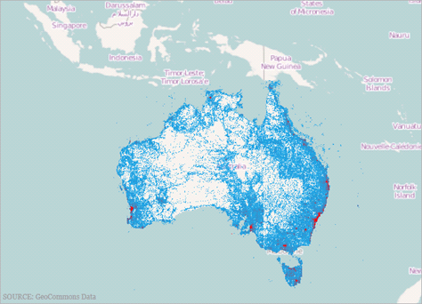

#### Related Topic

-   [**Configuring Geographic High-Density Scatter Series (igMap)**](igMap-Using-Geographic-High-Density-Scatter-Series.html)

#### Related Sample

-   [High Density Scatter Series](%%SamplesUrl%%/map/geo-high-density-scatter-series)

## igPieChart
### Curved label callout lines

You can now add two types of curves to the lines in the label callouts in the `igPieChart`. You can choose whether to use a straight line or one of the curves and specify the line style and the spacing between the label and the end of the line.

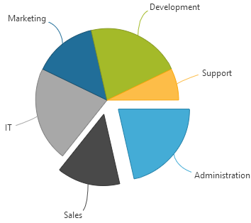

#### Related Sample

-   [Layout Configuration](%%SamplesUrl%%/pie-chart/layout-configuration)

## igPopover
### New control (CTP)

The `igPopover` control, currently in CTP, adds tooltip-like functionality to the DOM elements. It makes possible various customizations to tooltips, such as:

-   Displaying of HTML content
-   Custom positioning – left, right, top, bottom
-   Custom look-and-feel
-   Custom trigger – the event on which the `igPopover` will be shown
-   Multiple elements instantiation
-   Touch support

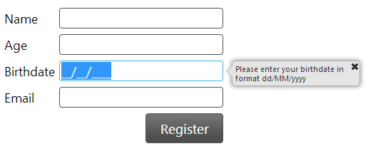

#### Related Samples

-   [Basic Popover](%%SamplesUrl%%/popover/basic-popover)

## igQRCodeBarcode
### New control

The `igQRCodeBarcode` control generates QR (Quick Response) barcode images for use in your web application. The following screenshot shows a sample `igQRCodeBarcode` control with the “http://www.infragistics.com” data encoded.

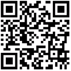

#### Related Topics

-   [igQRCodeBarcode](igQRCodeBarcode.html)

#### Related Samples

-   [QR Barcode Basic Configuration](%%SamplesUrl%%/barcode/basic-configuration)

## igRadialGauge
### New control

`igRadialGauge` is a data visualization control for displaying a gauge containing a number of visual elements, such as a scale with tick marks and labels, a needle, and a number of ranges. The control also supports ranges, which provides visual cues for the scale.

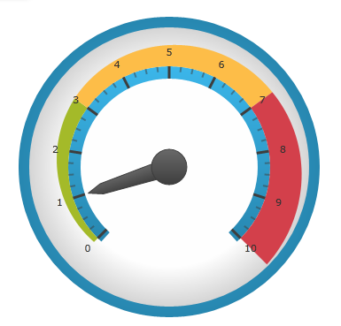

#### Related Topics

-   [igRadialGauge](igRadialGauge.html)

#### Related Samples

-   [igRadialGauge](%%SamplesUrl%%/radial-gauge/overview)

## igTileManager
### New control

Previously CTP, the `igTileManager` control has now been released to the
market and is fully documented.

The `igTileManager` is a layout control for rendering and managing data into tiles. The tiles are displayed in a responsive grid layout (for example, dashboard with a set of different components such as grid, chart, map, and etc.).

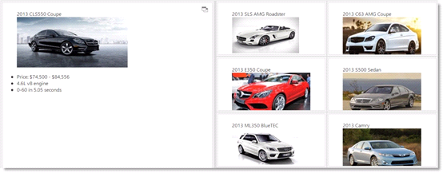

#### Related Topics

-   [igTileManager](igTileManager-Landing-Page.html)

#### Related Samples

-   [ASP.NET MVC Basic Usage](%%SamplesUrl%%/tile-manager/aspnet-mvc-helper)
-   [Binding to JSON Data](%%SamplesUrl%%/tile-manager/bind-json)
-   [Item Configurations](%%SamplesUrl%%/tile-manager/item-configurations)
-   [Leading Tile Configuration](%%SamplesUrl%%/tile-manager/leading-tile)

## igZoombar
### New control

The `igZoombar` control provides zooming functionality to range-enabled controls. The `igZoombar` features a horizontal scroll bar, a thumbnail of the whole range, and a resizable zoom-range window. The `igZoombar` integrates out-of-the-box with the `igDataChart` control.

  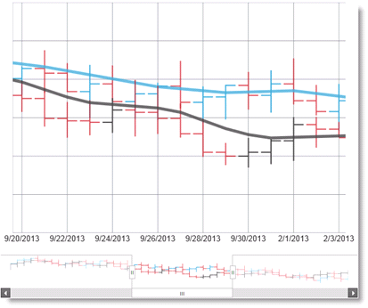

#### Related Topics

-   [igZoombar](igZoombar-LandingPage.html)

#### Related Samples

-   [Zoombar Financial Chart](%%SamplesUrl%%/zoombar/financial-chart)

 

 

