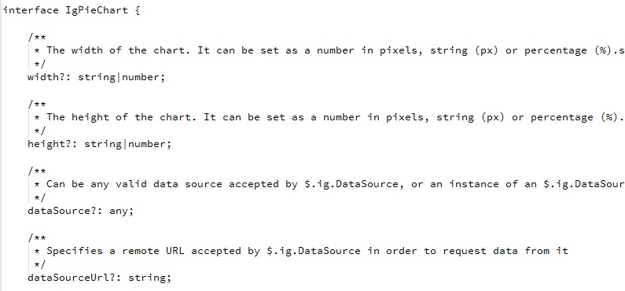
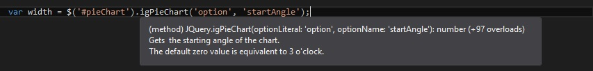
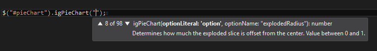
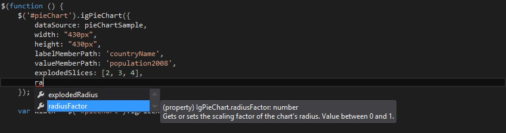

<!--
|metadata|
{
    "fileName": "whats-new-in-2016-volume1",
    "controlName": [],
    "tags": []
}
|metadata|
-->

#What's New in 2016 Volume 1

This topic presents the controls and the new and enhanced features for the Ignite UI™ 2016 Volume 1 release.

##What’s New Summary

The following summarizes what’s new in 2016 Volume 1. Additional details follow.

### igTileManager

Feature | Description
---|---
Splitter Options| `splitterOptions` now replaces the `showSplitter` option. Besides showing and hiding, additional functionalities are added. You can configure the splitter to be collapsible as well as attach to its collapsed/expanded events. Since `showSplitter` option will no longer be available, you can refer to the following sample to see how the new option can be used - [view sample](%%SamplesUrl%%/tile-manager/collapsible-splitter).

### igDataSource

Feature | Description
---|---
New field option - mapper| For field with dataType="object" we now allow setting a mapper function, which can be used for complex data extraction from complex objects, whose return value will be used for all data operations executed on the specific field.    You can find more detailed information in the following topic: [igDataSource Overview](igDataSource-igDataSource-Overview.html#schema-fields-mapper)|

### igGrid

Feature | Description
---|---
New column option- Mapper| For columns with dataType="object" we now allow setting a mapper function, which can be used for complex data extraction from complex objects, whose return value will be used for all data operations executed on the specific column.- [view sample](%%SamplesUrl%%/grid/handling-complex-objects).   You can find more detailed information in the following topic: [Columns and Layout](igGrid-Columns-and-Layout.html#-defining-mapper-function-for-column)|

### TypeScript Support

Starting with 16.1 release Ignite UI the minimum supported TypeScript version is 1.4.

Feature | Description
---|---
[Support for union types](#union-types) | widget members now support union types which greatly improves type checking.
[Intellisense improvements](#intellisense-improvements) | Intellisense is improved for options and methods.
[Member descriptions](#member-descriptions) | All members now have a description.

## TypeScript Support

###  Support for union types

[Union types](https://github.com/Microsoft/TypeScript/blob/master/doc/spec.md#3.4) introduced in TypeScript 1.4	allows for a variable or a member to have one of a set of several types. Previously members that were declared as type `any` now use union types to declare a more specific type. 

###  Intellisense improvements

Intellisense is improved for options and methods to suggest all widget`s overloads.

#### Option overloads

All possible options with getters and setters are now listed in the intellisense.

#### Method overloads

All possible methods with their parameters are now listed in the intellisense.

#### Methods intellisense on the widget's `data`
In jQuery UI syntax the widget methods can be invoked from the widget's data: $(".selector").data('widgetName'). This is now possible with the Ignite UI TypeScript directives.

###  Member descriptions

Widget options, events and methods now feature descriptions. The description can be seen in intellisense suggestions for improved usability of the widgets.

