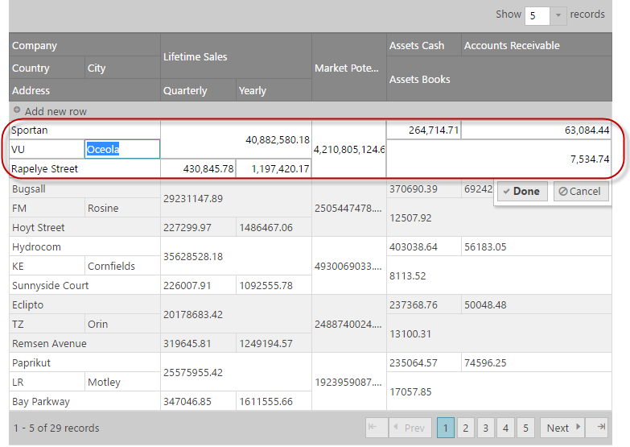
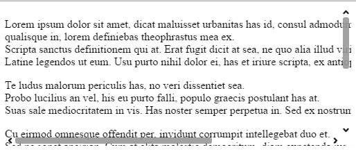

<!--
|metadata|
{
    "fileName": "whats-new-in-2016-volume2",
    "controlName": [],
    "tags": []
}
|metadata|
-->

#What's New in 2016 Volume 2

This topic presents the controls and the new and enhanced features for the Ignite UI™ 2016 Volume 2 release.

##What’s New Summary

The following summarizes what’s new in 2016 Volume 2. Additional details follow.

### General

Feature | Description
---|---
Ignite UI OSS | A big part of the Ignite UI toolset is now open source. Checkout the repository on [GitHub](https://github.com/IgniteUI/ignite-ui)|
Angular 2 Components (RTM) | Ignite UI widgets have component wrappers for Angular 2. For detailed information visit [Ignite UI Angular 2 GitHub](https://github.com/IgniteUI/igniteui-angular2) page.|
ASP.NET Core 1.0 MVC Helpers | Ignite UI MVC Helpers now support ASP.NET Core 1.0. Checkout the [Using Ignite UI controls in ASP.NET Core 1.0](Using--IgniteUI-Controls-in-ASP.NET-Core-1.0-project.html) topic.|
ASP.NET Core 1.0 MVC Tag Helpers | Ignite UI now provides Tag Helpers for ASP.NET Core 1.0.|

### igDataSource

Feature | Description
---|---
New grouping functionality| The igDataSource now handles grouping and persists the grouping expand and collapse state. |
Sorting performance optimizations | Local sorting is now up to 10x faster. |

### igGrid

Feature | Description
---|---
[Group By Improvements](#groupby-improvements) | Group By now features improved Virtualization support and APIs to expand/collapse rows. |
Sorting performance optimizations | Local sorting is now up to 10x faster. |
[Inline editing for Multi-Row Layout](#mrl-inline-editing)| The Multi-Row Layout feature now supports inline row and cell editing. |
Multi-Column Headers collapsible column groups | Collapsible Column Groups is a feature that provides an option to collapse/expand a Multi-Column Header to a smaller set of data. |
Column setter | Column collection now can be changed at runtime. |
Binding Real-Time Data sample| A new sample is added that demonstrates binding igGrid to real-time data - [view sample](%%SamplesUrl%%/grid/binding-real-time-data). |
Performance Options sample| A new sample is added that demonstrates the performance options provided by the igGrid - [view sample](%%SamplesUrl%%/grid/grid-performance). |

### igScroll

Feature | Description
---|---
[New Control](#igscroll)| The igScroll™ control unifies scrolling experience between browsers and devices. |

### igZoombar

Feature | Description
---|---
Integration with Custom Components| The igZoombar now exposes a pluggable integration mechanism for third-party custom components. Checkout the [igZoombar Integration with Custom Components](igZoombar-Integration-with-Custom-Components.html) topic.|

## igGrid

###  Group By Improvements

Group By has improved integration with Virtualization feature. Now it persist the grouped rows expand state between virtualization frames improving the end user experience.
Also two new API methods are added to [`expand`](%%jQueryApiUrl%%/ui.iggridgroupby#methods:expand) and [`collapse`](%%jQueryApiUrl%%/ui.iggridgroupby#methods:collapse) group rows.
Local grouping performance is optimized and now can be up to 10x faster.

#### Related Topics
-   [Column Grouping Overview (igGrid)](igGrid-GroupBy-Overview.html#api-usage)

#### Related Samples
-   [Continuous Virtualization](%%SamplesUrl%%/grid/virtualization-continuous)

###  Inline editing for Multi-Row Layout

Updating feature now works in row and cell edit mode when Multi-Row Layout is configured. Use [`navigationIndex`](%%jQueryApiUrl%%/ui.iggrid#options:columns.navigationIndex) option to configure the tab order of the editors when in edit mode.

#### Related Topics
-   [Grid Multi-Row Layout](igGrid-MultiRowLayout.html#features-integration)

#### Related Samples
-   [Multi-Row Layout](%%SamplesUrl%%/grid/multi-row-layout)

## igScroll

###  New Control

The igScroll is a stand-alone JQueryUI widget that allows enabling custom scrollbars with fluid scrolling functionality for desktop, hybrid and mobile environments.
It allows you to create a consistent scrolling experience across all scrolling containers on all devices.

#### Related Topics
-   [igScroll Overview](igScroll-Overview.html)
-   [Configuring igScroll](Configuring-igScroll.html)

#### Related Samples
-   [Basic Usage](%%SamplesUrl%%/scroll/basic-usage)
-   [Scrolling multiple containers at once](%%SamplesUrl%%/scroll/scrolling-multiple-containers)
-   [Configuration Options](%%SamplesUrl%%/scroll/configuration-options)