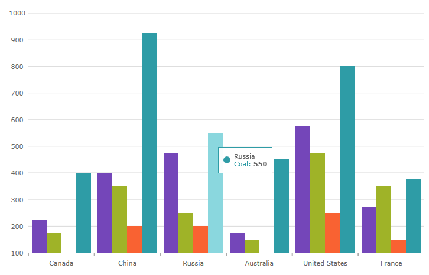
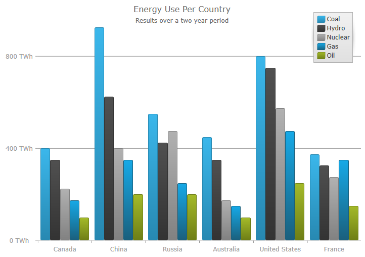
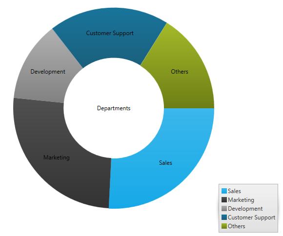

<!--
|metadata|
{
    "fileName": "whats-new-in-2016-volume2",
    "controlName": [],
    "tags": []
}
|metadata|
-->

#What's New in 2016 Volume 2

This topic presents the controls and the new and enhanced features for the %%ProductName%%™ 2016 Volume 2 release.

##What’s New Summary

The following summarizes what’s new in 2016 Volume 2. Additional details follow.

### General

Feature | Description
---|---
%%ProductName%% OSS | A big part of the %%ProductName%% toolset is now open source. Checkout the repository on [GitHub](https://github.com/IgniteUI/ignite-ui)|
%%ProductName%% directives for Angular 2 (RTM) | %%ProductName%% widgets have component wrappers for Angular 2. For detailed information visit [%%ProductName%% Angular 2 GitHub](https://github.com/IgniteUI/igniteui-angular2) page.|
%%ProductName%% Components for React (CTP) | %%ProductName%% widgets have component wrappers for [React](https://facebook.github.io/react/). For detailed information visit [%%ProductName%% Components for React](https://github.com/IgniteUI/igniteui-react) page.|
ASP.NET Core 1.0 MVC Helpers | %%ProductName%% MVC Helpers now support ASP.NET Core 1.0. Checkout the [Using %%ProductName%% controls in ASP.NET Core 1.0](Using-IgniteUI-Controls-in-ASP.NET-Core-1.0-project.html) topic.|
ASP.NET Core 1.0 MVC Tag Helpers | %%ProductName%% now provides Tag Helpers for ASP.NET Core 1.0. Checkout the [Using %%ProductName%% Tag Helpers](Using-Ignite-UI-Tag-Helpers.html) topic.|
[New Javascript file breakdown](#javascript-file-breakdown) | The goal is to reduce the amount of code required in order to load a specific feature. |
DPI Scaling | High DPI Scaling is enabled by default now which makes the components look much sharper and crisper than before. Components that have the DPI Scaling by default now are - igDataChart, igPieChart, igFunnelChart, igDoughnutChart, igRadialGauge, igLinearGauge, igBulletGraph, igSparkline, igRadialMenu. |
Standard moduling support | All of IgniteUI JavaScript files contain AMD module definitions. Therefore these files can be loaded using standard module loaders such as Require.JS, System.JS etc.|
[%%ProductName%% NuGet packages](#ignite-ui-nuget-packages) | New %%ProductName%% NuGet packages are available, including a package for creating .NET Core applications. |

### igCategoryChart

Feature | Description
---|---
[New Control](#igcategorychart)| With a simplified API this control can be easily configured to display category data. |

### igDataChart

Feature | Description
---|---
[New property](#new-chart-property) | A new property ConsolidatedColumnVerticalPosition is added, which determines the positioning logic to use for columns which have been consolidated into a single visual element. | 
[Performance Enhancements](#performance-enhancements)| In the Infragistics 2016 volume 2 release, we significantly improved the performance of the igDataChart control. |
[Design Changes](#design-changes) | We redesigned the defaults of the igDataChart, igPieChart, igFunnelChart, igDoughnutChart, igRadialGauge, igLinearGauge, igBulletGraph, and igSparkline control.|
[File Size Reduction](#file-size-reduction) | The size has been reduced for loading a category chart, and we also modularized the igDataChart control.|

### igDataSource

Feature | Description
---|---
New grouping functionality| The igDataSource now handles grouping and persists the grouping expand and collapse state. |
Sorting performance optimizations | Local sorting is now up to 10x faster. |

### igFunnelChart

Feature | Description
---|---
[Label Styling](#funnel-styling) | You can now specify the color of the funnel chart's inner and outer labels.

### igGrid

Feature | Description
---|---
[Group By Improvements](#groupby-improvements) | Group By now features improved Virtualization support and APIs to expand/collapse rows. |
Sorting performance optimizations | Local sorting is now up to 10x faster. |
[Inline editing for Multi-Row Layout](#mrl-inline-editing)| The Multi-Row Layout feature now supports inline row and cell editing. |
Multi-Column Headers collapsible column groups | Collapsible Column Groups is a feature that provides an option to collapse/expand a Multi-Column Header to a smaller set of data. |
Column setter | Column collection now can be changed at runtime. |
igGrid Modal Dialog extensibility| Grid features that include dialogs (Updating, Filtering, Sorting, Hiding, GroupBy, Column Moving) now add a new `dialogWidget` option allowing for custom dialog implementations - [view sample](%%SamplesUrl%%/grid/custom-modal-dialog) and [topic](Extending_igGrid_Modal_Dialog.html). |
Binding Real-Time Data sample| A new sample is added that demonstrates binding igGrid to real-time data - [view sample](%%SamplesUrl%%/grid/binding-real-time-data). |
Performance Options sample| A new sample is added that demonstrates the performance options provided by the igGrid - [view sample](%%SamplesUrl%%/grid/grid-performance). |

### igPieChart

Feature | Description
---|---
[Slice Selection](#slice-selection) | You can now select a pie slice on the igPieChart control.| 
[New Event](#pie-event)| New event that fires when a label is clicked. |
[Label Coloring](#pie-label-coloring) | You can now specify the color of the pie's inner and outer labels.|
[Data Path Options Renamed](#pie-data-path-renaming) | The valueMemberPath and labelMemberPath options are renamed.|

### igScroll

Feature | Description
---|---
[New Control](#igscroll)| The igScroll™ control unifies scrolling experience between browsers and devices. |

### igZoombar

Feature | Description
---|---
Integration with Custom Components| The igZoombar now exposes a pluggable integration mechanism for third-party custom components. Checkout the [igZoombar Integration with Custom Components](igZoombar-Integration-with-Custom-Components.html) topic.|

## igCategoryChart

###  New Control

A new control, the Category Chart, is added in this 2016 volume 2 release. This chart can be easily configured to display category data using a simple API. All you need to do is bind your data (a collection or a collection of collections).

By using a smart Data Adapter, the data is analyzed and the appropriate visualization is rendered. For example, if the chartType is set to "Auto", the control can determine that if it is provided a small data set then a column chart should be plotted, while a larger data set will draw a line chart.

However, you can also explicitly specify the chart type by setting the chartType to line, area, column, point, spline, splineArea, stepArea, stepLine, or waterfall.

Another example of the intuitive behavior of the Category Chart control is that you do not need to explicitly set the labels. The Category Chart will use the first appropriate string property that it finds and will use that for the labels.

Built to be easily configurable, it uses the igDataChart control as its engine, which means that it benefits from the high performing and powerful Data Chart features.

#### Related Topic:
-   [igCategoryChart Overview](categorychart-overview.html)

### New Javascript File Breakdown

The igDataChart, igPieChart, igFunnelChart, igDoughnutChart, igRadialGauge, igLinearGauge, igBulletGraph and igMap controls all have breaking changes in terms of the js files required. The goal is to reduce the amount of code required in order to load a specific feature. The script combiner has been updated to help you download a combined file with only the files you need and in the correct order depending on required features. The igLoader has also been updated to load the correct files depending on the features requested.

The following lists the files required if you want to load the files manually:

igDataChart, igCategoryChart, igPieChart, igFunnelChart, igDoughnutChart, igRadialGauge, igLinearGauge, igBulletGraph and igMap you first need:

* infragistics.util.js

* infragistics.ext_core.js

* infragistics.ext_collections.js

* infragistics.ext_ui.js

* infragistics.dv_core.js

igDataChart, igCategoryChart, igPieChart, igDoughnutChart, igRadialGauge, igLinearGauge, igBulletGraph and igMap you then need:

* infragistics.dv_geometry.js

If you want to load igRadialGauge you need:

* infragistics.radialgauge.js

* infragistics.ui.radialgauge.js

If you want to load igLinearGauge you need:

* infragistics.lineargauge.js

* infragistics.ui.lineargauge.js

If you want to load igBulletGraph you need:

* infragistics.bulletgraph.js

* infragistics.ui.bulletgraph.js

If you want to load igPieChart you need:

* infragistics.piechart.js

* infragistics.dvcommonwidget.js

* infragistics.ui.piechart.js

If you want to load igDoughnutChart you need everything for pie chart and in addition:

* infragistics.doughnutchart.js

* infragistics.ui.doughnutchart.js

If you want to load igFunnelChart you need:

* infragistics.funnelchart.js

* infragistics.ui.funnelchart.js

If you want to load any igDataChart or igMap features, you need:

* infragistics.datachart_core.js

If you want to load igMap you need:

* infragistics.ext_text.js

* infragistics.ext_io.js

* infragistics.ext_web.js

* infragistics.dv_geo.js

* infragistics.datachart_scatter.js

* infragistics.dvcommonwidget.js

* infragistics.geographicmap.js

* infragistics.ui.geographicmap.js

If you want to load the igDataChart, after loading the appropriate chart features, you need:

* infragistics.datachart.js

* infragistics.ui.chart.js

If you want to load any category series (column, area, line, spline, splineArea, stepLine, stepArea, point, waterfall) into the chart you need:

* infragistics.datachart_categorycore.js

* infragistics.datachart_category.js

If you want to load vertical category series (bar) into the chart you need:

* infragistics.datachart_categorycore.js

* infragistics.datachart_category.js

* infragistics.datachart_verticalcategory.js

If you want to load scatter series (scatter, scatterLine, scatterSpline, highDensityScatter, bubble) into the chart you need:

* infragistics.datachart_scatter.js

If you want to load range category series (rangeColumn, rangeArea) you need:

* infragistics.datachart_categorycore.js

* infragistics.datachart_rangecategory.js

If you want polar series (polarLine, polarArea, polarScatter, polarSpline, polarSplineArea) you need:

* infragistics.datachart_extendedaxes.js

* infragistics.datachart_polar.js

If you want radial series (radialColumn, radialLine, radialPie, radialArea) you need:

* infragistics.datachart_extendedaxes.js

* infragistics.datachart_radial.js

If you want stacked series you need:

* infragistics.datachart_categorycore.js

* infragistics.datachart_category.js

* infragistics.datachart_stacked.js

If you want annotation layers (crosshairLayer, itemToolTipLayer, categoryToolTipLayer, categoryHighlightLayer) you need:

* infragistics.datachart_annotation.js

If you want to use the chart legend you need:

* infragistics.legend.js

* infragistics.ui.chartlegend.js

If you want to load the new igCategoryChart control you need everything you need for loading category series in the data chart and in addition:

* infragistics.dv_dataseriesadapter.js

* infragistics.categorychart.js

* infragistics.dvcommonwidget.js

* infragistics.ui.basechart.js

* infragistics.ui.categorychart.js

### %%ProductName%% NuGet packages

Three new %%ProductName%% NuGet packages are added in this 2016 volume 2 release. Those packages can boost your productivity allowing you to setup your application faster. They will automatically include the %%ProductName%% files and references you need to your project.

With the new ASP.NET most modules are now wrapped as NuGet packages. Having this in mind our new MVC wrappers built on top of ASP.NET Core are also available as a NuGet package.

The NuGet packages are installed with the product`s installer and during the installation a new local feed is created, meaning that you don`t need to setup your NuGet Package Manager. You will find the local NuGet feed Infragistics (Local) the next time you run your Visual Studio.

#### Related Topic:
- [Using %%ProductName%% NuGet packages](using-ignite-ui-nuget-packages.html)

## igDataChart

###  New Chart Option

A new option, consolidatedColumnVerticalPosition, is introduced in this release in order to determine the positioning logic to use for columns which have been consolidated into a single visual element.

It accepts the following values:

*Minimum* - Consolidated Items should be positioned using their minimum value. 

*Maximum* - Consolidated Items should be positioned using their maximum value.

*Median* - Consolidated Items should be positioned using their median value. 

*RelativeMinimum* - Consolidated Items should be positioned using the value nearest to the reference value of the corresponding axis. 

*RelativeMaximum* - Consolidated Items should be positioned using the value farthest from the reference value of the corresponding axis.

#### Related Topic:
- [Series Types](igdatachart-series-types.html)

###  Performance Enhancements
Performance of the igDataChart control has been significantly enhanced this release.
When testing the igDataChart in a live updating scenario, with a data set of 50,000 points, where points are added to the end of the bound data set and removed from the beginning every 10ms, these differences can be observed between 16.1 and 16.2:

**Chrome:**

16.1: 70fps (frames per second)

16.2: 144fps

**Edge:**

16.1 55fps

16.2: 105fps

**Internet Explorer:**

16.1: 44fps

16.2: 100fps

Based on these numbers you can see that the igDataChart in 16.2 is approximately twice as fast for this raw throughput scenario than in 16.1.

###  Design Changes
In the Infragistics 2016 volume 2 release, we redesigned the defaults of the igDataChart, igPieChart, igFunnelChart, igSparkline, igRadialGauge, igLinearGauge, igBulletGraph  controls.

The following screenshots are some examples comparing the new and previous defaults:

#### Column Chart

**New**  

**Previous**

#### Legend

**New**

**Previous**

#### Stacked Area

**New**

**Previous**

#### Financial Charts

**New**

**Previous**

#### Pie Chart

**New**

**Previous**

#### Funnel Chart

**New**

**Previous**

#### Doughnut Chart

**New**

**Previous**

#### Radial Gauge

**New**

**Previous**

#### Linear Gauge

**New**

**Previous**

#### Bullet Graph

**New**

**Previous**

#### Sparkline

**New**

**Previous**

###  File Size Reduction
The size of files required for loading a category series in igDataChart (column, area, line, spline, splineArea, stepLine, stepArea, waterfall) has dropped 24% between 16.1 and 16.2. 

Additionally, the features in igDataChart are broken into more individual modules than they were before, so it is possible to have finer grained control over exactly which features are loaded to reduce payload size. Chart feature modules no longer have any overlap between them, further conserving payload size when loading multiple feature sets.

## igFunnelChart
###  New Styling Properties Added 

You can now specify the color of the labels depending on whether they are rendered inside or outside of the funnel chart using the [`textColor`](%%jQueryApiUrl%%/ui.igfunnelchart#options:textColor) and [`outerLabelTextColor`](%%jQueryApiUrl%%/ui.igfunnelchart#options:outerLabelTextColor) options. You can also style the text of both the inner and outer labels using the [`textStyle`](%%jQueryApiUrl%%/ui.igfunnelchart#options:textStyle)   and [`outerLabelTextStyle`](%%jQueryApiUrl%%/ui.igfunnelchart#options:outerLabelTextStyle) options. 
The following screenshot demostrates how to change the text color and style of the inner and outer labels.

**Related topics:** 

- [`textColor`](%%jQueryApiUrl%%/ui.igfunnelchart#options:textColor) 

- [`outerLabelTextColor`](%%jQueryApiUrl%%/ui.igfunnelchart#options:outerLabelTextColor) 

- [`textStyle`](%%jQueryApiUrl%%/ui.igfunnelchart#options:textStyle) 

- [`outerLabelTextStyle`](%%jQueryApiUrl%%/ui.igfunnelchart#options:outerLabelTextStyle)

## igGrid

###  Group By Improvements

Group By has improved integration with Virtualization feature. Now it persist the grouped rows expand state between virtualization frames improving the end user experience.
Also two new API methods are added to [`expand`](%%jQueryApiUrl%%/ui.iggridgroupby#methods:expand) and [`collapse`](%%jQueryApiUrl%%/ui.iggridgroupby#methods:collapse) group rows.
Local grouping performance is optimized and now can be up to 10x faster.

#### Related Topics
-   [Column Grouping Overview (igGrid)](igGrid-GroupBy-Overview.html#api-usage)

#### Related Samples
-   [Continuous Virtualization](%%SamplesUrl%%/grid/virtualization-continuous)
-   [Grouping API](%%SamplesUrl%%/grid/grouping-api)

###  Inline editing for Multi-Row Layout

Updating feature now works in row and cell edit mode when Multi-Row Layout is configured. Use [`navigationIndex`](%%jQueryApiUrl%%/ui.iggrid#options:columns.navigationIndex) option to configure the tab order of the editors when in edit mode.

#### Related Topics
-   [Grid Multi-Row Layout](igGrid-MultiRowLayout.html#features-integration)

#### Related Samples
-   [Multi-Row Layout Inline Editing](%%SamplesUrl%%/grid/multi-row-layout-inline-editing)

## igPieChart

###  Slice Selection 

You can now select a pie slice on the igPieChart control. This feature is enabled by default. You can set the [`selectionMode`](%%jQueryApiUrl%%/ui.igPieChart#options:selectionMode) option in order to support single or multiple slice selection and then check the [`selectedItem`](%%jQueryApiUrl%%/ui.igPieChart#options:selectedItem)  or [`selectedItems`](%%jQueryApiUrl%%/ui.igPieChart#options:selectedItems) options in order to see what data items are associated with those selected slices.

We also added new selection events, some of which are cancelable, so you can stop selection of particular slices from occurring. These events are:

* [`selectedItemChanging`](%%jQueryApiUrl%%/ui.igPieChart#events:selectedItemChanging)
* [`selectedItemChanged`](%%jQueryApiUrl%%/ui.igPieChart#events:selectedItemChanged)
* [`selectedItemsChanging`](%%jQueryApiUrl%%/ui.igPieChart#events:selectedItemsChanging)
* [`selectedItemsChanged`](%%jQueryApiUrl%%/ui.igPieChart#events:selectedItemsChanged)

You can see which pie slice is selected as it has a different style. The following screenshot shows the Marketing slice selected.

#### Related topics:
[igPieChart](igpiechart.html)

###  New Event for the Pie Chart

The igPieChart control now has a [`labelClick`](%%jQueryApiUrl%%/ui.igPieChart#events:labelClick) that fires when the labels of the pie slices are clicked.

#### Related topics:
[igPieChart Overview](igpiechart-overview.html)

###  Label Coloring

You can now specify the color of the labels depending on whether they are rendered inside or outside of a pie slice, by setting the following options:
- [`labelInnerColor`](%%jQueryApiUrl%%/ui.igPieChart#options:labelInnerColor)
- [`labelOuterColor`](%%jQueryApiUrl%%/ui.igPieChart#options:labelOuterColor)

#### Related topics:

- [`labelInnerColor`](%%jQueryApiUrl%%/ui.igPieChart#options:labelInnerColor)
- [`labelOuterColor`](%%jQueryApiUrl%%/ui.igPieChart#options:labelOuterColor)

###  Data Path Options Renamed
Two new options are added to the igPieChart control, these are intended to replace the existing [`valueMemberPath`](%%jQueryApiUrl%%/ui.igPieChart#options:valueMemberPath)  and [`labelMemberPath`](%%jQueryApiUrl%%/ui.igPieChart#options:labelMemberPath) options. The new options are [`dataValue`](%%jQueryApiUrl%%/ui.igPieChart#options:dataValue) and [`dataLabel`](%%jQueryApiUrl%%/ui.igPieChart#options:dataLabel). With the addition of these options, [`valueMemberPath`](%%jQueryApiUrl%%/ui.igPieChart#options:valueMemberPath)  and [`labelMemberPath`](%%jQueryApiUrl%%/ui.igPieChart#options:labelMemberPath) are now deprecated.

## igScroll

###  New Control

The igScroll is a stand-alone JQueryUI widget that allows enabling custom scrollbars with fluid scrolling functionality for desktop, hybrid and mobile environments.
It allows you to create a consistent scrolling experience across all scrolling containers on all devices.

#### Related Topics
-   [igScroll Overview](igScroll-Overview.html)
-   [Configuring igScroll](Configuring-igScroll.html)

#### Related Samples
-   [Basic Usage](%%SamplesUrl%%/scroll/basic-usage)
-   [Scrolling multiple containers at once](%%SamplesUrl%%/scroll/scrolling-multiple-containers)
-   [Configuration Options](%%SamplesUrl%%/scroll/configuration-options)

## igValidator

###  Adding Credit Card check

Adding [`creditCard`](%%jQueryApiUrl%%/ui.igValidator#options:creditCard) option and validation rule.

#### Related topics:
[Validation Rules](igvalidator-validation-rules.html)

## igEditors

###  Adding EmailAddress and Compare Data Annotation Validation Attributes

Feature | Description
---|---
EmailAddress | Validate text editor against a standard MVC email pattern.|
Compare | Use for comparison between linked editors. Often used in a password fields matching scenario.|