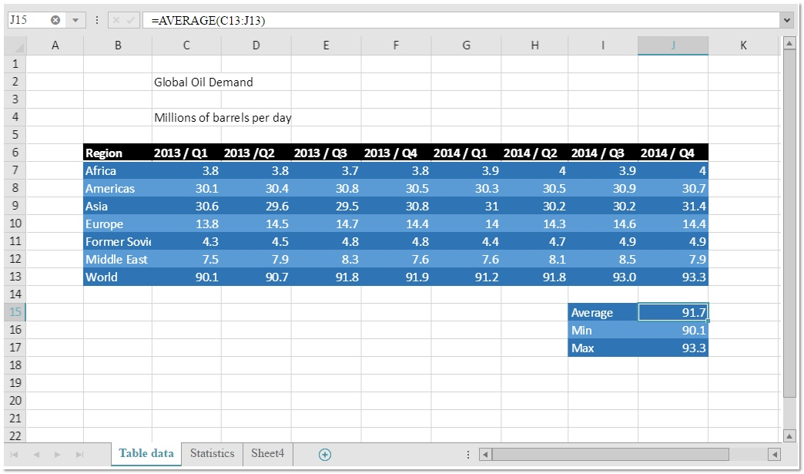
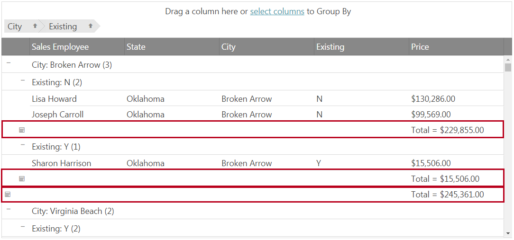

<!--
|metadata|
{
    "fileName": "whats-new-in-2017-volume1",
    "controlName": [],
    "tags": []
}
|metadata|
-->

# What's New in 2017 Volume 1

This topic presents the controls and the new and enhanced features for the Ignite UI™ 2017 Volume 1 release.


## What’s New Summary

The following summarizes what’s new in 2017 Volume 1. Additional details follow.

### igSpreadsheet

Feature | Description
---|---
[New control igSpreadsheet](#spreadsheet)| The igSpreadsheet is a jQuery widget that visualize excel documents in all modern browsers.

### igScheduler

Feature | Description
---|---
[New control igScheduler](#scheduler)| The igSpreadsheet is a jQuery widget that provides a common scheduling solution for presenting and managing time periods and the associated activities.

### igDataSource

Feature | Description
---|---
[Filter By Text](#filterbytext)| The igDataSource component provides a way to search for a specific words or phrases in all of its fields.

### igGrid

Feature | Description
---|---
[Date Handling](#griddatehandling)| The igGrid provides a way to control the display and edit of date values for clients in different time zones.
[More Flexible Caption](#gridcaption)| igGrid's new caption is designed to be more flexible and customizable.
[GroupBy Summaries](#groupSummaries)| The GroupBy feature now allows a summary row to be displayed below and/or above each group data island.

### igCombo

Feature | Description
---|---
[Knockout Disable Handler](#comboKnockoutDisable)| Knockout Disable binding handler has been implemnted for the combo.

### Editors

Feature | Description
---|---
[Knockout Disable Handler](#editorsKnockoutDisable)| Knockout Disable binding handler has been implemnted for the editors.


### igNumericEditor

Feature | Description
---|---
[Round Decimals](#roundDecimals)| The numeric editor introduces new option [`roundDecimals`](ui.ignumericeditor#options:roundDecimals) that allows to round values with decimal point.

### igDateEditor/igDatePicker

Feature | Description
---|---
[Date Handling](#dateHandling)| New editors' settings are needed when handling date transfers.

### igDatePicker

Feature | Description
---|---
[Date Picker Options MVC wrapper](#pickerOptionsWrapper) | When using DatePicker MVC wrapper, now additional wrapper for the date picker options is available.

## <a id="spreadsheet"></a>igSpreadsheet

In version 2017.1 we introduce the igSpreadsheet control. It is a jQuery widget that visualize excel documents in all modern browsers. For MVP version, the control has the following areas and features available:

-   Configurable component areas
    -   Formula Bar
    -   Context Menu
    -   Tab Bar Area
    -   Headers

-   Control manupaltions

    -   Selection
    -   Resizing
    -   Hiding
    -   Freezing Panes
    -   Splitting Panes
    -   Zooming

-   Data manipualtions
    -   Inserting and Deleting Cells, Columns and Rows
    -   Undo and Redo
    -   Copy and Paste
    -   Data Validation
    -   Worksheets
    -   Hyperlinks

-   Visual configurations
    -   Gridlines
    -   Cell Alignment
    -   Cell Borders
    -   Font Styles




#### Related Topics
-   [igSpreadsheet Overview](igspreadsheet-overview.html)
-   [Adding igSpreadsheet](adding-igspreadsheet.html)
-   [Configuring igSpreadsheet](igspreadsheet-configuring.html)


#### Related Samples
-   [Overview](%%SamplesUrl%%/spreadsheet/overview)
-   [View Configuration](%%SamplesUrl%%/spreadsheet/create-view-save)
-   [Import Data From Excel File](%%SamplesUrl%%/spreadsheet/loading-data)

## <a id="scheduler"></a> igScheduler
### New Control

The `igScheduler`™ control provides a common scheduling solution for presenting and managing time periods and the associated activities.

### Supported features:
-   Creating, editing and deleting of appointment.
    -   Configurable appointments display mode in the month view calendar (indicator or event subject).
    -   Assigning appointments to color themed resources.
-   Using different views (month and agenda view).
    -   Month and agenda views switching support
    -   Agenda view in month view support.
    -   Configurable agenda view days display range.
-   All day events supported.
-   Desktop, tablet and phone layout.
-   Responsive design.
    -   Desktop environment optimized UI.
-   Resources color scheme support.
-   Keyboard navigation support.
-   Localization support.


#### Related Topics
-   [igScheduler Overview](igScheduler-Overview.html)
-   [Configuring igScheduler](igscheduler-configuring.html)
-	[Adding igScheduler](igscheduler-adding-igscheduler.html)
-	[Configuring igScheduler](igscheduler-Configuring.html)
-	[Styling igScheduler](igscheduler-using-themes.html)
-	[Accessibility Compliance (igScheduler)](igscheduler-accessibility-compliance.html)
-	[Known Issues and Limitations (igScheduler)](igscheduler-known-limitations.html)

#### Related Samples

-   [igScheduler Agenda View](%%SamplesUrl%%/scheduler/agenda-view)
-   [igScheduler Agenda View](%%SamplesUrl%%/scheduler/appointment-indicators)

## igDataSource

### <a id="filterbytext"></a> Filter By Text

The igDataSource component provides a way to search for a specific words or phrases in all of its fields via the 'filterByText' method.

## igGrid

### <a id="griddatehandling"></a> Date Handling

When enabled for the igGrid, the EnableUTCDates option allows dates to be formatted as UTC dates on the client side. As a date value is received from the server it goes through a formatter function to display the date. If enableUTCDates is set to false, the final result returns date values via the standard date object methods (getFullYear(), getMonth(), getDate(),getHours() etc.) and if set to true UTC equivalents ( getUTCFullYear(), getUTCMonth(), getUTCDate(), getUTCHours() etc.) are used. 

### <a id="gridcaption"></a> Grid's Caption

The igGrid's caption now provides the ability to render HTML elements in it in order to give the user more customizability and flexability. It also comes with useful events for full control of its initialization.

### <a id="groupSummaries"></a> GroupBy Summaries

The GroupBy Summaries feature allows an additional summary row to be displayed below and/or above each group data island that displays summary information for the data columns in that island. The summary row is visible only when the related group is expanded.



#### Related Topics
-   [GroupBy Summaries Feature Overview (igGrid)](igGrid-GroupBy-Summaries.html)

#### Related Samples
-   [Grouping with summaries](%%SamplesUrl%%/grid/grouping)


## igCombo

### <a id="comboKnockoutDisable"></a> Knockout Disable Handler

If a developer wants to apply the Knockout [`disabled`](http://knockoutjs.com/documentation/disable-binding.html) binding handler to the combo control, it will not work and will not automatically enables/disables it. This is because combo has a special logic that handles enabling/disabling of the control. For that purpose additional `igComboDisable` binding handler is created, which implements the behavior, expected, when using the Knockout `disabled` handler.

#### Related Topics
-   [Configuring Knockout Support (igCombo)](igCombo-KnockoutJS-Support.html#)

## Editors

### <a id="editorsKnockoutDisable"></a> Knockout Disable Handler

If a developer wants to apply the Knockout [`disabled`](http://knockoutjs.com/documentation/disable-binding.html) binding handler to the editors, it will not work and will not automatically enables/disables them. This is because editors have a special logic that handles enabling/disabling of the control. For that purpose additional `igEditorDisable` binding handler is created, which implements the behavior, expected, when using the Knockout `disabled` handler.

#### Related Topics
-   [Configuring Knockout Support (Editors)](Configuring-Knockout-Support-%28Editors%29.html)


## igNumericEditor

### <a id="roundDecimals"></a> Round Decimals

In previous versions of the product, if user sets or enters a value in a numeric editor that has more decimal places than the one defined in the `maxDecimals` option, then the value was truncated. E.g. If an editor with defined 'maxDecimals' to `3`, receives a value `123.4567`, then it will be truncated to `123.456`. With version 17.1 of the product, a new option [`roundDecimals`](ui.ignumericeditor#options:roundDecimals) is introduced, which is enabled by default and rounds the numeric values, using the JavaScript `Math.round()` function. This means that the value of `123.4567` will be rounded and displayed in the editor as `123.457`. If the [`roundDecimals`](ui.ignumericeditor#options:roundDecimals) is disabled, then it will truncate the value and will show it as `123.456`, like in the old versions.

## igDateEditor/igDatePicker

### <a id="dateHandling"></a> Date Handling

When the dates in the editors are transferred from the client to the server аnd vice versa, the options [`enableUTCDates`](%%jQueryApiUrl%%/ui.igdateeditor#options:enableUTCDates) and [`displayTimeOffset`](%%jQueryApiUrl%%/ui.igdateeditor#options:displayTimeOffset) can be used to configure the editоrs and to properly handle date transfer.

#### Related Topics
-   [Migrating enableUTCDate option in 17.1](Migrating-enableUTCDates-option-in-17-1.html)
-   [Ignite UI controls in different time zones](Using-IgniteUI-controls-in-different-time-zones.html)

## igDatePicker

### <a id="pickerOptionsWrapper"></a> Date Picker Options MVC wrapper

The DatePicker MVC wrapper is extended to allow the definition of the date picker options, using additional MVC wrapper. The new wrapper contains all the jQuery UI datepicker options that can be applied to our igDatePicker. Here is an example of how it can be configured in MVC:

```
@(Html.Infragistics()
	.DatePicker()
	.DropDownAnimationDuration(1000)
	.DatePickerOptions(options => {
		 options.DefaultDate("+8");
		 options.MinDate("-5d");
		 options.MaxDate("+10d");

		 options.FirstDay(FirstWeekDay.Monday);
		 options.ShowWeek(true);

		 options.ShowOtherMonths(true);
		 options.SelectOtherMonths(true);

		 options.ChangeMonth(true);
		 options.ChangeYear(true);
		 options.AddClientEvent("onChangeMonthYear", "onChangeMonthYearHandler");

		 options.ShowButtonPanel(true);
		 options.GoToCurrent(true);

		 options.ShowAnim(AnimationEffect.Show);

		 options.AddClientEvent("onSelect", "onSelectHandler");
		 options.AddClientEvent("onClose", "onCloseHandler");
	})
	.Render())
```