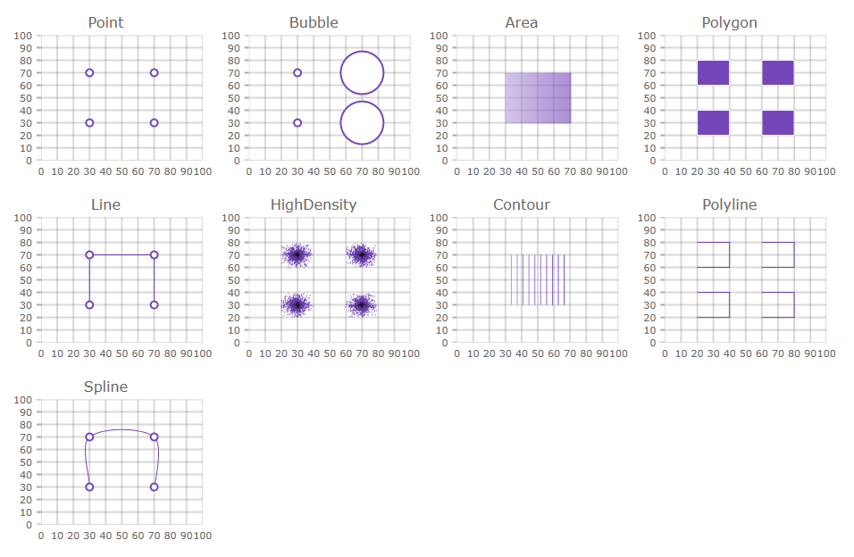

<!--
|metadata|
{
    "fileName": "whats-new-in-2017-volume2",
    "controlName": [],
    "tags": []
}
|metadata|
-->

# What's New in 2017 Volume 2

This topic presents the controls and the new and enhanced features for the Ignite UI™ 2017 Volume 1 release.


### Overview

The following table summarizes what’s new in 2017 Volume 2 and additional details follow.

Feature | Description
---|---
[New bundled files](#bundledFiles)| New bundled files for excel, spreadsheet and scheduler.
[New Localization and Globalization settings](#localization) | Globalization and Localizations options can now be set for all localizable components, either globally (for all controls on the page) or per control both on initialization or runtime.
.NET Core 2.0 support | IgniteUI MVC wrappers are now compatible with .NET Core 2.0 and Razor Pages.

### Spreadsheet
Feature | Description
---|---
[Editing](#spreadsheetEditing)| Editing of spreadsheet content.
[MVC Wrapper](#spreadsheetMVCWrapper)| MVC wrapper for the spreadsheet control.

### Editors

Feature | Description
---|---
[Suppress Keyboard](#suppressKeyboard)| Prevents onscreen keyboard from showing when the dropdown button is clicked/tapped.

### igDateEditor/igDatePicker

Feature | Description
---|---
[Spin Delta as Object](#spinDeltaObject)| Spin delta can be configured as an object, which defines specific values for each time period.

### igValidator

Feature | Description
---|---
[Execute all rules](#execute-all-rules)| New option allows multiple rules to run and display multiple error messages.

### igShapeChart

Feature | Description
---|---
[New control igShapeChart](#igshapechart-control)| New lightweight, highly performant chart. 


### igDataChart

Feature | Description
---|---
[New Axis TimeXAxis](#time-x-axis)| New axis type for igDataChart.
[New Series Types](#new-series)| More series types are available in the igDataChart now.

### igGrid

Feature | Description
---|---
[Physical Cell Merging](#cell-merging) | The igGrid Cell Merging feature now supports physical cell merging.
### igScheduler
Feature | Description
---|---
[Week View](#weekView)| Visualizing the activities by rendering them in a vertical list with time slots.|
[Day View](#dayView)| Visualizing the activities by rendering them in a vertical list with time slots. The time slots' duration can be configured.|
[Recurrent Activity](#recurrentActivity)| Used when you need to have repetitions of an activity following a specific recurrence pattern (for example each day at a specific hour or each month at a specific date).
[Scheduler MVC wrapper](igscheduler-asp-net-mvc-wrapper.html) | Build ASP.NET MVC wrapper for `igScheduler`.


## General

### <a id="bundledFiles"></a> New bundled files
New bundled files for excel, spreadsheet and scheduler have been included in 17.2 release. You can use them instead of defining individual required resources, or instead of using the igLoader. In order to run excel, spreadsheet or scheduler, it is needed to define the following bundled resources:

igGrid excel exporting using igExcel
```
<script type="text/javascript" src="igniteui/js/infragistics.core.js"></script>
<script type="text/javascript" src="igniteui/js/infragistics.lob.js"></script>
<script type="text/javascript" src="igniteui/js/infragistics.excel-bundled.js"></script>
<script type="text/javascript" src="igniteui/js/modules/infragistics.gridexcelexporter.js"></script>
```

igSpreadsheet
```
<script src="igniteui/js/infragistics.core.js"></script>
<script src="igniteui/js/infragistics.lob.js"></script>
<script src="igniteui/js/infragistics.excel-bundled.js"></script>
<script src="igniteui/js/infragistics.spreadsheet-bundled.js"></script>
```

igScheduler
```
<script src="igniteui/js/infragistics.core.js"></script>
<script src="igniteui/js/infragistics.lob.js"></script>
<script src="igniteui/js/infragistics.scheduler-bundled.js"></script>
```
### <a id='localization'></a> New Localization and Globalization settings

The following new options and methods have been introduced in order to allow setting and/or changing at runtime the current language/regional for all localizable components on the page or per control.

#### Global settings and APIs
##### settings

Option Name | Description| Default value
------------|----------- |--------------
$.ig.util.language | Gets/Sets global language used for all controls on initialization. | en
$.ig.util.regional | Gets/Sets global regional used for all controls on initialization. | en-US

##### APIs

Method Name | Description
------------|-----------
$.ig.util.changeGlobalLanguage | Changes the language for all controls on the page.
$.ig.util.changeGlobalRegional  | Changes the regional for all controls on the page.


#### Control specific settings

Option Name | Description| Default value
-------------|------------| -------------
language | Sets/Gets the locale language setting for the widget.| en
regional | Sets/Gets the regional setting for the widget. | en-US
locale | Sets/Gets the locale setting for the widget. | null

## Spreadsheet

### <a id="spreadsheetEditing"></a> Editing of the spreadsheet content

Version 17.2 of the product adds support for editing of the spreadsheet's cells, extending the inaugural features of the Spreadsheet control. There are several new API events, methods and options that can be used when manipulating spreadsheet content.

New events:
-   [`editModeEntering`](%%jQueryApiUrl%%/ui.igspreadsheet#events:editModeEntering) - Invoked when the Spreadsheet is about to start in-place editing of the [`activeCell`](%%jQueryApiUrl%%/ui.igspreadsheet#options:activeCell).
-   [`editModeEntered`](%%jQueryApiUrl%%/ui.igspreadsheet#events:editModeEntered) - Invoked when the Spreadsheet has started in-place editing of the [`activeCell`](%%jQueryApiUrl%%/ui.igspreadsheet#options:activeCell).
-   [`editModeExiting`](%%jQueryApiUrl%%/ui.igspreadsheet#events:editModeExiting) - Invoked when the Spreadsheet is about to end the in-place editing of the [`activeCell`](%%jQueryApiUrl%%/ui.igspreadsheet#options:activeCell).
-   [`editModeExited`](%%jQueryApiUrl%%/ui.igspreadsheet#events:editModeExited) - Invoked when the Spreadsheet has ended the in-place editing of the [`activeCell`](%%jQueryApiUrl%%/ui.igspreadsheet#options:activeCell).
-   [`editModeValidationError`](%%jQueryApiUrl%%/ui.igspreadsheet#events:editModeValidationError) - Invoked when the Spreadsheet is exiting edit mode and the new value for the [`activeCell`](%%jQueryApiUrl%%/ui.igspreadsheet#options:activeCell) is not valid based on the criteria of that cell's [`ig.excel.DataValidationRule`](%%jQueryApiUrl%%/ig.excel.DataValidationRule).


New methods:
-   [`getIsInEditMode()`](%%jQueryApiUrl%%/ui.igspreadsheet#methods:getIsInEditMode) - Indicates if the control is currently editing the value of the [`activeCell`](%%jQueryApiUrl%%/ui.igspreadsheet#options:activeCell).
-   [`getCellEditMode()`](%%jQueryApiUrl%%/ui.igspreadsheet#methods:getCellEditMode) - Returns an enumeration used to indicate the current edit mode state.

New options:
-   [`isFixedDecimalEnabled`](%%jQueryApiUrl%%/ui.igspreadsheet#options:isFixedDecimalEnabled) - Indicates whether a fixed decimal place is automatically added when a whole number is entered while in edit mode.
-   [`fixedDecimalPlaceCount`](%%jQueryApiUrl%%/ui.igspreadsheet#options:fixedDecimalPlaceCount) - Number of decimal places by which a whole number typed in during edit mode should be adjusted.

#### Related Topics
-   [igSpreadsheet Overview](igspreadsheet-overview.html)
-   [Editing API (igSpreadsheet)](igspreadsheet-editing.html)

#### Related Samples
-   [Overview](%%SamplesUrl%%/spreadsheet/overview)
-   [View Configuration](%%SamplesUrl%%/spreadsheet/create-view-save)
-   [Import Data From Excel File](%%SamplesUrl%%/spreadsheet/loading-data)

## Editors

### <a id="suppressKeyboard"></a> Suppress Keyboard

The [`suppressKeyboard`](%%jQueryApiUrl%%/ui.igtexteditor#options:suppressKeyboard) option prevents the onscreen keyboard (if available on device) to be shown when the dropdown button is clicked/tapped. This option prevents initial focus or removes it when the drop button is clicked/tapped.

## igDateEditor/igDatePicker

### <a id="spinDeltaObject"></a> Spin Delta as Object

The [`spinDelta`](%%jQueryApiUrl%%/ui.igdateeditor#options:spinDelta) option can be configured as an object, which defines specific values for each time period.
Accepted values for client-side widget's deltas are positive integer numbers, and the fractional portion of floating point numbers is ignored.
Accepted values for MVC wrapper's deltas are integer numbers.

The option can accept the following format:

```
$("#editor").igDateEditor({
    value: new Date(2017, 11, 8, 1, 1, 1),
    dateInputFormat: "dateTime",
    spinDelta: {
        year: 4,
        month: 3,
        day: 10,
        hours: 12,
        minutes: 15,
        seconds: 10,
        milliseconds: 100
    }
});
```

In MVC:
```
@(Html.Infragistics()
	.DateEditor()
	.Value(new DateTime(2017, 11, 8, 1, 1, 1))
    .DateInputFormat("dateTime")
    .SpinDelta(deltas =>
    {
        deltas.Year(4);
        deltas.Month(3);
        deltas.Day(10);
        deltas.Hours(12);
        deltas.Minutes(15);
        deltas.Seconds(10);
        deltas.Milliseconds(100);
    })
	.Render())
```

## igValidator

### <a id="execute-all-rules"></a> Execute all rules
The `igValidator` now supports a new [`executeAllRules`](%%jQueryApiUrl%%/ui.igValidator#options:executeAllRules) option that allows multiple rules to run even if one has already failed and thus produce and display multiple error messages.


Error related events like [`error`](%%jQueryApiUrl%%/ui.igValidator#events:error) and [`validated`](%%jQueryApiUrl%%/ui.igValidator#events:validated) now also provide `ui.rules` and `ui.messages` array arguments, listing in order each rule that did not pass and its message.

With this execution process change, rules also specify if they should run for empty values and the [`custom`](%%jQueryApiUrl%%/ui.igValidator#options:custom) rule is now allowed to run without one. This allows for scenarios where validation based on external factors can be applied on the empty value independently of the `required` option.

#### Related Topics
-   [Validation Rules](igValidator-Validation-Rules.html)


## <a id="igshapechart-control"></a> igShapeChart

The `igShapeChart` is a lightweight, highly performant chart. This chart can be easily configured to display scatter X/Y points, shape files or any custom shape that you can define using an array of arrays of X/Y points. The `igShapeChart` control is using a smart data adapter in order to analyze bound data and select an appropriate visualization to render. However, it is possible to specify which chart type the `igShapeChart` will use by setting the `chartType` property to one of the following values: `Area`,`Bubble`,`Contour`,`HighDensity`,`Point`,`Line`, `Spline`, `Polygon`, or `Polyline`. 



In addition, this chart can render break-even data as long as at least one data item has `FixedCost`, `VariableCost`, `SalesRevenue`, and `SalesUnits` data columns.


#### Related Topics
-   [igShapeChart Overview](shapechart-overview.html)
-   [Getting Started with Shapechart](shapechart-getting-started-with-shapechart.html)

## igDataChart

### <a id="time-x-axis"></a> TimeXAxis

A new axis, time x-axis, is added to the igDataChart this release. By default, this axis will automatically apply label formats which dynamically change as the user zooms into data. In addition, axis breaks may be configured to omit dates within a range.  For example, weekends can be skipped, or any range of dates considered insignificant can be skipped. The axis can also be configured to override the default label-formatting scheme for custom configuration of labels at varying visible date ranges.

#### Related Topics
-   [Configuring TimeXAxis (igDataChart)](igdatachart-configuring-timexaxis.html)

### <a id="new-series"></a> New Series Types

The following series types can be used with the igDataChart control:

* [Scatter Area Series](TriangulationSeries-Area-Series.html)
* [scatter Contour Series](TriangulationSeries-Contour-Series.html)
* [scatter Polyline Series](ShapeSeries-Polyline-Series.html)
* [scatter Polygon Series ](ShapeSeries-Polygon-Series.html)
 


## igScheduler

### <a id="weekView"></a> Week View
This view is visualizing the activities by rendering them in a vertical list with time slots. It is possible to show all seven week days or only the working days by using `weekViewDiplayMode` property.
Configuration to show all 24 hours or only the working hours is also possible.

### <a id="dayView"></a> Day View
Visualizing the activities by rendering them in a vertical list with time slots. Each activity occupies only the time slots between its start and end time.
This view has the ability to show up to 7 days. You can configure the day view to display all 24 hours or only the working hours.

### <a id="recurrentActivity"></a> Recurrent Activity
The activity recurrence is used when you need to have repetitions of an activity following a specific recurrence pattern (for example each day at a specific hour or each month at a specific date).

## igGrid

### <a id="cell-merging"></a> igGrid Physical Cell Merging

The igGrid Cell Merging feature now supports physical cell merging. The merging mode is specified via the [*mergeType*](%%jQueryApiUrl%%/ui.iggridcellmerging#options:mergeType) option.

**Enabling physical merging**

```js
$("#grid").igGrid({
 features: [
 	{
   	 	name: "Sorting"
    },
 	{
    	name: "CellMerging",
        mergeType: "physical"
    }
 ]
});

```
With this mode the cell DOM elements are physically merged into one cell with a corresponding rowSpan attribute as opposed to the "visual" merge mode where the DOM cells retain their DOM structure and are visually merged via css.

The following additional options have been added in order to allow further customization of the merging behavior:

 Option Name | Description | Default value
-------------|-------------|---------------
[mergeOn](%%jQueryApiUrl%%/ui.iggridcellmerging#options:mergeOn) | Defines when merging should be applied. | "sorting"
[mergeStrategy](%%jQueryApiUrl%%/ui.iggridcellmerging#options:mergeStrategy) | Defines the rules merging is based on. | "duplicate"
[columnSettings](%%jQueryApiUrl%%/ui.iggridcellmerging#options:columnSettings) | A list of column settings that specifies hiding options on a per column basis. | [ ]

#### Related Topics
- [Cell Merging Overview (igGrid)](igGrid-CellMerging-Overview.html): This topic explains the `igGrid` control’s Cells Merging feature and its functionality. It contains code examples demonstrating how to enable and configure cell merging in the `igGrid`.