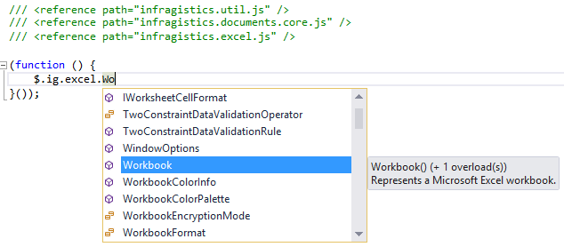
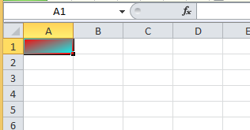
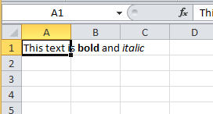

<!--
|metadata|
{
    "fileName": "javascript-excel-library-overview",
    "controlName": ["igExcel"],
    "tags": []
}
|metadata|
-->

# JavaScript Excel Library Overview

The Excel library is a JavaScript-only client-side library which can be used to load and save Microsoft Excel documents in the 2003 (.xls) and later file formats. The library supports getting and setting data and various format properties on rows, columns and cells. Further, the library also gives you the ability to control:

-   cell styles
-   merged cells
-   tables (with sorting and filtering)
-   data validations
-   formula solving
-   named references
-   cell values with mixed formatting
-   and more…

The Excel library can be used to export a grid or table to a workbook document on the client machine or read an Excel document and display its data in the browser. The library can even be used to solve formulas in the browser just as they would be calculated in Excel, all without sending anything to the server.

## Setting up the Environment

To use the Excel library, you must reference the following JavaScript files from the %%ProductName%% product, which are the minimum required:

-   infragistics.util.js
-   infragistics.ext_core.js [new in 17.1]
-   infragistics.ext_collections.js [new in 17.1]
-   infragistics.ext_text.js [new in 17.1]
-   infragistics.ext_io.js [new in 17.1]
-   infragistics.ext_ui.js [new in 17.1]
-   infragistics.documents.core_core.js [new in 17.1]
-   infragistics.ext_collectionsextended.js [new in 17.1]
-   infragistics.excel_core.js [new in 17.1]

When а worksheet object needs to be loaded from an existing Excel file or saved to a new Excel file (in the default Office Excel 2007 (and later) XML-based file format.), then you must reference the following as well:

-   infragistics.ext_threading.js [new in 17.1]
-   infragistics.ext_web.js [new in 17.1]
-   infragistics.xml.js [new in 17.1]
-   infragistics.documents.core_openxml.js [new in 17.1]
-   infragistics.excel_serialization_openxml.js [new in 17.1]

In addition, if you are working in Visual Studio, you can include the following IntelliSense annotation files to get better statement completion support and descriptions while coding:

-   infragistics.documents.core_core.intellisense.js [new in 17.1]
-   infragistics.excel_core.intellisense.js [new in 17.1]
-   infragistics.excel_serialization_openxml.intellisense.js [new in 17.1]

Once these references are included, you need to add the following code to the top of your `.js` files which has code using the Excel library:

**In JavaScript:**
```js
/// <reference path="infragistics.util.js" />
/// <reference path="infragistics.ext_core.js" />
/// <reference path="infragistics.ext_collections.js" />
/// <reference path="infragistics.ext_text.js" />
/// <reference path="infragistics.ext_io.js" />
/// <reference path="infragistics.ext_ui.js" />
/// <reference path="infragistics.documents.core_core.js" />
/// <reference path="infragistics.ext_collectionsextended.js" />
/// <reference path="infragistics.excel_core.js" />
/// <reference path="infragistics.ext_threading.js" />
/// <reference path="infragistics.ext_web.js" />
/// <reference path="infragistics.xml.js" />
/// <reference path="infragistics.documents.core_openxml.js" />
/// <reference path="infragistics.excel_serialization_openxml.js" />

```
With this code in place, you will start to see the Excel library types in the `$.ig.excel` namespace:



Having IntelliSense like this in place will greatly improve your productivity when working with the Excel library because you have access to important information about how to call each function and what they return.

## Creating a Workbook

You can easily create a new workbook instance using the Workbook constructor, which optionally accepts a format type.

**In JavaScript:**
```js
 var workbook = new $.ig.excel.Workbook();
// workbook.currentFormat() === $.ig.excel.WorkbookFormat.excel97To2003
```
**In JavaScript:**
```js
var workbook = new $.ig.excel.Workbook($.ig.excel.WorkbookFormat.excel2007);
// Change the format to the ISO/IEC 29500 Strict Open XML format
workbook.setCurrentFormat($.ig.excel.WorkbookFormat.strictOpenXml);
```
This code creates a workbook without the format being specified, which uses the default format of Excel 97-2003, or the .xls file format. To create a workbook with a different format, you can provide the format in the constructor or change it at runtime with the `setCurrentFormat` function:

The workbook format controls the type of data written out when the workbook is saved as well as the capabilities and limits of the objects at runtime. For example, when using the `excel97To2003` or `excel97To2003Template` formats, worksheets can only have 65,536 rows and 256 columns, whereas in all other formats, worksheets can have 1,048,576 rows and 16,384 columns.

## Adding a Worksheet

Every workbook needs at least one worksheet to be in a valid state. However, when a workbook instance is first created, it has no worksheets. Trying to save a newly created workbook will result in an error. To add a worksheet, use the add function of the workbook’s collection of worksheets.

>**Note:** The Worksheet function should never be used to construct an instance directly. In fact, many of the objects in the Excel library should never be created via constructors as they must be managed by the owning workbook and it should control their creation.

**In JavaScript:**
```js
var workbook = new $.ig.excel.Workbook();
var worksheet = workbook.worksheets().add('Sheet1');
```
Notice how the add function accepts a string: the name of the worksheet to be created, and returns the newly created worksheet instance. Many collections in the Excel library follow a similar pattern, where the add function accepts the information required to create the instance, and returns the newly created instance.

## Adding Data to a Cell

Once you have created a worksheet, the next step is most likely to populate it with data. There are a few ways to do this depending on your needs: more readable code or faster code. To add data to a cell using the most readable code, you can use the `getCell` function on the worksheet to obtain a reference to a cell instance and then set its value or apply a formula.

**In JavaScript:**
```js
var workbook = new $.ig.excel.Workbook();
var worksheet = workbook.worksheets().add('Sheet1');
var cell = worksheet.getCell('A1');
cell.value(7.354);
cell = worksheet.getCell('R2C1', $.ig.excel.CellReferenceMode.r1C1);
cell.applyFormula('=A1*2');
var x = cell.value(); // x === 14.708
```
This code snippet shows a few things. First of all, it shows the `getCell` function being used with an A1 style cell address. This is the default cell reference mode of the workbook when it is created (you can get or set the cell reference mode using the workbook’s `cellReferenceMode` function) and by default, `getCell` will use the workbook’s cell reference mode to parse the reference string and get the cell. This code also demonstrates the ability to override this cell reference mode and use the R1C1 mode to parse the reference instead. The `getCell` function can also accept the name of a named reference which refers to a cell. The call can optionally accept another cell instance as an origin cell if the reference string represents a relative reference with offsets, such as ‘R[-3]C’.

In addition to getting cell instances, this code also shows how to set a cell value with the value function. This function allows you to specify a Boolean, Number, String, Date (**Note**: Dates are not yet fully supported in the CTP, and may cause exceptions when setting them on cells or loading/saving a workbook with them as cell values), `ErrorValue` instance to represent an error literal and a `FormattedString` instance to represent text with mixed formatting. As you can also see at the end of the code, the value function can be specified with no arguments to get a cell’s value. Many functions in the Excel library representing read-write entities follow this pattern: if they are supplied an argument, they set the value and if they are invoked without arguments, they retrieve the value.

This code also demonstrates how to set formulas on a cell with the `applyFormula` function. The function accepts the formula string in the cell reference mode currently being used by the workbook (A1 by default). This code also shows that the formula’s calculated value can be obtained immediately by getting the value of the cell owning the formula.

So as stated before, that code is very readable, but could be slow if you have a loop that needs to set the values of thousands of cells. Each cell access requires parsing an address string. Also, the cells are actually owned by the row, so setting the values of multiple cells in the same row could require looking up the same row from the address over and over again. Instead, the row instance can be cached and then cells on the row can be accessed much faster:

**In JavaScript:**
```js
var workbook = new $.ig.excel.Workbook();
var worksheet = workbook.worksheets().add('Sheet1');
for (var rIndex = 0; rIndex < 100; rIndex++) {
    var row = worksheet.rows(rIndex);
    for (var cIndex = 0; cIndex < 32; cIndex++) {
        var cell = row.cells(cIndex);
        cell.value('Row :' + (rIndex + 1) + ', Column :' + (cIndex + 1));
    }
}
```
This code snippet demonstrates a few key concepts about the Excel library. First of all, rows and columns are lazily allocated the first time they are requested (*cells are always reallocated each time they are requested; this is explained more below*). This code asks for the first 100 rows without ever creating or adding them to the worksheet because each row instance will be created and added automatically the first time it is accessed. Another important concept demonstrated here is the usage of combination collection and indexer functions. One way to get and access a collection is to get the collection using the get accessor function and then index into it with the collection’s item function, but as you can see, this can get quite verbose:

**In JavaScript:**
```js
var cell = workbook.worksheets().item('Sheet1').rows().item(0).cells().item(1);
```
So in cases where a collection is read-only, the function that would normally return the collection can optionally accept arguments to indicate which element to get from the collection instead. With these combination collection and indexer functions, you can shorten the above line to this:

**In JavaScript:**
```js
var cell = workbook.worksheets('Sheet1').rows(0).cells(1);
```
And this code is much more readable, although the longer line of code above can still be used.

The code above which sets values on 3,200 cells (100 rows with 32 columns) is slightly less readable than the original code snippet because you cannot see actual cell addresses as they would appear in Excel. However, since each row is only retrieved once and no address parsing is required, this code runs faster than similar code which accesses all cells with string addresses. Beyond this optimization the code can be made to run even faster. Internally, cell instances are not retained because they do not store their data. Each row instance actually stores all data and format information for the cells it logically contains. This allows the Excel library to provide huge memory savings because it requires fewer instances to be held in memory by the object hierarchy rooted by the workbook. However, the Excel library still aims to expose an API which allows you to work with a cell as an entity. So when a cell is requested in either of the two mechanisms described so far, a transient cell instance is returned to represent a cell. Once your code no longer references the cell, it becomes free for garbage collection. The cell instance knows how to get and set information from the associated row when accessed, since the row actually owns that cell’s data. Keep in mind, however, that the cell instance is really just a wrapper around the row, and in many cases, doesn’t need to be created at all. There are many functions exposed off the row to get and set information for the cell at a particular column index. Here is the above code snippet modified to not use cell instances:

**In JavaScript:**
```js
var workbook = new $.ig.excel.Workbook();
var worksheet = workbook.worksheets().add('Sheet1');
for (var rIndex = 0; rIndex < 100; rIndex++) {
    var row = worksheet.rows(rIndex);
    for (var cIndex = 0; cIndex < 32; cIndex++) {
        row.setCellValue(cIndex, 'Row :' + (rIndex + 1) + ', Column :' + (cIndex + 1));
    }
}
```
This change results in the least readable way to set cell values, (which is only slightly less readable than the previous example) however, this approach is much more performant since it prevents the creation of 3,200 cell instances and therefore reduces a lot of memory pressure.

### Formatting a Cell

To change the format of a cell, you can get the format instance from a cell using its `cellFormat` function and then set formatting values:

**In JavaScript:**
```js
var workbook = new $.ig.excel.Workbook();
var worksheet = workbook.worksheets().add('Sheet1');
var format = worksheet.getCell("A1").cellFormat();
format.fill($.ig.excel.CellFill.createLinearGradientFill(45, '#FF0000', '#00FFFF'));
Or as described above, if you have a performance-critical area of code, you can bypass the address parsing and cell object creation by going through the row directly:
var workbook = new $.ig.excel.Workbook();
var worksheet = workbook.worksheets().add('Sheet1');
var format = worksheet.rows(0).getCellFormat(0);
format.fill($.ig.excel.CellFill.createLinearGradientFill(45, '#FF0000', '#00FFFF'));
```
Either of these two snippets create a workbook that, when saved and opened in Microsoft Excel, looks like this:



Through the format object, you can change the appearance of the cell as well as the font used to display any text. All font related properties are exposed off a font sub-object returned by the font function of the format. The following code shows the various format and font properties which can be set on a cell, row, or column:

**In JavaScript:**
```js
var workbook = new $.ig.excel.Workbook();
var worksheet = workbook.worksheets().add('Sheet1');
var format = worksheet.getCell("A1").cellFormat();
format.alignment($.ig.excel.HorizontalCellAlignment.center);
format.bottomBorderColorInfo(new $.ig.excel.WorkbookColorInfo('#FF0000'));
format.bottomBorderStyle($.ig.excel.CellBorderLineStyle.dotted);
format.indent(1);
format.fill($.ig.excel.CellFill.createLinearGradientFill(45, '#FF0000', '#00FFFF'));
format.formatString("0.00%");
format.locked($.ig.excel.ExcelDefaultableBoolean.true);
format.rotation(45);
format.shrinkToFit($.ig.excel.ExcelDefaultableBoolean.false);
format.style(workbook.styles('Bad'));
format.verticalAlignment($.ig.excel.VerticalCellAlignment.top);
format.wrapText($.ig.excel.ExcelDefaultableBoolean.true);
format.font().bold($.ig.excel.ExcelDefaultableBoolean.true);
format.font().colorInfo(new $.ig.excel.WorkbookColorInfo('#0000FF'));
format.font().height(440);
format.font().italic($.ig.excel.ExcelDefaultableBoolean.true);
format.font().name('Consolas');
format.font().strikeout($.ig.excel.ExcelDefaultableBoolean.true);
format.font().superscriptSubscriptStyle($.ig.excel.FontSuperscriptSubscriptStyle.subscript);
format.font().underlineStyle($.ig.excel.FontUnderlineStyle.single);
```
>**Note**: The JavaScript Excel library has been ported from the Infragistics C# Excel library provided on various platforms. At the time of that code’s creation, representing a Boolean with an additional default value required an enumeration type, which in this case was called `ExcelDefaultableBoolean`. Newer versions of C# now allow for a nullable Boolean, which removes the need for `ExcelDefaultableBoolean`, but removing the enumeration and using a nullable Boolean would constitute a breaking change we are not willing to make. In the porting process, the enumeration was brought over as well despite it being unnecessary in JavaScript, as the functions such as bold on the font would be able to accept true, false, or null. However, there was not sufficient time to safely make a change like this before for the CTP. For the RTM version of the JavaScript Excel library, this change will be made and `ExcelDefaultableBoolean` will no longer exist.

>**Note**: Another change which could not be made in time for the CTP was the ability to pass colors where `WorkbookColorInfo` instances are required. `WorkbookColorInfo` can represent accent and tinted colors, but in many cases, a normal RGB color with no tinting will be specified. In these cases, the color string should be sufficient and it should get wrapped in a `WorkbookColorInfo` automatically. This will be done for the RTM, but for the CTP, any place accepting a `WorkbookColorInfo` will need to have one passed in manually as shown in the snippet above.

You can also create a cell value that has mixed formatting:

**In JavaScript:**
```js
var workbook = new $.ig.excel.Workbook();
var worksheet = workbook.worksheets().add('Sheet1');
var formattedString = new $.ig.excel.FormattedString('This text is bold and italic');
// Apply the value first before changing format values since 
// formats are shared internally on the workbook
worksheet.getCell("A1").value(formattedString);
var font = formattedString.getFont(13, 4);
font.bold($.ig.excel.ExcelDefaultableBoolean.true);
font = formattedString.getFont(22);
font.italic($.ig.excel.ExcelDefaultableBoolean.true);
```
This code creates a `FormattedString` instance, sets it on a cell, and then applies font formatting to it in specific ranges of text. The `getFont` function returns fonts that apply to ranges based on a start index and optional length parameter. If the length is not specified, the returned font will control from the start index to the end of the string. These font objects are the same font sub-objects exposed by the font function of a cell format. Note that the `FormattedString` must be set on a cell before formatting can be applied because common font information is shared internally on the workbook and a standalone `FormattedString` instance has no workbook with which to share font information. This code creates the following workbook when saved and opened in Microsoft Excel:



### Saving a Workbook

To save a workbook, simply use the save function exposed off the workbook instance:

**In JavaScript:**
```js
var workbook = new $.ig.excel.Workbook();
var worksheet = workbook.worksheets().add('Sheet1');
worksheet.getCell("A1").value(1.5);
workbook.save(function (err, data) {
        
});
```
This function accepts a single callback function which will either be passed an error that happened during saving or the final data saved. This data is a Uint8Array containing the saved bytes in a representation that Microsoft Excel is able to recognize. This saved data can sent back to the server to prepare it for download or converted to a Base64 encoded string to be stored for later.

>**Note**: Currently, the save operation and callback occur synchronously, but this may change in the future if support for asynchronous saving is added.

>**Note:** *See the* **Using the JavaScript Excel Library** topic for more information on how to use the result of the result of the save function to allow a user to download a saved workbook directly from the browser (without requiring a trip back to the server).

### Loading a Workbook

To load a workbook, you do not use the Workbook constructor. Instead, Workbook has a function which loads a workbook from a Uint8Array or Base64 encoded string which will create and return the newly loaded workbook instance:

**In JavaScript:**
```js
$.ig.excel.Workbook.load(data, function (err, workbook) {
});
```
Similar to the save method, the callback function will either be passed an error that happened during loading or the newly loaded workbook instance.

>**Note**: Currently, the load operation and callback occur synchronously, but this may change in the future if support for asynchronous loading is added.

After loading, you can access the worksheets and cell data as described above.

### Getting Data from a Cell

To access the worksheets, you can use the combination collection and indexer functions mentioned above to index into the worksheets collection of the workbook. You can specify the 0-based index of the worksheet in the collection or its name. When looping over the worksheets, you would probably use the index:

**In JavaScript:**
```js
$.ig.excel.Workbook.load(data, function (err, workbook) {
    // (Error checking logic)
    for (var i = 0; i < workbook.worksheets().count(); i++) {
        var worksheet = workbook.worksheets(i);
        // ...
    }
});
```
However, if you know the case-insensitive name of a specific worksheet, you can get the worksheet with that name instead:

**In JavaScript:**
```js
$.ig.excel.Workbook.load(data, function (err, workbook) {
    // (Error checking logic)
    var worksheet = workbook.worksheets('Sheet1');
});
```
Once a reference to a worksheet is obtained, you can get a cell’s value by getting a cell instance and calling its value function without any arguments, which retrieves the value instead of setting it:

**In JavaScript:**
```js
$.ig.excel.Workbook.load(data, function (err, workbook) {
    // (Error checking logic)
    var worksheet = workbook.worksheets('Sheet1');
    var value = worksheet.getCell('A1').value();
});
```
Alternatively, if you need to obtain the cell’s value in a performance critical area of code, you can bypass the address parsing and cell instance creation, as described above, by using functions exposed directly off the row:

**In JavaScript:**
```js
$.ig.excel.Workbook.load(data, function (err, workbook) {
    // (Error checking logic)
    var worksheet = workbook.worksheets('Sheet1');
    var value = worksheet.rows(0).getCellValue(0);
});
```
In addition to getting a cell’s value, you can also get the display text that is used when displaying the value to a user in Microsoft Excel:

**In JavaScript:**
```js
var workbook = new $.ig.excel.Workbook();
var worksheet = workbook.worksheets().add('Sheet1');
var cell = worksheet.getCell('A1');
cell.cellFormat().formatString('0.00%');
cell.value(5.12638);
var text = cell.getText(); // text === '512.64%'
```
This code uses the `getText` function on the cell instance to get the value as it would be formatted in the display. You can also obtain this text without going through a cell instance by using the `getCellText` function on a row instance instead.
                    