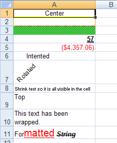

<!--
|metadata|
{
    "fileName": "javascript-excel-library-applying-styles-to-cells",
    "controlName": ["igExcel"],
    "tags": ["How Do I","Styling"]
}
|metadata|
-->

# Applying Styles to Cells

## Before You Begin
The ability to apply styles to cells is one of the ways the JavaScript Excel allows you to customize your worksheets. Every aspect of the cell can be customized and each cell can appear differently. You can control the font used in the cell, the call background and borders, and the placement and rotation of text. You can even use different formats for different pieces of text in the same cell.

Most styles can be applied by setting properties on the `cellFormat` property of [`WorksheetCell`](%%jQueryApiUrl%%/ig.excel.WorksheetCell "Link to the API Reference Guide to the worksheetCell member.") , [`WorksheetRow`](%%jQueryApiUrl%%/ig.excel.WorksheetRow "Link to the Web API Reference Guide to the WorksheetRow member.") , [`WorksheetColumn`](%%jQueryApiUrl%%/ig.excel.WorksheetColumn "Link to the Web API Reference Guide to the WorksheetColumn member.") , and [`WorksheetMergedCellsRegion`](%%jQueryApiUrl%%/ig.excel.WorksheetMergedCellsRegion "Link to the Web API Reference Guide to the WorksheetMergedCellsRegion member.") .

## What You Will Accomplish
This walkthrough will show you how to apply a variety of styles to the cells of a worksheet.

## Follow these Steps
1.  **Create a workbook with a worksheet.**
    1.  Create an HTML page.
    2.  Add a Button to it.
    3.  Create a function for its click event.
    4.  Create a Workbook with one Worksheet:

        **In JavaScript:**

        ```js
		var workbook = new $.ig.excel.Workbook();
		var worksheet = workbook.worksheets().add("Sheet1");
        ```

    5.  Increase the width of the first column so all text for the cells is visible:

        **In JavaScript:**

        ```js
		worksheet.columns(0).width(6000);
        ```

2.  **Apply the styles to the cells.**
    1.  Change the horizontal alignment of a cell so the value is centered in the cell:

        **In JavaScript:**

        ```js
        worksheet.rows(0).cells(0).value("Center");
		worksheet.rows(0].cells(0).cellFormat().alignment($.ig.excel.HorizontalCellAlignment.center);
        ```

    2.  Give the cell different border styles and colors to separate it from other cells:

        **In JavaScript:**

        ```js
        worksheet.rows(1).cells(0).cellFormat().bottomBorderColor(new $.ig.excel.WorkbookColorInfo("red"));
		worksheet.rows(1).cells(0).cellFormat().bottomBorderStyle($.ig.excel.CellBorderLineStyle.dashDot);
		worksheet.rows(1).cells(0).cellFormat().leftBorderColor(new $.ig.excel.WorkbookColorInfo("yellow"));
		worksheet.rows(1).cells(0).cellFormat().leftBorderStyle($.ig.excel.CellBorderLineStyle.thick);
		worksheet.rows(1).cells(0).cellFormat().rightBorderColor(new $.ig.excel.WorkbookColorInfo("orange"));
		worksheet.rows(1).cells(0).cellFormat().rightBorderStyle($.ig.excel.CellBorderLineStyle.thin);
		worksheet.rows(1).cells(0).cellFormat().topBorderColor(new $.ig.excel.WorkbookColorInfo("blue"));
		worksheet.rows(1).cells(0).cellFormat().topBorderStyle($.ig.excel.CellBorderLineStyle.double);
        ```

    3.  Apply a background style to a cell to it stands out:

        **In JavaScript:**

        ```js
		worksheet.rows(2).cells(0).cellFormat().fill($.ig.excel.CellFill.createPatternFill("lime", "gray", $.ig.excel.FillPatternStyle.diagonalCrosshatch);
        ```

    4.  Change the font of a cell so its value appears differently:

        **In JavaScript:**

        ```js
		worksheet.rows(3).cells(0).value(57);
		worksheet.rows(3).cells(0).cellFormat().font().bold(true);
		worksheet.rows(3).cells(0).cellFormat().font().underlineStyle($.ig.excel.FontUnderlineStyle.double);
        ```

    5.  Apply a format string to a cell so the type of value displayed is easily recognized (the following cell is used to display currency):

        **In JavaScript:**

        ```js
		worksheet.rows(4).cells(0).value(-4357.059);
		worksheet.rows(4).cells(0).cellFormat().formatString("\"$\"#,##0.00_);[Red](\"$\"#,##0.00)");
        ```

    6.  Indent text in a cell:

        **In JavaScript:**

        ```js
        worksheet.rows(5).cells(0).value("Intented");
		worksheet.rows(5).cells(0).cellFormat().indent(2);
        ```

    7.  Rotate text in a cell:

        **In JavaScript:**

        ```js
        worksheet.rows(6).cells(0).value("Rotated");
		worksheet.rows(6).cells(0].cellFormat().rotation(45);
        ```

    8.  Shrink text to fit in the cell:

        **In JavaScript:**

        ```js
		worksheet.rows(7).cells(0).value("Shrink text so it is all visible in the cell");
		worksheet.rows(7).cells(0).cellFormat().ShrinkToFit(true);
        ```

    9.  Change the vertical alignment of a cell so the value appears at the top of the cell when it does not have a default height:

        **In JavaScript:**

        ```js
		worksheet.rows(8).height(500);
		worksheet.rows(8).cells(0).value("Top");
		worksheet.rows(8).cells(0).cellFormat().verticalAlignment($.ig.excel.VerticalCellAlignment.top);
        ```

    10. Wrap the text in a cell so it does hang over into the next cell or get cut off:

        **In JavaScript:**

        ```js
		worksheet.rows(9).cells(0).value("This text has been wrapped.");
		worksheet.rows(9).cells(0).cellFormat().wrapText(true);
        ```

    11. Apply mixed formatting to the text in a cell using a FormattedString object:

        **In JavaScript:**

        ```js
		var formattedString = new $.ig.excel.FormattedString( "Formatted String" );
		worksheet.rows(10).cells(0).value(formattedString);
		
		var font1 = formattedString.getFont( 3, 6 );
		font1.color(new $.ig.excel.WorkbookColorInfo("red"));
		font1.underlineStyle($.ig.excel.FontUnderlineStyle.single);
		font1.height(300);
		
		var font2 = formattedString.getFont( 10 );
		font2.bold(true); 
		font2.italic(true);
		font2.strikeout(true);
        ```

3.  **Serialize the workbook.**

    Save the workbook:

    **In JavaScript:**

    ```js
	workbook.save(function(data) { 
	  },
	  function(error) {
	  });
    ```




 

 


