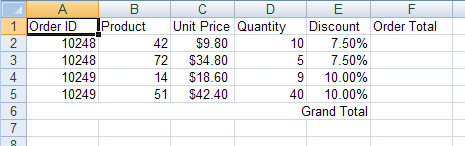
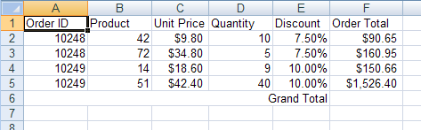
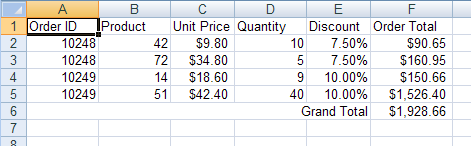

<!--
|metadata|
{
    "fileName": "javascript-excel-library-calculating-order-totals",
    "controlName": ["igExcel"],
    "tags": ["Getting Started","How Do I"]
}
|metadata|
-->

# Calculating Order Totals

## Before You Begin
A common task in a Microsoft® Excel® workbook is to store a column or row of numerical data and have a cell containing the total of these numbers. The nice thing about this total is it can automatically update when one of the numbers changes. You can create a total cell in a worksheet by applying a formula as the cell's value.

## What You Will Accomplish
Using this topic, you will learn how to create cells contains totals of data in the worksheet.

## Follow these Steps
1.  **Create a workbook with a worksheet.**
    1.  Create an HTML page.
    2.  Add a Button to it.
    3.  Create a function for its click event.
    4.  Create a Workbook with one Worksheet:

        **In JavaScript:**

        ```js
		var workbook = new $.ig.excel.Workbook();
		var worksheet = workbook.worksheets().add("Sheet1");
        ```

2.  **Define the columns for the worksheet data.**
    1.  Make column headers so the data is easily identified:

        **In JavaScript:**

        ```js
		var headersRow = worksheet.rows(0);
		headersRow.cells(0).value("Order ID");
		headersRow.cells(1).value("Product");
		headersRow.cells(2).value("Unit Price");
		headersRow.cells(3).value("Quantity");
		headersRow.cells(4).value("Discount");
		headersRow.cells(5).value("Order Total");
        ```

    2.  Set special formatting for any columns which require it:

        **In JavaScript:**

        ```js
        // The "Unit Price" column should display its values as dollars
		worksheet.columns(2).cellFormat.formatString("\"$\"#,##0.00_);(\"$\"#,##0.00)");
		
		// The "Discount" column should display its values as percentages
		worksheet.columns(4).cellFormat.formatString("0.00%");
		
		// The "Order Total" column should display its values as dollars
		worksheet.columns(5).cellFormat.formatString("\"$\"#,##0.00_);(\"$\"#,##0;00)");
		// Allow enough room to display the totals
		worksheet.columns(5).width(3000);
        ```

3.  **Populate the cells with data.**
    1.  Populate the cells with data (not the cells that will contain totals; those will be calculated by formulas later):

        **In JavaScript:**

        ```js
		var currentRow = worksheet.rows(1);
		currentRow.cells(0).value(10248);
		currentRow.cells(1).value(42);
		currentRow.cells(2).value(9.80);
		currentRow.cells(3).value(10);
		currentRow.cells(4).value(0.075);
		
		currentRow = worksheet.rows(2);
		currentRow.cells(0).value(10248);
		currentRow.cells(1).value(72);
		currentRow.cells(2).value(34.80);
		currentRow.cells(3).value(5);
		currentRow.cells(4).value(0.075);
		
		currentRow = worksheet.rows(3);
		currentRow.cells(0).value(10249);
		currentRow.cells(1).value(14);
		currentRow.cells(2).value(18.60);
		currentRow.cells(3).value(9);
		currentRow.cells(4).value(0.1);
		
		currentRow = worksheet.rows(4);
		currentRow.cells(0).value(10249);
		currentRow.cells(1).value(51);
		currentRow.cells(2).value(42.40);
		currentRow.cells(3).value(40);
		currentRow.cells(4).value(0.1);
        ```

4.  **Create a Grand Total label under the data.**
    1.  Create a merged cell, update the data, and apply a label:

        **In JavaScript:**

        ```js
		var mergedCell = worksheet.mergedCellsRegions().add( 5, 0, 5, 4 );
		mergedCell.value("Grand Total");
        ```

    2.  Adjust the text alignment so the label appears closer to where the Grand Total cell will be:

        **In JavaScript:**

        ```js
		mergedCell.cellFormat().alignment($.ig.excel.HorizontalCellAlignment.right);
        ```

	

5.  **Apply a formula to calculate the sub total of each order record.**
    1.  Create a formula that calculates the order total. The formula will multiply the unit price by the quantity, and remove the discount from the total: =[UnitPrice]*[Quantity]*(1-[Discount]). The formula will be created as if it were calculating the order total for the first order (the total in cell F2). However, the formula will be created using relative cell references, so when it is applied to the other order total cells, the cell references will be correctly shifted downwards:

        **In JavaScript:**

        ```js
		var orderTotalFormula = $.ig.excel.Formula.parse("=C2*D2*(1-E2)", $.ig.excel.CellReferenceMode.a1);
        ```

    2.  Create a cell region that defines the cells to which the formula will be applied:

        **In JavaScript:**

        ```js
		var region = new $.ig.excel.WorksheetRegion(worksheet, 1, 5, 4, 5);
        ```

    3.  Apply the formula to the region of order total cells:

        **In JavaScript:**

        ```js
        orderTotalFormula.applyTo( region );
        ```

	

6.  **Apply a formula to determine the grand total.**
    1.  Create a formula to total all "Order Total" cells for a grand total. This formula will use absolute references by prefacing row and column identifiers with a dollar sign ($), but relative references can be used as well:

        **In JavaScript:**

        ```js
		var grandTotalFormula = $.ig.excel.Formula.parse("=SUM($F$2:$F$5)", $.ig.excel.CellReferenceMode.a1);
        ```

    2.  Apply the formula to the grand total cell:

        **In JavaScript:**

        ```js
        grandTotalFormula.applyTo(worksheet.rows(5).cells(5));
        ```

	

7.  **Save the workbook**

    Save the workbook:

    **In JavaScript:**

    ```js
	workbook.save(function(data) { 
	  },
	  function(error) {
	  });
    ```