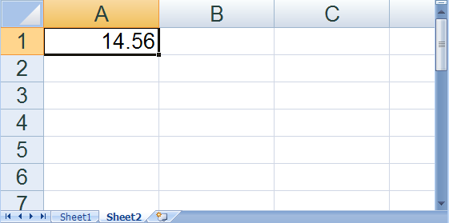

<!--
|metadata|
{
    "fileName": "javascript-excel-library-create-a-workbook",
    "controlName": ["igExcel"],
    "tags": ["Getting Started"]
}
|metadata|
-->

# Create a Workbook

Before you can take advantage of the features in the JavaScript Excel Library, you will need to create a [Workbook](%%jQueryApiUrl%%/ig.excel.Workbook "Link to the Web API Reference Guide to the Workbook member.") object. You can do this by either reading an existing Microsoft® Excel® file, as explained in the How Do I... topic: [Read an Excel File into a Workbook](JavaScript-Excel-Library-Read-an-Excel-2007-XLSX-File-Into-a-Workbook.html "Explains how to read and excel file into a workbook.") or you can create a blank workbook. When you create a blank workbook, before writing it to a file, you must add at least one worksheet. You can also set various display and print options on the workbook and worksheets.

The following code demonstrates how to create a blank workbook, set a few properties, and add some worksheets.

**In JavaScript:**

```js
// Create a new workbook
// Create a new workbook
var workbook = new $.ig.excel.Workbook();

// Show only the vertical scroll bar
workbook.windowOptions().scrollBars($.ig.excel.ScrollBars.vertical);

// Create two worksheets for the workbook
var worksheet1 = workbook.worksheets().add("Sheet1");
var worksheet2 = workbook.worksheets().add("Sheet2");

// Set the value of one of the cells
worksheet2.rows(0).cells(0).value(14.56);

// Zoom in to double the normal viewing size on Sheet2
worksheet2.displayOptions().magnificationInNormalView(200);

// Make Sheet2 the selected worksheet
workbook.windowOptions().selectedWorksheet(worksheet2);
```
