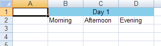

<!--
|metadata|
{
    "fileName": "javascript-excel-library-merge-cells",
    "controlName": ["igExcel"],
    "tags": ["How Do I"]
}
|metadata|
-->

# Merge Cells
Aside from setting the value or format of cells, you can also merge cells to make two or more cells appear as one. If you merge cells, they must be in a rectangular region. When part of a merged region, each cell in the region will have the same value and cell format; also, they will all be associated with the same [`WorksheetMergedCellsRegion`](%%jQueryApiUrl%%/ig.excel.WorksheetMergedCellsRegion "Link to the Web API Reference Guide to the WorksheetMergedCellsRegion member.") object, accessible from their [`associatedMergedCellsRegion`](%%jQueryApiUrl%%/ig.excel.WorksheetCell#methods:associatedMergedCellsRegion "Link to the Web API Reference Guide to the WorksheetMergedCellsRegion member.") property. The `WorksheetMergedCellsRegion` object will also have the same value and cell format as the cells. Setting the value (or cell format) of the region or any cell in the region will change the value of all cells and the region. If you unmerge cells, because the merged region was removed from the worksheet, all of the previously merged cells will retain the shared cell format they had before they were unmerged. However, only the top-left cell of the region will retain the shared value.

The following code demonstrates how to merge some cells and set the value and format of the merged cells region.

**In JavaScript:**

```js
Infragistics.Documents.Excel.Workbook workbook = new Infragistics.Documents.Excel.Workbook();
Infragistics.Documents.Excel.Worksheet worksheet = workbook.Worksheets.Add( "Sheet1" );

// Make some column headers
var workbook = new $.ig.excel.Workbook();
var worksheet = workbook.worksheets().add( "Sheet1" );

// Make some column headers
worksheet.rows(1).cells(1).value("Morning");
worksheet.rows(1).cells(2).value("Afternoon");
worksheet.rows(1).cells(3).value("Evening");

// Create a merged region that will be a header to the column headers
var mergedRegion1 = worksheet.mergedCellsRegions().add( 0, 1, 0, 3 );

// Set the value of the merged region
mergedRegion1.value("Day 1");

// Give the merged region a solid background color
mergedRegion1.cellFormat().fill($.ig.excel.CellFill.createSolidFill("skyblue"));

// Set the cell alignment of the middle cell in the merged region.
// Since a cell and its merged region shared a cell format, this will 
// ultimately set the format of the merged region
worksheet.rows(0).cells(2).cellFormat().alignment($.ig.excel.HorizontalCellAlignment.center);
```



 

 


