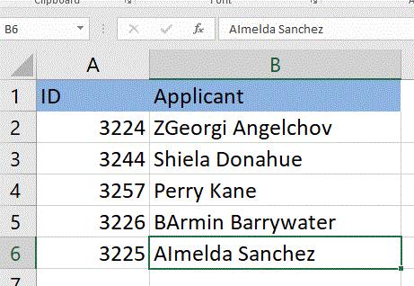

<!--
|metadata|
{
    "fileName": "igExcelEngineSorting",
    "controlName": ["igExcel"],
    "tags": ["Sort"]
}
|metadata|
-->

# Worksheet level Sorting

Before you can take advantage of the features in the JavaScript Excel Library, you will need to create a [Workbook](%%jQueryApiUrl%%/ig.excel.Workbook "Link to the Web API Reference Guide to the Workbook member.") object. You can do this by either reading an existing Microsoft® Excel® file, as explained in the How Do I... topic: [Read an Excel File into a Workbook](JavaScript-Excel-Library-Read-an-Excel-2007-XLSX-File-Into-a-Workbook.html "Explains how to read and excel file into a workbook.") or you can create a blank workbook. When you create a blank workbook, before writing it to a file, you must add at least one worksheet.

For the worksheet level object we added sorting. Sorting is done by setting a sorting condition on a worksheet level object on either column or row. You can sort columns or rows in ascending or descending order.

The sort conditions in a sheet are only reapplied when sort conditions are added, removed, modified, or when the [reapplySortConditions](%%jQueryApiUrl%%/ig.excel.WorksheetSortSettings#methods: reapplySortConditions "Link to the Web API Reference Guide to the reapplySortConditions member.") method is called on the sheet. Columns or rows will be sorted within the region. 'Rows' is the default sort type.

## Property settings

The following table maps the desired Method to the property sort settings that manage it.

| Method			| Description     																	|
| ------------- 	|:-------------:																	|
| [SortType](%%jQueryApiUrl%%/ig.excel.WorksheetSortSettings#methods:sortType "Link to the Web API Reference Guide to the SortType member.") | The control supports editing and provides several events and methods. |
|[CaseSensitive](%%jQueryApiUrl%%/ ig.excel.SortSettings%601#methods:caseSensitive  "Link to the Web API Reference Guide to the caseSensitive member.") |True to sort with case sensitivity|
|[SetRegion](%%jQueryApiUrl%%/ig.excel.WorksheetSortSettings#methods:setRegion "Link to the Web API Reference Guide to the SetRegion member.")|To apply the sort setting
|[SortCondition](%%jQueryApiUrl%%/ ig.excel.SortSettings%601#methods:sortCondition "Link to the Web API Reference Guide to the SortCondition member.") |To use when sorting the region of data.


## The following sort condition types are available to set on columns:

| Method			| Description     																	|
| ------------- 	|:-------------:																	|
| [OrderedSortCondition](%%jQueryApiUrl%%/ig.excel.OrderedSortCondition#methods:ig.excel.OrderedSortCondition "Link to the Web API Reference Guide to the OrderedSortCondition member.") | The control supports editing and provides several events and methods. |
|[CustomListSortCondition](%%jQueryApiUrl%%/ ig.excel.CustomListSortCondition#methods:ig.excel.CustomListSortCondition "Link to the Web API Reference Guide to the CustomListSortCondition member.") |True to sort with case sensitivity|
|[FillSortCondition](%%jQueryApiUrl%%/ig.excel.FillSortCondition#methods:ig.excel.FillSortCondition "Link to the Web API Reference Guide to the FillSortCondition member.")|To apply the sort setting
|[FontColorSortCondition](%%jQueryApiUrl%%/ ig.excel.FontColorSortCondition#methods:ig.excel.FontColorSortCondition "Link to the Web API Reference Guide to the FontColorSortCondition member.") |To use when sorting the region of data.

The following code snippet shows how to perform Worksheet level sorting on the {ExcelEngineName}.Set the region to apply sorting from column B2 to column B8.

Following is the code that implements this example.


**In JavaScript:**


```js
// Create a new workbook

var workbook = new $.ig.excel.Workbook($.ig.excel.WorkbookFormat.excel2007);
var sheet = workbook.worksheets().add('Sheet1');

// Set the value of one of the cells

sheet.getCell('A1').value('ID');
sheet.getCell('B1').value('Applicant');

sheet.getCell('A2').value(3224);
sheet.getCell('B2').value('BArmin Barrywater');
sheet.getCell('A3').value(3244);
sheet.getCell('B3').value('ZGeorgi Angelchov');
sheet.getCell('A4').value(3257);
sheet.getCell('B4').value('AImelda Sanchez');
sheet.getCell('A5').value(3226);
sheet.getCell('B5').value('Perry Kane');
sheet.getCell('A6').value(3225);
sheet.getCell('B6').value('Shiela Donahue');            

// Sort the worksheet object

sheet.sortSettings().sortType($.ig.excel.WorksheetSortType.rows);		
sheet.sortSettings().caseSensitive(true);			
sheet.sortSettings().setRegion("B2:B8");
sheet.sortSettings().sortConditions().add(new $.ig.excel.RelativeIndex(0), new $.ig.excel.OrderedSortCondition($.ig.excel.SortDirection.ascending));        

// Save the workbook
saveWorkbook(workbook, "Table.xlsx");

```
