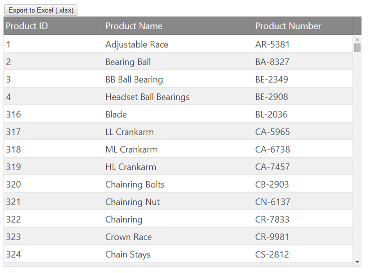
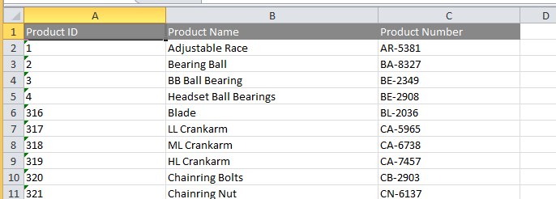

<!--
|metadata|
{
    "fileName": "using-the-javascript-excel-library",
    "controlName": ["igExcel"],
    "tags": []
}
|metadata|
-->

#Using the Infragistics JavaScript Excel Library:

This section contains topics covering the use of the JavaScript Excel Library.

This particular topic demonstrates how to export the contents of an Ignite UI `igGrid` to an Excel workbook using the new JavaScript Excel Library. Which can give you a general insight of how powerful the Infragistics JavaScript Excel Library is.

## Initial Setup 

The following topic uses an `igGrid` that is setup with the loader widget using the following code:

**In JavaScript:**
```js
$.ig.loader({
    scriptPath: "js/",
    cssPath: "http://cdn-na.infragistics.com/igniteui/%%ProductVersion%%/latest/css/",
    resources: "igGrid.Summaries"
});
```
Here, the loader is configured to load JavaScript files from the js folder, load the Ignite UI styles from the Infragistics CDN and load the grid Summaries feature.

Once the scripts are loaded then the grid is constructed as shown in the following code:

**In JavaScript:**

```js
$.ig.loader(function () {
    $("#grid1").igGrid({
        autoGenerateColumns: false,
        autoCommit: true,
        columns: [
            {
                headerText: "Product ID", key: "ProductID",
                dataType: "number", width: "200px"
            },
            {
                headerText: "Product Name", key: "Name",
                dataType: "string", width: "300px"
            },
            {
                headerText: "Product Number", key: "ProductNumber",
                dataType: "string", width: "200px"
            }
        ],
        primaryKey: "ProductID",
        dataSource: adventureWorks,
        height: "500px"
    });
});
```
>**Note:** The `adventureWorks` data source is an excerpt of the [Adventure Works database](http://msftdbprodsamples.codeplex.com/) as a JavaScript array and is available in the related sample linked below.

The body of the HTML looks like this:

**In HTML:**
```html
<body>
    <button id="export" onclick="exportWorkbook()">Export to Excel (.xlsx)</button>
    <a id="link" download="grid.xlsx"></a>
    <table id="grid1"></table>
</body>
```
The body of this document consists of a button, which when clicked invokes the `exportWorkbook` function. This topic demonstrates how to construct this function to export the grid data to an Excel workbook. The related sample also contains a table into which the `igGrid` is placed by the initialization code above.

>**Note:** The button's onclick event handler is used in this topic for illustration purposes only. The sample code uses jQuery to handle the click event.

With this initial setup, the page looks something like this:



## Creating a Workbook and Worksheet

The first step in exporting to an Excel workbook is to create a workbook instance. This is done by invoking the Workbook constructor function, like so:

**In JavaScript:**

```js
var workbook = new $.ig.excel.Workbook($.ig.excel.WorkbookFormat.excel2007);
```
The format is specified here to indicate that the workbook will eventually be saved in the 2007 (.xlsx) file format. The next step is to add a worksheet to hold the exported data. Unlike workbooks, worksheets are not created via the Worksheet constructor function. Instead the workbook manages the creation of worksheets when one is added. The code only needs to supply the name of the new worksheet:

**In JavaScript:**
```js
var worksheet = workbook.worksheets().add('Sheet1');
```
This code adds a worksheet with the name of “Sheet1” to the worksheets collection and obtains a reference, returned from the add function, to the newly created worksheet instance.

## Exporting Headers

In the `igGrid`, headers and data are separated into different sections, but on the worksheet, they must all exist in the same area of cells. Therefore, the code that exports the grid must keep track of the current row index where cells can safely be exported to ensure that headers and data do not overlap. Since the concepts of row, column, and cell exist for both the grid and Excel worksheet, the code adopts the convention of prefixing these ambiguous Excel related entities with "xl", for example:

**In JavaScript:**
```js
var xlRowIndex = 0;
```
The row indexes are 0-based in the Excel library, so this code indicates that the next available row for export is the first row in the worksheet.

Next, you need to obtain a reference to the table of cells representing the header in the grid and iterate over the rows in that table:

**In JavaScript:**
```js
var headersTable = $("#grid1").igGrid("headersTable")[0];
for (var headerRowIndex = 0;
    headerRowIndex < headersTable.rows.length;
    headerRowIndex++, xlRowIndex++) {
    var headerRow = headersTable.rows[headerRowIndex];
    // TODO: Export the header row
}
```
Notice how the increment portion of the for loop increments both `headerRowIndex` and `xlRowIndex`. This ensures that after exporting each header row, the code will move down to the next header row and the next worksheet row. Since there is only one header row in this example, the interior of this loop runs only one time, but it will leave the `xlRowIndex` value pointing to the next worksheet row.

To export each header row in the loop body, you must first obtain a reference to associated row in the worksheet:

**In JavaScript:**
```js
var xlHeaderRow = worksheet.rows(xlRowIndex);
```
Since rows are lazily created the first time they are requested, you don’t need to construct and add a row to a worksheet. Just asking for a row will ensure it is created.

Then you can copy over the appropriate formatting applied to the header row. In this case, only the font color should be exported, so that can be set like so:

**In JavaScript:**
```js
var computedStyle = window.getComputedStyle(headerRow);
var xlColorInfo = new $.ig.excel.WorkbookColorInfo(computedStyle.color);
xlHeaderRow.cellFormat().font().colorInfo(xlColorInfo);
```
This code takes the foreground color computed for the header row in the browser, and uses it to set the font’s color, first wrapping it in a `WorkbookColorInfo` instance. Font color and other colors in Excel support more complex color information than just RGB, such as themed colors and tints, and this color information is represented in the `WorkbookColorInfo` instances.

After initializing the header row on the worksheet, you can export each header cell for that row:

**In JavaScript:**
```js
for (var headerCellIndex = 0;
    headerCellIndex < headerRow.cells.length;
    headerCellIndex++) {
    var headerCell = headerRow.cells[headerCellIndex];
            
    worksheet.columns(headerCellIndex).setWidth(
        headerCell.offsetWidth, $.ig.excel.WorksheetColumnWidthUnit.pixel);
    var xlHeaderCell = xlHeaderRow.cells(headerCellIndex);
    var computedStyle = window.getComputedStyle(headerCell);
    xlHeaderCell.cellFormat().fill(
        $.ig.excel.CellFill.createSolidFill(computedStyle.backgroundColor));
    xlHeaderCell.value($(headerCell).text());
}
```
There are a few things going on here. First, the code iterates over each cell in the current header row and obtains a reference to it in `headerCell`. Next, it uses the calculated width of that cell to initialize the width of the associated column on the worksheet, using pixels as the width unit.

Then, it obtains a reference to the worksheet cell where the header data will be exported. Since the cells have a background color which should be preserved when exporting, it gets the computed style’s background color from the header cell, converts it into a solid `CellFill` instance and applies it as the fill of the cell’s format.

And finally, it uses the text displayed in the browser as the value for the cell. It does this by passing the text to the value function of the cell to set the value.

## Exporting Data

Exporting the data cells is very similar to exporting header cells. Once again, the loop over the rows should iterate both the grid row index and the worksheet row index so no exported rows overlap in the worksheet. In this case, the code does not need to export the format of the cells and can just export their values:

**In JavaScript:**

```js
var rows = $("#grid1").igGrid("rows");
for (var dataRowIndex = 0;
    dataRowIndex < rows.length;
    dataRowIndex++, xlRowIndex++) {
    var dataRow = rows[dataRowIndex];
    var xlRow = worksheet.rows(xlRowIndex);
    for (var dataCellIndex = 0;
        dataCellIndex < dataRow.cells.length;
        dataCellIndex++) {
        var dataCell = dataRow.cells[dataCellIndex];
        xlRow.setCellValue(dataCellIndex, $(dataCell).text());
    }
}
```
However, there is something slightly different here. With the header cells, performance is not a big concern since there are only three of them in this case. However, when exporting data, you have to consider performance and use the fastest possible code since there could be many rows. As stated in the “JavaScript Excel Library Overview” topic, as a memory optimization, the rows actually contain all cell data and formatting information. So it is not actually necessary to use cell instances for many operations. For setting formatting and cell values, all operations can be performed via the row instances. In this case, the code uses `setCellValue`, passing in the current column index and the new value to set the value of the cell in that row at the specified column index. Not requesting the cell prevents a transient cell instance from getting created and reduces the amount of memory pressure during the export, which will make the code more performant.

## Saving the Workbook

After the data is copied from the grid to the workbook, the last step is to save the workbook. In the case of the Excel library, this means converting the workbook from an object model representation to a binary representation containing the file contents Microsoft Excel would recognize. This is done using the save function of the workbook. In this case, the format used during saving is Excel 2007, since that format was specified when the code first created the workbook instance.

>**Note:** In order to provide full browser support the following code relies on two 3rd party libraries: [Blob.js](https://github.com/eligrey/Blob.js/) and [FileSaver.js](https://github.com/eligrey/FileSaver.js/). Referencing these libraries on the page defines a saveAs function which allows a file generated on the client to be saved locally. If you cannot include these libraries on your page, one alternative is to construct a [data URI](http://en.wikipedia.org/wiki/Data_URI_scheme) by converting the data array to a Base64 encoded string with the [window.btoa](https://developer.mozilla.org/en-US/docs/Web/API/WindowBase64.btoa) function and using a mime type of "application/vnd.openxmlformats-officedocument.spreadsheetml.sheet", then you can use that URI as the href attribute of an anchor tag. However, this approach does not work in IE due to security reasons, but does work in Chrome and Firefox. Another alternative is to post the data to the server and have the server provide an URL with which the user can download the saved file.

**In JavaScript:**
```js
workbook.save(function (err, data) {
    if (err) {
        alert('Error Exporting');
    }
    else {
        var blob = new Blob([data], {
            type: "application/vnd.openxmlformats-officedocument.spreadsheetml.sheet"
        });
        saveAs(blob, "grid.xlsx");
    }
});
```
The save function accepts a callback with two parameters: an error instance and a Uint8Array instance, only one of which will be non-null when the callback is invoked. When the save operation completes successfully, this code saves the data to a file named grid.xlsx. When opened in Microsoft Excel, which that file should look something like this:



## Putting it All Together

Here is the full `exportWorkbook` function. For a more detailed solution on exporting a grid, including exporting summary formulas and all formatting properties, see the “Related Samples” section below.

**In JavaScript:**
```js
function exportWorkbook() {
    var workbook = new $.ig.excel.Workbook($.ig.excel.WorkbookFormat.excel2007);
    var worksheet = workbook.worksheets().add('Sheet1');
    var xlRowIndex = 0;
    var headersTable = $("#grid1").igGrid("headersTable")[0];
    for (var headerRowIndex = 0;
        headerRowIndex < headersTable.rows.length;
        headerRowIndex++, xlRowIndex++) {
        var headerRow = headersTable.rows[headerRowIndex];
        var xlHeaderRow = worksheet.rows(xlRowIndex);
        var computedStyle = window.getComputedStyle(headerRow);
        var xlColorInfo = new $.ig.excel.WorkbookColorInfo(computedStyle.color);
        xlHeaderRow.cellFormat().font().colorInfo(xlColorInfo);
        for (var headerCellIndex = 0;
            headerCellIndex < headerRow.cells.length;
            headerCellIndex++) {
            var headerCell = headerRow.cells[headerCellIndex];
            worksheet.columns(headerCellIndex).setWidth(
                headerCell.offsetWidth, $.ig.excel.WorksheetColumnWidthUnit.pixel);
            var xlHeaderCell = xlHeaderRow.cells(headerCellIndex);
            var computedStyle = window.getComputedStyle(headerCell);
            xlHeaderCell.cellFormat().fill(
                $.ig.excel.CellFill.createSolidFill(computedStyle.backgroundColor));
            xlHeaderCell.value($(headerCell).text());
        }
    }
    var rows = $("#grid1").igGrid("rows");
    for (var dataRowIndex = 0;
        dataRowIndex < rows.length;
        dataRowIndex++, xlRowIndex++) {
        var dataRow = rows[dataRowIndex];
        var xlRow = worksheet.rows(xlRowIndex);
        for (var dataCellIndex = 0;
            dataCellIndex < dataRow.cells.length;
            dataCellIndex++) {
            var dataCell = dataRow.cells[dataCellIndex];
            xlRow.setCellValue(dataCellIndex, $(dataCell).text());
        }
    }
    workbook.save(function (err, data) {
        if (err) {
            alert('Error Exporting');
        }
        else {
            var blob = new Blob([data], {
                type: "application/vnd.openxmlformats-officedocument.spreadsheetml.sheet"
            });
            saveAs(blob, "grid.xlsx");
        }
    });
}
```
### Related Topics

- [JavaScript Excel Library Overview](JavaScript-Excel-Library-Overview.html)

### Related Samples

- [Excel Table](%%NewSamplesUrl%%/javascript-excel-library/excel-table)
- [Excel Formatting](%%NewSamplesUrl%%/javascript-excel-library/excel-formatting)
- [Excel Formulas](%%NewSamplesUrl%%/javascript-excel-library/excel-formulas)
- [Import Data From Excel ](%%NewSamplesUrl%%/javascript-excel-library/excel-import-data)
                    
