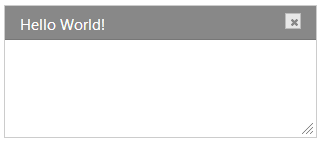
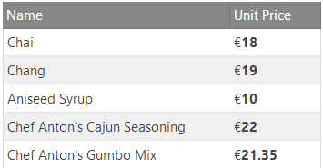
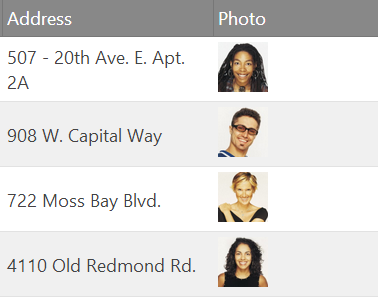
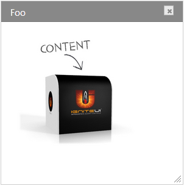

<!--
|metadata|
{
    "fileName": "using-ignite-ui-with-angularjs",
    "controlName": [],
    "tags": []
}
|metadata|
-->

#Using %%ProductName%% with AngularJS

##Topic Overview

This topic contains an overview using the %%ProductName%% directives for AngularJS.

### Required background

The following lists the concepts, topics, and articles required as a prerequisite to understanding this topic.

-   Topics
    -   [%%ProductName%% Overview](NetAdvantage-for-jQuery-Overview.html)

-   Concepts
    -   [AngularJS Conceptual Overview](https://docs.angularjs.org/guide/concepts)
    -   [AngularJS Two-way Data Binding](https://docs.angularjs.org/tutorial/step_04)

### In this topic

This topic contains the following sections:

-   [**Introduction**](#introduction)
    -   [Directives](#directives)
-   [**Options**](#options)
    -   [Declarative Options](#declarative-options)
    -   [Scope Options](#scope-options)
    -   [Events](#events)
    -   [Options Evaluation](#options-evaluation)
-   [**Creating Angular app with %%ProductName%%**](#creating-angular-app)
    -   [Requirements](#requirements)
    -   [Steps](#steps)
-   [**Data Binding**](#data-binding)
    -   [Two-way Data Binding](#two-way-data-binding)
    -   [One-way Data Binding](#one-way-data-binding)
-   [**Templates**](#templates)
    -   [Setting Templates Declaratively](#setting-templates-declaratively)
-   [**Controls with HTML content**](#controls-with-html-content)
-   [**Related Content**](#related-content)
    -   [Topics](#topics)
    -   [Samples](#samples)

## <a id="introduction"></a>Introduction


The [%%ProductName%%® directives for AngularJS](https://github.com/IgniteUI/igniteui-angularjs) allow you to take advantage of data binding and declarative programming when using %%ProductName%%® controls in AngularJS apps.

The directives are available as a separate module called `'igniteui-directives'` in the *igniteui-angular.js* file. They extend Angular with HTML markers that enable initialization and binding of %%ProductName%% controls in the context (scope) provided by AngularJS.

>**Note:** Directives are registered dynamically based on the loaded %%ProductName%% widgets. Therefore, you should make sure only the proper scripts are loaded on the page (and preferably avoid loading unused widgets).

## <a id="directives"></a>Directives

As Angular provides a very flexible syntax for writing directives and normalizes different declarative approaches to a single behavior, there are multiple ways you can initialize a control and its options. You have a number of different options available to you to initialize an %%ProductName%% control in an Angular application. You may use a custom tag element `<control-name>`, attributes like `<div data-control-name>` or a class name `<div class="control-name">`. Each of these approaches will match the control directive and produce the same result. Stated another way, the following definitions all work to initialize an `igRating` control:

**In HTML:**

```html
<ig-rating></ig-rating>
<div data-ig-rating></div>
<div class="ig-rating"></div>
```

For readability, best practices recommend using tags and attributes over classes. Even though Angular normalizes other delimiters, it’s also recommended for %%ProductName%% Angular directives the control names to be lower case and dash-delimited.

## <a id="options"></a>Options


All options provided for a directive are intended for the %%ProductName%% widget that it will create, therefore all applicable options can be found under the [%%ProductName%% API reference](%%jQueryApiUrl%%/). There are two mutually-exclusive ways to define options – declaratively in the View or as an object in the Scope.

### <a id="declarative-options"></a>Declarative Options

Options in the view are provided as either attributes of the main tag or as child tags in the case of complex type options.

>**Note:** Declarative options must be in lower case and dash-delimited.

For example setting value on the `igRating`:

**In HTML:**
```html
<ig-rating value="4" value-as-percent="false"></ig-rating>
```
Or defining the column configuration for the `igGrid`:

**In HTML:**
```html
<ig-grid id="grid1" data-source="northwind" auto-generate-columns="false">
    <columns>
        <column key="ProductID" header-text="Product ID" width="50px" data-type="number"></column>
        <column key="ProductName" header-text="Name"  width="250px"  data-type="string"></column>
        <column key="QuantityPerUnit" header-text="Quantity per unit"  width="200px" data-type="string"></column>
        <column key="UnitPrice" header-text="Unit Price"  width="100px" data-type="number"></column>
    </columns>
</ig-grid>
```
The name of the parent tag must match the name of the complex option or array ([`columns`](%%jQueryApiUrl%%/ui.iggrid#options:columns) in this case). For arrays the name of the child tag obviously doesn’t carry over and can arbitrary, but for complex object settings it must also match the child object. For example the [`restSettings`](%%jQueryApiUrl%%/ui.iggrid#options:restSettings) have `create` and `remove` options that can be set like so:

**In HTML:**
```html
<rest-settings>
    <create url="/api/product/" batch="false"></create>
    <remove url="/api/product/" batch="true"></remove>
</rest-settings>
```
### <a id="scope-options"></a>Scope Options

With scope options (or as often referred as Controller initialization which is the most common case) the entire options object is defined within the scope. The way the directive finds its options is by using the attribute directive matching and assigning it the scope object property to use. For example, if you have the following `igTree` directive:

**In HTML:**
```html
<div ig-tree="treeOptions"></div>
```
The options are initialized in the controller:

**In JavaScript:**
```js
app.controller('treeController',
            ['$scope', 'productCategories',
    function ($scope,   productCategories) {
        $scope.treeOptions = {
            dataSource: productCategories.data,
            bindings: {
                textKey: "Name",
                valueKey: "ProductCategoryID",
                childDataProperty: "ProductSubcategories"
            }
        };
    }]);
```
These options may seem familiar to you as they are simply using the [%%ProductName%% API](%%jQueryApiUrl%%/ui.igtree) in the controller as there is no need for AngularJS to normalize them from the view.

### <a id="events"></a>Events

Although standard methods of [handling %%ProductName%% events](Using-Events-in-NetAdvantage-for-jQuery.html) are still available, directives can also bind handlers that are defined declaratively as an attribute with `event-` prefix. The name of the event still follows the same naming convention as options - **lower case and dash-delimited**. For example, the following code listing shows how to declare the [`ended`](%%jQueryApiUrl%%/ui.igvideoplayer#events:ended) event of the `igVideoPlayer`:

**In HTML:**
```html
<ig-video-player id="video1" event-ended="videoEnded"></ig-video-player>
```
**In JavaScript:**
```js
app.controller('videoController', ['$scope',
function ($scope) {
    $scope.videoEnded = function (e, args) {
        //handle event, use arguements
    }
}]);
```
>**Note:** Keep in mind there are many user interaction-related events in the %%ProductName%% controls are not raised when the controls are manipulated through the API. The directives use API methods to achieve data binding. For example, the [`activeItemChanged`](%%jQueryApiUrl%%/ui.igcombo#events:activeItemChanged) event of the `igCombo` control is not raised because a change was made to the `ngModel` to which it was bound.

### <a id="options-evaluation"></a>Options Evaluation

Currently the options provided to the directives support only one time binding with an Angular expression. This means the value of the expression is evaluated in the scope once before it is passed to the widget for initialization. To assign a scope property to an option use Angular’s expression syntax inside the value itself. Everything that [$eval](https://docs.angularjs.org/api/ng/type//$rootScope.Scope#$eval) can evaluate within the scope can be used. For example assigning an `igRating` value (percent based by default) with a 0-10 value:

**In JavaScript:**
```js
app.controller('ratingController', ['$scope',
function ($scope) {
    $scope.averageRating = 7.5;
}]);
```
By dividing it by 10:

**In HTML:**
```html
<ig-rating value="{{averageRating/10}}"></ig-rating>
```


## <a id="creating-angular-app"></a>Creating Angular app with %%ProductName%%

### <a id="requirements"></a>Requirements

When considering the required resources the same requirements and options apply as described in the [Using JavaScript Resources in %%ProductName%%](Deployment-Guide-JavaScript-Resources.html) documentation in addition to loading the %%ProductName%% Angular directives module afterwards. This means that along with some styles the application would also need to include:

-   [jQuery](http://www.jquery.com/) 1.7 and later
-   [jQuery UI](http://jqueryui.com/) 1.8 and later
-   [AngularJS](http://www.angularjs.org/) 1.0 and later
-   [%%ProductName%%](http://www.igniteui.com/) 13.1 and later

### <a id="steps"></a>Steps

1.  Begin by including the [%%ProductName%% theme and structural](Deployment-Guide-Styling-and-Theming.html) files:

    **In HTML:**
	```html
	<!-- %%ProductName%% Required Combined CSS Files -->
	<link href="http://cdn-na.infragistics.com/igniteui/%%ProductVersion%%/latest/css/themes/infragistics/infragistics.theme.css" rel="stylesheet" />
	<link href="http://cdn-na.infragistics.com/igniteui/%%ProductVersion%%/latest/css/structure/infragistics.css" rel="stylesheet" />
	```

2.  Add the JavaScript libraries ([modernizr](http://modernizr.com/) is optional):

    **In HTML:**
	```html
	<!-- JavaScript Library Dependencies -->
	<script src="http://modernizr.com/downloads/modernizr-latest.js"></script>
	<script src="http://code.jquery.com/jquery-1.9.1.min.js"></script>
	<script src="http://code.jquery.com/ui/1.10.3/jquery-ui.min.js"></script>
	```

3.  Include %%ProductName%% and the directives module. Preferably use a custom download, but you can also [include %%ProductName%% in any available way](Deployment-Guide-JavaScript-Resources.html).

    **In HTML:**
	```html
	<!-- %%ProductName%% Required Combined JavaScript Files -->
	<script src="http://cdn-na.infragistics.com/igniteui/%%ProductVersion%%/latest/js/infragistics.core.js"></script>
	<script src="http://cdn-na.infragistics.com/igniteui/%%ProductVersion%%/latest/js/infragistics.lob.js"></script>
	<script src="igniteui-angular.min.js"></script>
	```

4.  At this point you have all directives loaded in a module you can list it as a dependency in your own and define angular controllers, factories, providers and so on:

    **In JavaScript:**
	```js
	var app = angular.module('igniteui-sample', ['igniteui-directives']);
	app.controller('sampleController', ['$scope', function($scope) {
		$scope.header = 'Hello World!';
	}]);
	```
5.  In your view you need to instruct Angular where your application runs and the controller to use. For example:

	**In HTML:**
	```html
	<body class="container" ng-app="igniteui-sample" ng-controller="sampleController">
		<!--...-->
	</body>
	```

6.  And finally add the desired directive, for example an `igDialog`:

    **In HTML:**
	```html
	<body class="container" ng-app="igniteui-sample" ng-controller="sampleController">
		<ig-dialog id="dialog1" header-text="{{header}}" height="325px"></ig-dialog>
	</body>
	```
    

## <a id="data-binding"></a>Data Binding


Besides providing initialization integration, one of the main benefits of the %%ProductName%% directives for AngularJS is data binding support. The directives automatically assign AngularJS watchers to the sources provided at initialization, so the only requirement to enable data binding is to set the `dataSource` option or `data-source` attribute to the desired property from the scope:

**In HTML:**
```html
<ig-grid id="grid1" data-source="northwind" primary-key="ProductID" auto-generate-columns="true"></ig-grid>
```

Where data is injected in the scope using a [factory provider](https://docs.angularjs.org/guide/providers) and defined as:

**In JavaScript:**

    app.controller('gridController',
                ['$scope', 'northwind',
        function ($scope,   northwind) {
            $scope.northwind = northwind.data;
    }]);

### <a id="two-way-data-binding"></a>Two-way Data Binding

The most common case includes controls that can consume and manipulate data, for those type of controls two way data binding is supported. A two-way binding means data values inside the controls are updated if changes are made to the underlying data source. In addition, if changes are made in the view from the control the underlying data is also kept in sync. Controls that support two-way data binding include:

-   igGrid
-   igCombo
-   igEditors
-   igTree

>**Note:** For some controls two-way binding requires enabling additional features, such as the Updating feature on the `igGrid`.

### <a id="one-way-data-binding"></a>One-way Data Binding

The other main group are controls that cannot edit their information (mostly consisting of Data Visualization controls), but will still reflect any changes in the data source to which they are bound. In this case the directives create a one-way connection which propagates data changes to the widget in the view. Controls in this group include:

-   igHtmlEditor
-   igDataChart
-   igSparkline
-   igFunnelChart

## <a id="templates"></a>Templates

Many %%ProductName%% controls support templates that are by default handled by the [Infragistics Templating Engine](igTemplating-Overview.html). The %%ProductName%%® Templating Engine is a JavaScript library used to apply a content template to a set of HTML elements. It supports conditional logic and nested templates. The engine uses a `${property}` notation for substitution of the corresponding property values in the data provided. For example, wrapping column values in additional markup for styling and formatting:

**In HTML:**
```html
<ig-grid>
    <columns>
        <column key="UnitPrice" header-text="Unit Price"  width="100px" data-type="number"
                template="€ <strong> ${UnitPrice} </strong>"></column>
    </columns>
</ig-grid>
```



Or providing additional HTML markup to the cell, like an image column:

**In JavaScript:**
```js
app.controller('gridController',
            ['$scope', 'northwindEmployees',
    function ($scope,   northwindEmployees) {
        $scope.gridOptions = {
            dataSource: $scope.northwindEmployees.data,
            columns: [
                   //...
                   { headerText: "PhotoPath", 
                   key: "PhotoPath", 
                   dataType: "string",  
                   template: '' 
               }
            ],
            // ...
        };
    }]);
```



### <a id="setting-templates-declaratively"></a>Setting Templates Declaratively

The templating engine uses double curly braces for **conditional templates** (e.g. `{{if condition}}` ), which are also used by Angular for expression evaluation. Therefore, using such templates in declarative initialization **can cause conflicts**. For more information on how you can provide conditional templates declaratively or customize the templating process refer to the [Conditional and Advanced Templating with AngularJS](Conditional-and-Advanced-Templating-with-AngularJS.html) topic.

**Related:** [igGrid sample](http://igniteui.github.io/igniteui-angularjs/samples/igGrid.html)

## <a id="controls-with-html-content"></a>Controls with HTML content

In order to provide HTML content to a control (and prevent it from being parsed as an option), you must wrap any markup you don't want parsed in a `<content>` element. The following example demonstrates how you may add additional markup to the `igDialog` control.

**In HTML:**
```html
<ig-dialog id="dialog1" header-text="Foo" height="300px">
      <content>
      <p>
            
      </p>
      </content>
</ig-dialog>
```



This approach to providing additional markup applies to controls such as the `igDialog`, `igLayoutManager` and the `igTileManager`.

**Related:** [igDialog Angular sample](http://igniteui.github.io/igniteui-angularjs/samples/igDialog.html)

## <a id="related-content"></a>Related Content

### <a id="topics"></a>Topics

The following topics provide additional information related to this topic.

-   [Conditional and Advanced Templating with AngularJS](Conditional-and-Advanced-Templating-with-AngularJS.html)

### <a id="samples"></a>Samples

The following samples provide additional information related to this topic.

-   [%%ProductName%% directives for AngularJS samples](http://igniteui.github.io/igniteui-angularjs/)
-   [All %%ProductName%% control samples](%%SamplesUrl%%)

                    