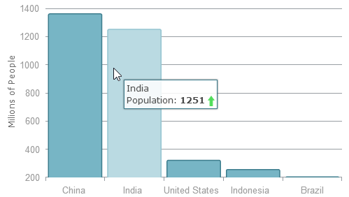
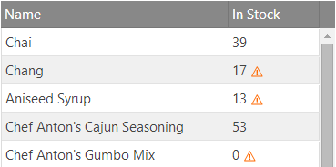

<!--
|metadata|
{
    "fileName": "conditional-and-advanced-templating-with-angularjs",
    "controlName": [],
    "tags": []
}
|metadata|
-->
#Conditional and Advanced Templating with AngularJS

##Topic Overview

This topic explains how to use conditional templates and use advanced templating methods to customize controls created with the Ignite UI directives for AngularJS.

### Required background

The following lists the concepts, topics, and articles required as a prerequisite to understanding this topic.

-   Topics
    -   [Using Ignite UI with AngularJS](Using-Ignite-UI-with-AngularJS.html)
    -   [Infragistics Templating Engine](igTemplating-Overview.html)

-   Concepts
    -   [Angular Expressions](https://docs.angularjs.org/guide/expression)

### In this topic

This topic contains the following sections:

-   [**Introduction**](#introduction)
    -   [Context and Scope](#context-and-scope)
-   [**Declarative conditional and iterative templates**](#declarative-templates)
    -   [Templates within the directive](#templates-within-directive)
    -   [External templates](#external-templates)
        -   [Using a Scope Method](#scope-method)
        -   [Non-Bindable Directive](#non-bindable-directive)
-   [**Using different templating engines**](#different-templating-engines)
    -   [jsRender with igGrid](#jsrender-grid)
    -   [Overriding the Templating Function](#overriding-templating)
-   [**Related Content**](#related-content)
    -   [Topics](#topics)
    -   [Samples](#samples)

## <a id="introduction"></a>Introduction

As Ignite UI controls use [Infragistics Templating Engine](igTemplating-Overview.html) by default to handle templating, there are a few characteristics that must be taken into account when creating Ignite UI controls in an Angular app, more specifically when doing so declaratively. The templating engine supports both common substitution using a `${property}` notation, as well as **conditional and iterative operations** that using double curly braces (e.g. `{{condition / loop}}` ). The latter is however in direct conflict with Angular’s [expression](https://docs.angularjs.org/guide/expression) evaluation as it uses the same syntax for bindings and therefore would recognize such templates and attempt to parse them. That is usually not a desired effect as it is likely to cause exceptions due to syntax and context differences. Even without errors, it might change the template’s markup that is otherwise intended for evaluation at within a control’s rendering process. This topic provides a few alternatives for using complex templates declaratively as well as methods to customize the entire templating handling with different engines.

### <a id="context-and-scope"></a>Context and Scope

Templates handled by the engine are also evaluated in the global `window` scope. Therefore, any global functions and objects such as `parseInt()` or `Math` can be used in addition to arithmetic operations within the condition clause. That, in turn, means `$scope` properties are not available for evaluation out of the box.

Control templates are also often intended for a context different than the document or Angular’s scope. For example the `igGrid` column templates are to be evaluated in the context of the current data record being rendered and cannot be generally evaluated directly against the data source. Each control is responsible for matching data item with its intended template and passing them to the templating function.

## <a id="declarative-templates"></a>Declarative Conditional and Iterative Templates

While using any templating syntax to initialize controls with scope-defined options is acceptable, that is not always the case with declaratively defined templates.

### <a id="templates-within-directive"></a>Templates within the Directive

There are differences in regard to where the template property is defined in the directive. Template on many controls are a top level option, for example the [`itemTemplate`](%%jQueryApiUrl%%/ui.igcombo#options:itemTemplate) of the `igCombo`:

**In HTML:**
```html
<ig-combo id="combo1"
          item-template='${ProductName} {{if ${UnitsInStock} > 0 }} ${UnitsInStock} {{/if}}' 
          data-source="northwind"
          text-key="ProductName"
          value-key="ProductID">
ig-combo>
```

This configuration will cause Angular to try to parse the template and **throw an exception**! This is because even with custom tags, attributes from the parent (i.e. the `<ig-combo>`) element are carried over after it is replaced with the actual valid HTML tag the control will use. However, [`series.tooltipTemplate`](%%jQueryApiUrl%%/ui.igDataChart#options:series.tooltipTemplate) for the `igDataChart` or [`columns.template`](%%jQueryApiUrl%%/ui.iggrid#options:columns.template) on the `igGrid` **will work as expected**:

**In HTML:**
```html
<ig-data-chart id="datachart1" data-source="dataChart">
    <!-- ... -->
    <series>
        <series name="2015Population" type="column" value-member-path="Pop2015"
                x-axis="NameAxis" y-axis="PopulationAxis"
                show-tooltip="true"
                tooltip-template="${item.CountryName} <br> Population: <strong>${item.Pop2015}</strong>
                        {{if ${item.Pop2015} > ${item.Pop2005} }}   
                        {{else}}  {{/if}}">
        </series>
    </series>
</ig-data-chart>
```



**In HTML:**
```html
<ig-grid id="grid1" data-source="northwind" primary-key="ProductID">
    <columns>
        <!-- ... -->
        <column key="UnitsInStock" header-text="In Stock"  width="100px" data-type="number" 
                template=" ${UnitsInStock} {{if ${UnitsOnOrder} >= ${UnitsInStock} }}  {{/if}}>
        </column>
    </columns>
</ig-grid>
```



The templates works as expected because nested elements under the parent are removed in the directive templating phase during the [bootstrapping process](https://docs.angularjs.org/guide/bootstrap) and are safe to use.

### <a id="external-templates"></a>External Templates

The easiest way to avoid conflicts would be to define templates outside the `ng-app` directive but that would mean the template can no longer be part of the Ignite UI directive options. Nonetheless, an external template can often have a desired effect. For example you can increase readability of your code or share templates between controls. Either way, the directives need to be able to find that template for control initialization and to do that you use a scope method.

### <a id="scope-method"></a>Using a Scope Method

A function defined in the angular scope can be used to provide the template value via option evaluation. It can perform both complex tasks for initialization or simply provide access to a template defined somewhere in the document. While some controls provide the choice to supply either the template itself or the id by which it can be found( e.g. the `igDataChart`), the Ignite UI directives will register the `getHtml()` function in your scope for the rest:

**In JavaScript:**
```js
function getHtml(selector){
      return $(selector).html();
};
```

All that it does is provide a jQuery selection proxy in the scope. The function will not override custom implementations if such already exist. Now with the option evaluation `getHtml()` can be used to supply HTML to any option, including templates:

**In HTML:**
```html
<ig-grid id="grid1" data-source="northwind" auto-generate-columns="false">
    <columns>
        <column key="UnitPrice" header-text="Unit Price" width="100px" data-type="string" 
                    template="{{getHtml('#colTemplate')}}">
    </columns>
</ig-grid>
```

Where the element with an ID of “colTemplate” is the container of the template defined outside the angular app:

**In HTML:**
```html
<script id="colTemplate" type="text/template">
      $ ${UnitPrice} 
      {{if parseInt(${UnitPrice}) >= 20 }} 
      
      {{else}}
      
      {{/if}}
</script>
```
### <a id="non-bindable-directive"></a>Non-Bindable Directive

When defining external templates that need to be within the Angular application scope, the option is to mark the template container with the [`ng-non-bindable`](https://docs.angularjs.org/api/ng/directive/ngNonBindable) directive, which instructs AngularJS to skip parsing and compiling the contents of the element:

**In HTML:**
```html
<script id=" colTemplate " type="text/template" ng-non-bindable>
	…
script>
```

Such templates can be again assigned to the options using the `getHtml()` function as described above.

**Related Sample:** [igGrid Sample](http://igniteui.github.io/igniteui-angular/samples/igGrid.html)

## <a id="different-templating-engines"></a>Using Different Templating Engines


While the Infragistics Templating Engine is used by default, it is not by any means exclusive. The `igGrid` for example comes with built-in [jsRender](http://www.jsviews.com/) support and different engines can be plugged-in quite easily using a single function override.

### <a id="jsrender-grid"></a>jsRender with igGrid

[jsRender](http://www.jsviews.com/) is a powerful and fast templating engine that can handle complex templates and can be extended with custom tags and helper functions to produce highly customizable, advanced templates. The [jsRender Integration](igGrid-jsRender-Integration.html) in the grid is controlled by the [`templatingEngine`](%%jQueryApiUrl%%/ui.iggrid#options:templatingEngine) option:

**In HTML:**

```html
<ig-grid data-source="northwind" auto-generate-columns="false" templating-engine="jsRender" >
    <columns>
        <column key="UnitPrice" header-text="Unit Price"  width="100px" data-type="string" template="$ {{>UnitPrice}}"></column>
    </columns>
</ig-grid>
```

To use this feature jsRender script must be referenced on the page. Note that this **does not affect other controls**, their templates would still be handled by the Ignite UI engine by default and follow the default syntax. As jsRender uses double curly braces even more extensively, the same techniques to avoid conflicts with Angular apply as described so far. Even more so, as substitution of a single property (e.g. `template="{{>UnitPrice}}"`) without any additional markup or formatting will be recognized as an expression to evaluate even for options nested within a directive.

**Related Sample:** [JsRender Integration](%%NewSamplesUrl%%/grid/jsrender-integration)

### <a id="overriding-templating"></a>Overriding the Templating Function

In advanced scenarios where other customization options are exhausted it is also possible to override the main templating function with your own. This is only possible in **Ignite UI version 14.1 and later**. The `tmpl` is the main function of the Infragistics Templating Engine and is defined globally under the `$.ig` namespace object. This function is called by all relevant Ignite UI controls and it receives both the template and data object:

**In JavaScript:**
```js
$.ig.tmpl = function (template, data) {
    /* handle the templating process */
    return template;
};
```

>**Note:** The templating function returns string results (building the whole HTML string before inserting it into the DOM is superior to creating objects performance-wise). The return result type and the parameters are expected by the controls and should not be changed.

The templating process at this point may be handled in any number of ways – from completely custom implementation, to using the parameters to pass to templating functions of other engines such as [Handlebars](http://handlebarsjs.com/) or [Mustache](https://github.com/janl/mustache.js). Again, depending on syntax all limitations as with default templates are still valid.

If you want to use Angular’s syntax there are two options that handle evaluation of expressions in html – the compile and interpolate services. The string output requirement of the templating function essentially excludes the [`$compile`](https://docs.angularjs.org/api/ng/service//$compile) service as an option for custom templating (as compiled and linked templates still won’t have the time to activate). The [`$interpolate`](https://docs.angularjs.org/api/ng/service//$interpolate) service, however, immediately evaluates any expressions in the markup and directly substitutes their values. Creating such templating solution still requires a `$scope` reference accessible from the global function and also matching the passed data item in the angular app scope so it can be evaluated, but it is possible to execute logic from scope methods on every render.

>**Note:** Keep in mind that overriding the templating function applies to every active Ignite UI control in the application, so if other controls have templates the new function should be able to handle those as well. Changing templating engines also usually means templates for all controls must change to match the new syntax.

## <a id="related-content"></a>Related Content

### <a id="topics"></a>Topics

The following topics provide additional information related to this topic.

-   [Using different template engines with Ignite UI controls](http://www.infragistics.com/community/blogs/marina_stoyanova/archive/2014/05/30/using-different-template-engines-with-ignite-ui-controls.aspx)
-   [jsRender Integration](iggrid-jsrender-integration.html)

### <a id="samples"></a>Samples

The following samples provide additional information related to this topic.

-   [igGrid Sample](http://igniteui.github.io/igniteui-angular/samples/igGrid.html)

                    