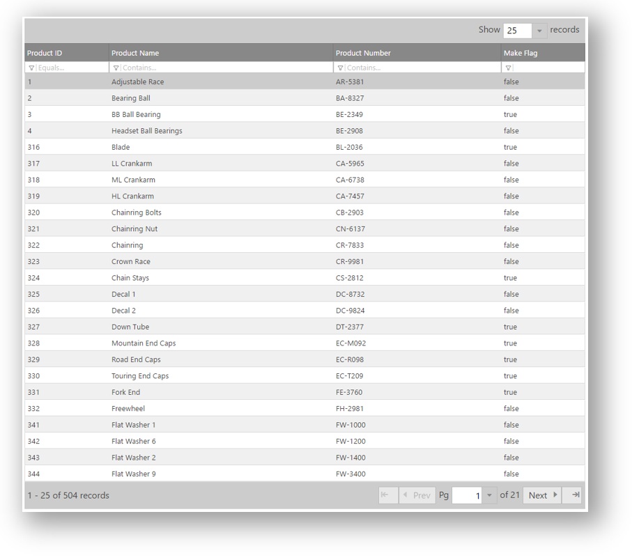
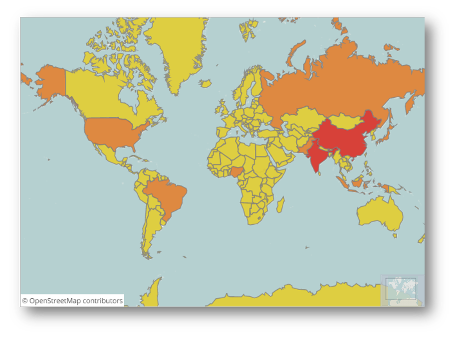
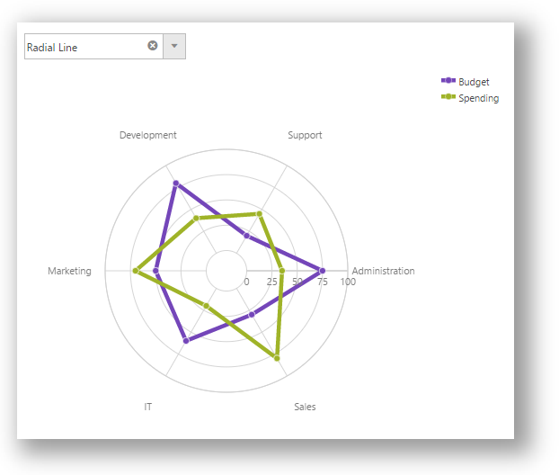

<!--
|metadata|
{
    "fileName": "typescript-samples",
    "controlName": [],
    "tags": []
}
|metadata|
-->

# TypeScript Samples

## Topic Overview
This topic covers samples with Ignite UI controls and TypeScript.

### In this topic

This topic contains the following sections:
-   [Requirements](#requirements)
-   [Grid Sample](#grid_sample)
    -   [Preview](#grid_sample_preview)
    -   [Details](#grid_sample_details)
-   [Editors Sample](#editors_sample)
    -   [Preview](#editors_sample_preview)
    -   [Details](#editors_sample_details)
-   [Tile Manager Sample](#tile_manager_sample)
    -   [Preview](#tile_manager_sample_preview)
    -   [Details](#tile_manager_sample_details)
-   [Dialog Window Sample](#dialog_window_sample)
    -   [Preview](#dialog_window_sample_preview)
    -   [Details](#dialog_window_steps_html)
-   [Templating Engine Sample](#templating_engine_sample)
    -   [Preview](#templating_engine_preview)
    -   [Details](#templating_engine_steps)
-   [Data Chart Sample](#data_chart_sample)
    -   [Preview](#data_chart_preview)
    -   [Details](#data_chart_details)
-   [Pie Chart Sample](#pie_chart_sample)
    -   [Preview](#pie_chart_preview)
    -   [Details](#pie_chart_details)
-   [Tree Sample](#tree_sample)
    -   [Preview](#tree_sample_preview)
    -   [Details](#tree_sample_details)
-   [Barcode Sample](#barcode_sample)
    -   [Preview](#barcode_preview)
    -   [Details](#barcode_details)
-   [Layout Manager Sample](#layout_manager_sample)
    -   [Preview](#layout_manager_preview)
    -   [Details](#layout_manager_details)
-   [Pivot View Sample](#pivot_view_sample)
    -   [Preview](#pivot_view_preview)
    -   [Details](#pivot_view_details)
-   [Map Sample](#map_sample)
    -   [Preview](#map_sample_preview)
    -   [Details](#map_sample_details)
-   [Loader Sample](#loader_sample)
    -   [Preview](#loader_sample_preview)
    -   [Details](#loader_sample_details)
-   [Related Content](#related_content)

### <a id="requirements"></a>Requirements
In order to run these samples, you need to have:
-   The required Ignite UI JavaScript and CSS files
-   The required Ignite UI TypeScript definitions


### <a id="grid_sample"></a>Grid Sample​
This sample will demonstrate how we can use `igGrid` with TypeScript.

#### <a id="grid_sample_preview"></a>Preview
The following screenshot is a preview of the final result.



#### <a id="grid_sample_details"></a>Details
This sample will demonstrate how to use TypeScript for creating igGrid and features like Paging, Filtering and Sorting.

**In HTML:**
```html
	<table id="grid1"></table>
```
We use the adventureWorks data source to populate the igGrid.

```js
var adventureWorks = [
    { "ProductID": 1, "Name": "Adjustable Race", "ProductNumber": "AR-5381", "MakeFlag": false, "FinishedGoodsFlag": false, "Color": null, "SafetyStockLevel": 1000, "ReorderPoint": 750, "StandardCost": 0.0000, "ListPrice": 0.0000, "Size": null, "SizeUnitMeasureCode": null, "WeightUnitMeasureCode": null, "Weight": null, "DaysToManufacture": 0, "ProductLine": null, "Class": null, "Style": null, "ProductSubcategoryID": null, "ProductModelID": null, "SellStartDate": "\/Date(896648400000)\/", "SellEndDate": null, "DiscontinuedDate": null, "rowguid": "694215b7-08f7-4c0d-acb1-d734ba44c0c8", "ModifiedDate": "\/Date(1078992096827)\/" }, 
    { "ProductID": 2, "Name": "Bearing Ball", "ProductNumber": "BA-8327", "MakeFlag": false, "FinishedGoodsFlag": false, "Color": null, "SafetyStockLevel": 1000, "ReorderPoint": 750, "StandardCost": 0.0000, "ListPrice": 0.0000, "Size": null, "SizeUnitMeasureCode": null, "WeightUnitMeasureCode": null, "Weight": null, "DaysToManufacture": 0, "ProductLine": null, "Class": null, "Style": null, "ProductSubcategoryID": null, "ProductModelID": null, "SellStartDate": "\/Date(896648400000)\/", "SellEndDate": null, "DiscontinuedDate": null, "rowguid": "58ae3c20-4f3a-4749-a7d4-d568806cc537", "ModifiedDate": "\/Date(1078992096827)\/" } ...
]
```

We initialize the grid in TypeScript.

**In TypeScript:**
```typescript
/// <reference path="http://www.igniteui.com/js/typings/jqueryui.d.ts" />
/// <reference path="http://www.igniteui.com/js/typings/jquery.d.ts" />
/// <reference path="http://www.igniteui.com/js/typings/igniteui.d.ts" />
declare var adventureWorks: any;
$(function () {
    $("#grid1").igGrid({
        width: "100%",
        columns: [
            { headerText: "Product ID", key: "ProductID", dataType: "number", width: "15%" },
            { headerText: "Product Name", key: "Name", dataType: "string", width: "40%" },
            { headerText: "Product Number", key: "ProductNumber", dataType: "string", width: "30%" },
            { headerText: "Make Flag", key: "MakeFlag", dataType: "bool", width: "15%" }
        ],
        dataSource: adventureWorks,
        features: [
            {
                name: "Paging"
            },
            {
                name: "Sorting"
            },
            {
                name: "Filtering"
            }
        ],
	});
});
```

### <a id="editors_sample"></a>Editors Sample​
This sample will demonstrate how we can use `igEditors` with TypeScript.

#### <a id="editors_sample_preview"></a>Preview
The following screenshot is a preview of the final result.


#### <a id="editors_sample_details"></a>Details
Create the HTML - we are going to have different editors - Text Editor, Date Editor, Date Picker with Localization, Mask Editor, Currency Editor and Percent Editor.

**In HTML:**
```html
<div id="editors">
	<div>
		<h4>
			Text Editor
		</h4>
		<div id="textEditor"></div>
	</div>
	<div>
		<h4>
			Date Picker with Japan localization
		</h4>
		<div id="jaDatePicker"></div>
	</div>
	<div>
		<h4>
			Date and Time editor
		</h4>
		<div id="dateTimeEditor"></div>
	</div>
	<div>
		<h4>
			Mask editor
		</h4>
		<div id="maskEditor"></div>
	</div>
	<div>
		<h4>
			Currency editor
		</h4>
		<div id="currencyEditor"></div>
	</div>
	<div>
		<h4>
			Percent editor
		</h4>
		<div id="percentEditor"></div>
	</div>
</div>
```
We initialize the editors in TypeScript.
**In TypeScript:**
```typescript
/// <reference path="http://www.igniteui.com/js/typings/jquery.d.ts" />
/// <reference path="http://www.igniteui.com/js/typings/jqueryui.d.ts" />
/// <reference path="http://www.igniteui.com/js/typings/igniteui.d.ts" />

$(function () {
    $("#textEditor").igTextEditor({
        width: "200",
        value: "John"
    });

    $("#dateTimeEditor").igDateEditor({
        width: "200",
        dateInputFormat: "dateTime",
        value: new Date()
    });

    $("#jaDatePicker").igDatePicker({
        width: "200",
        value: new Date(),
        readOnly: true,
        dropDownOnReadOnly: true,
        dateDisplayFormat: "dateLong",
        regional: "ja"
    });

    $("#currencyEditor").igCurrencyEditor({
        width: "200",
        value: -8709.98,
        negativePattern: "$ -n",
        positivePattern: "$ n",
        regional: "en-US"
    });

    $("#maskEditor").igMaskEditor({
        width: "200",
        inputMask: 'AaaL/aa',
        dataMode: 'rawTextWithRequiredPromptsAndLiterals'
    });

    $("#percentEditor").igPercentEditor({
        width: "200",
        value: "42",
        displayFactor: 1
    });
});
```

### <a id="tile_manager_sample"></a>Tile Manager Sample​
This sample will demonstrate how we can use `igTileManager` with TypeScript.

#### <a id="tile_manager_sample_preview"></a>Preview
The following screenshot is a preview of the final result.


#### <a id="tile_manager_sample_details"></a>Details
Create the HTML - we are going to have three tabs with car brands and an `igTileManager` which will load photos of the selected car brand.

**In HTML:**
```html
<h1 class="hOne">Infragistics Car Dealership</h1>
<h3>Choose a car brand to browse</h3>
<div id="car-tabs">
    <ul>
        <li><a href="#magarcedesDashboard">Magarcedes</a></li>
        <li><a href="#hoidaDashboard">Hoida</a></li>
        <li><a href="#pausheDashboard">Paushe</a></li>
    </ul>

    <div id="magarcedesDashboard" class="dashboard"></div>
    <div id="hoidaDashboard" class="dashboard"></div>
    <div id="pausheDashboard" class="dashboard"></div>
</div>
```

<a id="tile_manager_steps_ds"></a>Create the Data Source - we are adding the classes `CarData` and `Info`, and initialize the three car brands data. We are storing everything in the `Cars` array.

**In TypeScript:**
```typescript
/// <reference path="../../js/typings/jquery.d.ts" />
/// <reference path="../../js/typings/jqueryui.d.ts" />
/// <reference path="../../js/typings/igniteui.d.ts" />

class Info {
    description: string
    constructor(_description: string) {
        this.description = _description;
    }
}

class CarData {
    name: string;
    picture: string;
    priceRange: string;
    extras: Info[];
    constructor(_name: string, _picture: string, _priceRange: string, _extras: Info[]) {
        this.name = _name;
        this.picture = _picture;
        this.priceRange = _priceRange;
        this.extras = _extras;
    }

    addExtra(_extra) {
        this.extras.push(_extra);
    }
}

var Magarcedes: CarData[] = [];
Magarcedes.push(new CarData("2013 LSL AMG", "../../images/samples/tile-manager/car-dealership/shutterstock_139519967.jpg",
    "$199,500 - $206,000", [new Info("0-100 in 3.8 seconds"), new Info("Top speed: 317 km/h")]));
...

var Hoida: CarData[] = [];
Hoida.push(new CarData("2013 Candy", "../../images/samples/tile-manager/car-dealership/shutterstock_57034834.jpg",
    "$21,661 - $29,404", [new Info("Gas I4 2.5L engine"), new Info("Highway fuel efficiency 35 mpg")]));
...

var Paushe: CarData[] = [];
Paushe.push(new CarData("2013 CST", "../../images/samples/tile-manager/car-dealership/shutterstock_38288989.jpg",
    "$39,095 - $59,090", [new Info("Available All Wheel Drive"), new Info("Available touch-screen glide-up navigation with voice recognition"),
        new Info("Leather seating surfaces"), new Info("Adaptive Remote Start")]));
...

var Cars: CarData[][] = [];
Cars.push(Magarcedes);
Cars.push(Hoida);
Cars.push(Paushe);
```

<a id="tile_manager_steps_tm"></a>Create the igTileManager - we are creating the `igTileManager` and the tabs. Then we preselect the first car brand and set the tabs to update the `igTileManager` data source when a tab is selected.

**In TypeScript:**
```typescript
$(function () {
    var activated: boolean[] = [false, false, false, false],
    options: IgTileManager = {
            columnWidth: 210,
            columnHeight: 210,
            marginLeft: 10,
            marginTop: 10,
            dataSource: Cars,
            items: [
                { rowIndex: 0, colIndex: 0, rowSpan: 2, colSpan: 2 },
                { rowIndex: 0, colIndex: 2, rowSpan: 1, colSpan: 1 },
                { rowIndex: 1, colIndex: 2, rowSpan: 1, colSpan: 1 },
                { rowIndex: 2, colIndex: 0, rowSpan: 1, colSpan: 1 },
                { rowIndex: 2, colIndex: 1, rowSpan: 1, colSpan: 1 },
                { rowIndex: 2, colIndex: 2, rowSpan: 1, colSpan: 1 }
            ],
            maximizedTileIndex: 0,
            maximizedState: '<figure><figcaption>${name}</figcaption></figure><ul><li>Price: ${priceRange}</li>' +
            '{{each ${extras} }}<li>${extras.description}</li>{{/each}}</ul>',
            minimizedState: '<figure><figcaption>${name}</figcaption>'
        };

    // First time initialization of the tab that will be shown on page load
    options.dataSource = Cars[0];
    activated[0] = true;
    $('#magarcedesDashboard').igTileManager(options);

    var tabOptions: JQueryUI.TabsOptions = {
        activate: function (event, ui) {
            var index = ui.newTab.index();
            if (!activated[index]) {
                options.dataSource = Cars[index];
                ui.newPanel.igTileManager(options);
                activated[index] = true;
            } else {
                ui.newPanel.igTileManager('reflow');
            }
        }
    }

    $('#car-tabs').tabs(tabOptions);
});
```

### <a id="dialog_window_sample"></a>Dialog Window Sample
This sample will demonstrate how we can use `igDialog` with TypeScript

#### <a id="dialog_window_sample_preview"></a>Preview
The following screenshot is a preview of the final result.


####<a id="dialog_window_sample_details"></a>Details
Create the HTML - we are going to show the Infragistics' site inside the `igDialog`.

**In HTML:**
```html
<button id="openDialog"></button>

    <div id="dialog">
            <iframe src="http://www.infragistics.com" frameborder="0" width= "100%" height="100%"></iframe>
    </div>
```

<a id="dialog_window_steps_ts"></a>Create the igDialog - we are creating the `igDialog` in closed state. Then we attach an event handler function for the `click` event to the button so that the modal dialog window will open when the button is clicked.

**In TypeScript:**
```typescript
$(function () {

    // Initialize the open button with igButton
    $("#openDialog").igButton({ labelText: "Open Dialog" });

    // Initialize the igDialog
    $("#dialog").igDialog({
        state: "closed",
        modal: true,
        draggable: false,
        resizable: false,
        height: 500,
        width: 400
    });

    $("#openDialog").on({
        click: function (e) {
            // Open the igDialog
            $("#dialog").igDialog("open");
        }
    });
});
```

### <a id="templating_engine_sample"></a>Templating Engine Sample
This sample will demonstrate how we can use the `igTemplatingEngine` with TypeScript

#### <a id="templating_engine_preview"></a>Preview
The following screenshot is a preview of the final result.


####<a id="templating_engine_steps"></a>Details
Create the HTML - This sample demonstrates how to use nested templates using the Infragistics Templating Engine in TypeScript. In this example the movies collection for each actor is iterated through and a Tree is used to display the movies data.

**In HTML:**
```html
<script id="colTmpl" type="text/template">
    <div class='tree'>
        <ul>
            {{each ${movies} }}
            <li>
                ${movies.name}
                <ul>
                    <li>Genre: ${movies.genre}</li>
                    <li>Year: ${movies.year}</li>
                    <li>
                        <a>
                            <span class='ratingLabel' style='float:left'>Rating:</span>
                            <span class='rating'>${movies.rating}</span>
                        </a>
                    </li>
                    <li class='clear'>Languages: ${movies.languages}</li>
                    <li>Subtitles: ${movies.subtitles}</li>
                </ul>
            {{/each}}
        </ul>
    </div>
</script>

<div id="resultGrid"></div>
```

We are adding the classes `Movie` and `Actor`, and initialize the movies and actors data.

**In TypeScript:**
```typescript
/// <reference path="http://www.igniteui.com/js/typings/jquery.d.ts" />
/// <reference path="http://www.igniteui.com/js/typings/jqueryui.d.ts" />
/// <reference path="http://www.igniteui.com/js/typings/igniteui.d.ts" />

class Movie {
    name: string;
    year: number;
    genre: string;
    rating: number;
    languages: string;
    subtitles: string;
    constructor(inName: string, inYear: number, inGenre: string, inRating: number, inLanguage: string, inSubs: string) {
        this.name = inName;
        this.year = inYear;
        this.genre = inGenre;
        this.rating = inRating;
        this.languages = inLanguage;
        this.subtitles = inSubs;
    }
}

class Actor {
    firstName: string;
    lastName: string;
    nationality: Object;
    movies: Movie[];
    constructor(inFirstName: string, inLastName: string, inNationality: Object, inMoviesArray: Movie[]) {
        this.firstName = inFirstName;
        this.lastName = inLastName;
        this.nationality = inNationality;
        this.movies = inMoviesArray;
    }
}

var moviesDWashington: Movie[] = [];
moviesDWashington.push(new Movie("American Gangster", 2007, "Biography, Crime, Drama", 7.9, "English, German", "Japanese, English"));

var moviesAJolie: Movie[] = [];
moviesAJolie.push(new Movie("In the Land of Blood and Honey", 2011, "Drama, Romance, War", 3.2, "English", "English, French"));

var moviesPCruz: Movie[] = [];
moviesPCruz.push(new Movie("Sahara", 2005, "Action, Adventure, Comedy", 5.9, "English, Spanish", "Japanese, French"));

var moviesGClooney: Movie[] = [];
moviesGClooney.push(new Movie("Ocean's Thirteen", 2007, "Crime, Thriller", 6.9, "English", "Spanish, French"));

var moviesJRoberts: Movie[] = [];
moviesJRoberts.push(new Movie("Eat Pray Love", 2010, "Drama, Romance", 5.3, "English, German", "Spanish, French"));

var actors: Actor[] = [];
actors.push(new Actor("Denzel", "Washington", { key: "USA", value: "USA" }, moviesDWashington));
```

After that we initialize the `igGrid` and the `igTree` controls

**In TypeScript:**
```typescript
$(function () {
    var i = 0, currentValue, limit,
        imagesRoot = "http://www.igniteui.com/images/samples/templating-engine/multiConditionalColTemplate";

    $("#resultGrid").igGrid({
        dataSource: actors,
        width: "100%",
        autoGenerateColumns: false,
        columns: [
            { headerText: "First Name", key: "firstName", width: 100 },
            { headerText: "Last Name", key: "lastName", width: 200 },
            { headerText: "Nationality", key: "nationality", width: 100, template: " ${nationality.value} " },
            { headerText: "Movies", key: "movies", width: 500, template: $("#colTmpl").html() },
        ],
        rendered: function () {
            initializeInnerControls();
        },
        features: [
            {
                name: "Paging",
                type: "local",
                pageSize: 3,
                pageSizeChanged: function () {
                    initializeInnerControls();
                },
                pageIndexChanged: function () {
                    initializeInnerControls();
                }
            }
        ]
    });

    function initializeInnerControls() {
        $(".tree").igTree({ hotTracking: false });
        limit = $('.rating').length;
        for (i = 0; i < limit; i++) {
            currentValue = parseFloat($($('.rating')[i]).html());
            $($('.rating')[i]).igRating({
                voteCount: 10,
                value: currentValue,
                valueAsPercent: false,
                precision: "exact"
            });
        }
    }
});
```

### <a id="data_chart_sample"></a>Data Chart Sample
This sample demonstrates how to create Data Chart in TypeScript using class-based approach for configuring data.
#### <a id="data_chart_preview"></a>Preview
The following screenshot is a preview of the final result.


#### <a id="data_chart_details"></a></a>Details

Create the HTML
**In HTML:**
```html
<div id="data-chart"></div>

<div class="USCensus-attribution">
	Population data from:<br>
	<a href="http://www.census.gov/" target="_blank">U.S. Census Bureau</a>
</div>
```

Create the Data Source abd the `igPieChart` in TypeScript
**In TypeScript:**
```typescript
/// <reference path="http://www.igniteui.com/js/typings/jquery.d.ts" />
/// <reference path="http://www.igniteui.com/js/typings/jqueryui.d.ts" />
/// <reference path="http://www.igniteui.com/js/typings/igniteui.d.ts" />

class CountryPopulation {
    countryName: string;
    population2005: number;
    population1995: number;
    constructor(inName: string, populationIn1995: number, populationIn2005: number) {
        this.countryName = inName;
        this.population2005 = populationIn2005;
        this.population1995 = populationIn1995;
    }

}

var samplePopulation: CountryPopulation[] = [];
samplePopulation.push(new CountryPopulation("China", 1216,  1297));
samplePopulation.push(new CountryPopulation("India", 920, 1090));
samplePopulation.push(new CountryPopulation("United States", 266, 295));
samplePopulation.push(new CountryPopulation("Indonesia", 197, 229));
samplePopulation.push(new CountryPopulation("Brazil", 161, 186));

$(function () {
    $("#data-chart").igDataChart({
        width: "80%",
        height: "400px",
        title: "Population per Country",
        subtitle: "Five largest projected populations for 1995 and 2005",
        dataSource: samplePopulation,
        axes: [
            {
                name: "NameAxis",
                type: "categoryX",
                title: "Country",
                label: "countryName"
            },
            {
                name: "PopulationAxis",
                type: "numericY",
                minimumValue: 0,
                title: "Millions of People",
            }
        ],
        series: [
            {
                name: "1995Population",
                title: "1995",
                type: "column",
                isDropShadowEnabled: true,
                useSingleShadow: false,
                shadowColor: "#666666",
                isHighlightingEnabled: true,
                isTransitionInEnabled: true,
                xAxis: "NameAxis",
                yAxis: "PopulationAxis",
                valueMemberPath: "population1995",
                showTooltip: true
            },
            {
                name: "2005Population",
                title: "2005",
                type: "column",
                isDropShadowEnabled: true,
                useSingleShadow: false,
                shadowColor: "#666666",
                isHighlightingEnabled: true,
                isTransitionInEnabled: true,
                xAxis: "NameAxis",
                yAxis: "PopulationAxis",
                valueMemberPath: "population2005",
                showTooltip: true
            },
            {
                name: "categorySeries",
                type: "categoryToolTipLayer",
                useInterpolation: false,
                transitionDuration: 150
            },
            {
                name: "crosshairLayer",
                title: "crosshair",
                type: "crosshairLayer",
                useInterpolation: false,
                transitionDuration: 500
            }
        ]
    });
})
```

### <a id="pie_chart_sample"></a>Pie Chart Sample
This sample will demonstrate the use of TypeScript for creating Pie Chart control with a legend and different options for the layout.

#### <a id="pie_chart_preview"></a>Preview
The following screenshot is a preview of the final result.


#### <a id="pie_chart_details"></a></a>Details

Create the HTML - we are going to create Pie Chart with the ability to set different options for the layout, which includes label positions, lines, angles, radius and legend.

**In HTML:**
```html
<div id="pieChart"></div>
    <div id="legend"></div>

    <table class="options">
        <tr>
            <td>Start Angle:</td>
            <td>
                <div id="angle" class="slider"></div>
            </td>
        </tr>
        <tr>
            <td>Radius:</td>
            <td>
                <div id="radius" class="slider"></div>
            </td>
        </tr>
        <tr>
            <td>Label Position:</td>
            <td>
                <div class="comboContainer">
                    <select id="labelPosition">
                        <option value="none">None</option>
                        <option value="center">Center</option>
                        <option value="insideEnd">Inside End</option>
                        <option value="outsideEnd" selected="selected">Outside End</option>
                        <option value="bestFit">Best Fit</option>
                    </select>
                </div>
            </td>
        </tr>
        <tr>
            <td>Leader Line:</td>
            <td>
                <div class="comboContainer">
                    <select id="leaderLine">
                        <option value="straight" selected="selected">Straight</option>
                        <option value="arc">Arc</option>
                        <option value="spline">Spline</option>
                    </select>
                </div>
            </td>
        </tr>
    </table>
```

Create the Data Source - we are adding the class `PieChartCountryPopulation`, and initialize the country population data. We are storing everything in the `PieChartCountryPopulation` array.

**In TypeScript:**
```typescript
/// <reference path="../../js/typings/jquery.d.ts" />
/// <reference path="../../js/typings/jqueryui.d.ts" />
/// <reference path="../../js/typings/igniteui.d.ts" />

class PieChartCountryPopulation {
    countryName: string;
    population2008: number;
    constructor(inName: string, populationIn2008: number) {
        this.countryName = inName;
        this.population2008 = populationIn2008;
    }
}

var pieChartSample: PieChartCountryPopulation[] = [];
pieChartSample.push(new PieChartCountryPopulation("China", 1333));
pieChartSample.push(new PieChartCountryPopulation("India", 1140));
pieChartSample.push(new PieChartCountryPopulation("United States", 304));
pieChartSample.push(new PieChartCountryPopulation("Indonesia", 228));
pieChartSample.push(new PieChartCountryPopulation("Brazil", 192));
```

Create the igPieChart - we are creating the `igPieChart` and all other relevant controls like `igCombo` and `slider` in order to configure the layout.

```typescript
$(function () {
    $('#pieChart').igPieChart({
        dataSource: pieChartSample,
        width: "430px",
        height: "430px",
        dataLabel: 'countryName',
        dataValue: 'population2008',
        explodedSlices: [2, 3, 4],
        radiusFactor: .6,
        startAngle: -30,
        labelsPosition: "outsideEnd",
        leaderLineType: "straight",
        labelExtent: 40,
        legend: { element: 'legend', type: "item" }
    });

    $("#angle").slider({
        slide: function (event, ui) {
            $("#pieChart").igPieChart("option", "startAngle", ui.value);
        },
        min: 0,
        max: 360
    });

    $("#radius").slider({
        slide: function (event, ui) {
            $("#pieChart").igPieChart("option", "radiusFactor", ui.value / 1000.0);
        },
        min: 0,
        max: 1000,
        value: 600
    });

    $("#labelPosition").igCombo({
        enableClearButton: false,
        mode: "dropdown",
        selectionChanged: function (evt, ui) {
            if ($.isArray(ui.items) && ui.items[0] != undefined) {
                $("#pieChart").igPieChart("option", "labelsPosition", ui.items[0].data.value);

                $("#labelExtent").slider("option", "disabled", ui.items[0].data.value != "outsideEnd");
                $("#leaderLine").igCombo("option", "disabled", ui.items[0].data.value != "outsideEnd" ? true : false);
            }
        }
    });

    $("#leaderLine").igCombo({
        enableClearButton: false,
        mode: "dropdown",
        selectionChanged: function (evt, ui) {
            if ($.isArray(ui.items) && ui.items[0] != undefined) {
                $("#pieChart").igPieChart("option", "leaderLineType", ui.items[0].data.value);
            }
        }
    });
});
```

### <a id="tree_sample"></a>Tree Sample
This sample will demonstrate how we can use `igTree` with TypeScript.

#### <a id="tree_sample_preview"></a>Preview
The following screenshot is a preview of the final result.


#### <a id="tree_sample_details"></a>Details
Create the HTML - we are going to create an `igTree` will represent a file explorer consisting of folders and files.

**In HTML:**
```html
<div id="tree"></div>
```

Create the Data Source - we are creating a hierarchical structure consisting of folders, subfolders and files.

**In TypeScript:**
```typescript
/// <reference path="../../js/typings/jquery.d.ts" />
/// <reference path="../../js/typings/jqueryui.d.ts" />
/// <reference path="../../js/typings/igniteui.d.ts" />

class FileType {
    name: string;
    type: string;
    imageUrl: string;
    folder: FileType[];
    constructor(inName: string, inType: string, inImageUrl: string, inFolder: FileType[]) {
        this.name = inName;
        this.type = inType;
        this.imageUrl = inImageUrl;
        this.folder = inFolder;
    }
}

function createSubfolderFiles(parentFolder: FileType, subFolders: string[], files: string[][],
    folderPicture: string, filePicture: string) {
    var fileIndex, subFolderIndex;
    for (subFolderIndex = 0; subFolderIndex < subFolders.length; subFolderIndex++) {
        parentFolder.folder.push(new FileType(subFolders[subFolderIndex], "Folder", folderPicture, []));

        for (fileIndex = 0; fileIndex < files[subFolderIndex].length; fileIndex++) {
            parentFolder.folder[subFolderIndex].folder.push(new FileType(files[subFolderIndex][fileIndex], "File", filePicture, []));
        }
    }
}

var folderMusic = new FileType("Music", "Folder", "../../images/samples/tree/book.png", []);
var musicSubFolders = ["Y.Malmsteen", "WhiteSnake", "AC/DC", "Rock"];
var musicFiles = [["Making Love", "Rising Force", "Fire and Ice"], ["Trouble", "Bad Boys", "Is This Love"],
    ["ThunderStruck", "T.N.T.", "The Jack"], ["Bon Jovi - Always"]];
createSubfolderFiles(folderMusic, musicSubFolders, musicFiles, "../../images/samples/tree/book.png", "../../images/samples/tree/music.png");

...

var folderDeleted = new FileType("Deleted", "Folder", "../../images/samples/tree/bin_empty.png", []);
var folderComputer = new FileType("Computer", "Folder", "../../images/samples/tree/computer.png", []);
folderComputer.folder.push(folderMusic);
folderComputer.folder.push(folderDocuments);
folderComputer.folder.push(folderPictures);
folderComputer.folder.push(folderNetwork);
folderComputer.folder.push(folderDeleted);

var files = [folderComputer];
```

Create the `igTree` - we are creating the `igTree` and binding it to the generated data source.

**In TypeScript:**
```typescript
$(function () {
    var options: IgTree = {
        checkboxMode: 'triState',
        singleBranchExpand: true,
        dataSource: $.extend(true, [], files),
        initialExpandDepth: 0,
        pathSeparator: '.',
        bindings: {
            textKey: 'name',
            valueKey: 'type',
            imageUrlKey: 'imageUrl',
            childDataProperty: 'folder'
        },
        dragAndDrop: true,
        dragAndDropSettings: {
            allowDrop: true,
            customDropValidation: function (element) {
                // Validates the drop target
                var valid = true,
                    droppableNode = $(this);

                if (droppableNode.is('a') && droppableNode.closest('li[data-role=node]').attr('data-value') === 'File') {
                    valid = false;
                }

                return valid;
            }
        }
    }

    $("#tree").igTree(options);
});
```

### <a id="barcode_sample"></a>Barcode Sample
This sample will demonstrate how to use TypeScript for creating Barcode and how to configure specific settings for it.
#### <a id="barcode_preview"></a>Preview
The following screenshot is a preview of the final result.


#### <a id="barcode_details"></a></a>Details

Create the HTML - we are going to create barcode based on some data (in our case hyperlinks to Infragistics website). `Encoding mode` and `Eci Header Display Mode` could be used in order to manipulate the barcode modes.

**In HTML**
```html
<table class="options">
    <tr>
        <td style="text-align:left;">
            <div id="barcode"></div>
        </td>
    </tr>
    <tr>
        <td>Data:</td>
        <td>
            <input id='combo' dir="ltr"></input>
        </td>
        <td>
            <input id="setButton" type="button" value="Set" style="width:50px; float: left;" />
        </td>
    </tr>
    <tr>
        <td>Encoding Mode:</td>
        <td>
            <div class="comboContainer">
                <select id="encodingMode">
                    <option value="undefined">Undefined</option>
                    <option value="numeric">Numeric</option>
                    <option value="alphanumeric">Alphanumeric</option>
                    <option value="byte" selected="selected">Byte</option>
                    <option value="anji">Kanji</option>
                </select>
            </div>
        </td>
    </tr>
    <tr>
        <td>Eci Header Display Mode:</td>
        <td>
            <div class="comboContainer">
                <select id="eciHeaderDisplayMode">
                    <option value="hide" selected="selected">Hide</option>
                    <option value="show">Show</option>
                </select>
            </div>
        </td>
    </tr>
</table>
```
Create the Data Source - we are adding the class `IGProducts` and initialize the Infragistics Products data. Everything is stored in the `igProductsData` array.

**In TypeScript**
```typescript
/// <reference path="../../js/typings/jquery.d.ts" />
/// <reference path="../../js/typings/jqueryui.d.ts" />
/// <reference path="../../js/typings/igniteui.d.ts" />

class IGProducts {
    id: number;
    name: string;
    constructor(productId: number, productName: string) {
        this.id = productId;
        this.name = productName;
    }
}

var igProductsData: IGProducts[] = [];
igProductsData.push(new IGProducts(1, "http://www.infragistics.com/products/ultimate"));
igProductsData.push(new IGProducts(2, "http://www.infragistics.com/products/professional"));
igProductsData.push(new IGProducts(3, "http://www.infragistics.com/products/jquery"));

```
Create the igBarcode - we are creating the `igBarcode` and all other relevant controls like `igCombo` in order to help with the layout configuration.

```typescript
$(function () {
    $("#barcode").igQRCodeBarcode({
        height: "300px",
        width: "100%",
        data: "http://www.infragistics.com/products/jquery/samples",
    });

    $("#dataInput").igTextEditor({
        width: "300px",
        value: "http://www.infragistics.com/products/jquery/help"
    });

    $("#setButton").click(function () {
        $("#barcode").igQRCodeBarcode("option", "data", $("#dataInput").igTextEditor("value"));
    });

	$('#combo').igCombo({
		dataSource: igProductsData,
		textKey: 'Name',
		valueKey: 'ID',
		width: "500px",
		initialSelectedItems: [{
			index: 0
		}]
	});

    $("#encodingMode").igCombo({
        enableClearButton: false,
        mode: "dropdown",
        selectionChanged: function (evt, ui) {
            if ($.isArray(ui.items) && ui.items[0] != undefined) {
                $("#barcode").igQRCodeBarcode("option", "encodingMode", ui.items[0].data.value);
            }
        }
    });

    $("#eciHeaderDisplayMode").igCombo({
        enableClearButton: false,
        mode: "dropdown",
        selectionChanged: function (evt, ui) {
            if ($.isArray(ui.items) && ui.items[0] != undefined) {
                $("#barcode").igQRCodeBarcode("option", "eciHeaderDisplayMode", ui.items[0].data.value);
            }
        }
    });
});
```

### <a id="layout_manager_sample"></a>Layout Manager Sample
This sample will demonstrate how to configure Layout Manager's Grid Layout and it's ability to have items with arbitrary position in a grid with a predefined size.
#### <a id="layout_manager_preview"></a>Preview
The following screenshot is a preview of the final result.


#### <a id="layout_manager_details"></a></a>Details

Create the HTML - we are going to create layout manager with Grid layout which can be use to organize content and set different container layout.

**In HTML:**
```html
..
<style type="text/css">
        ul {
            list-style-type: none;
            font-family: Verdana;
        }

        #layout {
            position: relative;
        }

        .ig-layout-item {
            font-size: 20px;
        }

        @media all and (max-width: 480px) {
            .ig-layout-item {
                font-size: 16px;
            }
        }
    </style>
</head>
<body>
    <div id="layout"></div>
</body>
..
```
Create the `igLayoutManager` - different structure of the layout could be configured by changing `items` and `gridLayout` options.

**In TypeScript:**
```typescript
/// <reference path="../../js/typings/jquery.d.ts" />
/// <reference path="../../js/typings/jqueryui.d.ts" />
/// <reference path="../../js/typings/igniteui.d.ts" />

$(function () {
	options: IgLayoutManager = {
		layoutMode: "grid",
        width: "100%",
        height: "600px",
        gridLayout: { cols: 3, rows: 3 },
        items: [
            { rowSpan: 2, colSpan: 2, colIndex: 0, rowIndex: 0 },
            { rowSpan: 1, colSpan: 1, rowIndex: 0, colIndex: 2 },
            { rowSpan: 1, colSpan: 1, rowIndex: 1, colIndex: 2 },
            { rowSpan: 1, colSpan: 3, colIndex: 0, rowIndex: 2 }
        ],
		itemRendered: function(evt, ui){
			args.item.append("<ul><li>colspan: " + args.itemData.colSpan + "</li><li>rowspan: " + args.itemData.rowSpan + "</li></ul></span>");

			// get the element
			if (args.itemData.colSpan == 2 && args.itemData.rowSpan == 2) {
				args.item.css("background-color", "#eee");
				args.item.css("color", "#555");
			} else if (args.itemData.rowSpan == 1 && args.itemData.colSpan == 1) {
				if (args.itemData.rowIndex == 0) {
					args.item.css("background-color", "#2CBDF9");
					args.item.css("color", "#FFF");
				} else {
					args.item.css("background-color", "#FFA72D");
					args.item.css("color", "#FFF");
				}
			} else {
				args.item.css("background-color", "#2CBDF9");
				args.item.css("color", "#FFF");
			}
		}
	};

    $('#layout').igLayoutManager(options);
});

```

### <a id="pivot_view_sample"></a>Pivot View Sample
This sample will demonstrate how to use TypeScript to create igPivotView and how to assign the data using the class-based approach.
#### <a id="pivot_view_preview"></a>Preview
The following screenshot is a preview of the final result.


#### <a id="pivot_view_details"></a></a>Details

Create the HTML - we are going to create Pivot Grid View composed of three components `igPivotGrid`, `igPivotDataSelector` and `igSplitter`.

**In HTML:**
```html
<div id="pivotView"></div>
```
Create the `igPivotView` - provides in one place needed tools for manipulating multidimensional (OLAP data) in a pivot grid.

**In TypeScript:**
```typescript
/// <reference path="../../js/typings/jquery.d.ts" />
/// <reference path="../../js/typings/jqueryui.d.ts" />
/// <reference path="../../js/typings/igniteui.d.ts" />

class SelectorProduct {
    ProductCategory: string;
    SellerName: string;
    Country: string;
    City: string;
    Date: string;
    UnitPrice: number;
    UnitsSold: number;
    constructor(public category, public sellerName, public country, public city,
        public date, public unitPrice, public unitsSold) {
        this.ProductCategory = category;
        this.SellerName = sellerName;
        this.Country = country;
        this.City = city;
        this.Date = date;
        this.UnitPrice = unitPrice;
        this.UnitsSold = unitsSold;
    }
}

var dataView: SelectorProduct[] = [];
dataView.push(new SelectorProduct("Clothing", "Stanley Brooker", "Bulgaria", "Plovdiv", "01/01/2012", 12.81, 282));
dataView.push(new SelectorProduct("Clothing", "Elisa Longbottom", "US", "New York", "01/05/2013", 49.57, 296));
dataView.push(new SelectorProduct("Bikes", "Lydia Burson", "Uruguay", "Ciudad de la Costa", "01/06/2011", 3.56, 68));
dataView.push(new SelectorProduct("Accessories", "David Haley", "UK", "London", "04/07/2012", 85.58, 293));
dataView.push(new SelectorProduct("Components", "John Smith", "Japan", "Yokohama", "12/08/2012", 18.13, 240));
dataView.push(new SelectorProduct("Clothing", "Larry Lieb", "Uruguay", "Ciudad de la Costa", "05/12/2011", 68.33, 456));
dataView.push(new SelectorProduct("Components", "Walter Pang", "Bulgaria", "Sofia", "02/19/2013", 16.05, 492));

function saleValueCalculator(items, cellMetadata) {
        var sum = 0;
        $.each(items, function (index, item) {
            sum += item.UnitPrice * item.UnitsSold;
        });
        return (Math.round(sum * 10) / 10).toFixed(2);
};

dataSource = new $.ig.OlapFlatDataSource({
    dataSource: dataView,
    metadata: {
        cube: {
            name: "Sales",
            caption: "Sales",
            measuresDimension: {
                caption: "Measures",
                measures: [ //for each measure, name and aggregator are required
                    {
                        caption: "Units Sold", name: "UnitsSold",
                        aggregator: $.ig.OlapUtilities.prototype.sumAggregator('UnitsSold')
                    },
                    {
                        caption: "Unit Price", name: "UnitPrice",
                        aggregator: $.ig.OlapUtilities.prototype.sumAggregator('UnitPrice')
                    },
                    {
                        caption: "Sale Value", name: "SaleValue", aggregator: saleValueCalculator
                    }]
            },
            dimensions: [ // for each dimension
                {
                    caption: "Date", name: "Date", /*displayFolder: "Folder1\\Folder2",*/ hierarchies: [
                        $.ig.OlapUtilities.prototype.getDateHierarchy(
                            "Date", // the source property name
                            ["year", "quarter", "month", "date"], // the date parts for which levels will be generated (optional)
                            "Dates", // The name for the hierarchy (optional)
                            "Date", // The caption for the hierarchy (optional)
                            ["Year", "Quarter", "Month", "Day"], // the captions for the levels (optional)
                            "All Periods") // the root level caption (optional)
                    ]
                },
                {
                    caption: "Location", name: "Location", hierarchies: [{
                        caption: "Location", name: "Location", levels: [
                            {
                                name: "AllLocations", caption: "All Locations",
                                memberProvider: function (item) { return "All Locations"; }
                            },
                            {
                                name: "Country", caption: "Country",
                                memberProvider: function (item) { return item.Country; }
                            },
                            {
                                name: "City", caption: "City",
                                memberProvider: function (item) { return item.City; }
                            }]
                    }]
                },
                {
                    caption: "Product", name: "Product", hierarchies: [{
                        caption: "Product", name: "Product", levels: [
                            {
                                name: "AllProducts", caption: "All Products",
                                memberProvider: function (item) { return "All Products"; }
                            },
                            {
                                name: "ProductCategory", caption: "Category",
                                memberProvider: function (item) { return item.ProductCategory; }
                            }]
                    }]
                },
                {
                    caption: "Seller", name: "Seller", hierarchies: [{
                        caption: "Seller", name: "Seller", levels: [
                            {
                                name: "AllSellers", caption: "All Sellers",
                                memberProvider: function (item) { return "All Sellers"; }
                            },
                            {
                                name: "SellerName", caption: "Seller",
                                memberProvider: function (item) { return item.SellerName; }
                            }]
                    }]
                }]
        }
    },

    rows: "[Date].[Dates]",
    columns: "[Product].[Product]",
    measures: "[Measures].[UnitsSold]"
});

$(function () {
    $("#pivotView").igPivotView({
        dataSource: dataSource
    });
});

```

### <a id="map_sample"></a>Map Sample
This sample demonstrates how to use TypeScript to bind database and shape files with countries of the world to the Map control using a geographic shapes series.

#### <a id="map_sample_preview"></a>Preview
The following screenshot is a preview of the final result.



#### <a id="map_sample_details"></a></a>Details

Create the HTML - we are going to create a map that is showing a tooltip when a country is hovered.

**In HTML:**
```html
<script id="geoShapeTooltip" type="text/x-jquery-tmpl">
	<table id="tooltipTable">
		<tr>
			<th colspan="2">
				${item.fieldValues.NAME}, ${item.fieldValues.REGION}
			</th>
		</tr>
		<tr>
			<td>Population:</td>
			<td>${item.fieldValues.POP2005}</td>
		</tr>
	</table>
</script>

<div id="map"></div>
```
Initialize the `igMap` and define the geographic shapes series.

**In TypeScript:**
```typescript
/// <reference path="http://www.igniteui.com/js/typings/jquery.d.ts" />
/// <reference path="http://www.igniteui.com/js/typings/jqueryui.d.ts" />
/// <reference path="http://www.igniteui.com/js/typings/igniteui.d.ts" />

class ColorPicker {
    brushes: string[];
    interval: number;
    constructor(_min: number, _max: number) {
        this.brushes = ["#d9c616", "#d96f17", "#d1150c"];
        this.interval = (_max - _min) / (this.brushes.length - 1);
    }

    getColorByIndex(val) {
        var index = Math.round(val / this.interval);
        if (index < 0) {
            index = 0;
        } else if (index > (this.brushes.length - 1)) {
            index = this.brushes.length - 1;
        }
        return this.brushes[index];
    }
}

var colorPicker = new ColorPicker(100000, 500000000);

$(function () {
    $("#map").igMap({
        width: "700px",
        height: "500px",
        windowRect: { left: 0.1, top: 0.1, height: 0.7, width: 0.7 },
        overviewPlusDetailPaneVisibility: "visible",
        overviewPlusDetailPaneBackgroundImageUri: "http://www.igniteui.com/images/samples/maps/world.png",
        series: [{
            type: "geographicShape",
            name: "worldCountries",
            markerType: "none",
            shapeMemberPath: "points",
            shapeDataSource: 'http://www.igniteui.com/data-files/shapes/world_countries_reg.shp',
            databaseSource: 'http://www.igniteui.com/data-files/shapes/world_countries_reg.dbf',
            opacity: 0.8,
            outlineThickness: 1,
            showTooltip: true,
            tooltipTemplate: "geoShapeTooltip",
            shapeStyleSelector: {
                selectStyle: function (s, o) {
                    var pop = s.fields.item("POP2005");
                    var popInt = parseInt(pop);
                    var colString = colorPicker.getColorByIndex(popInt); //getColorValue(popInt);
                    return {
                        fill: colString,
                        stroke: "gray"
                    };
                }
            }
        }]
    });
    $("#map").find(".ui-widget-content").append("<span class='copyright-notice'><a href='http://www.openstreetmap.org/copyright'>© OpenStreetMap contributors</a></span>");
});
```

### <a id="loader_sample"></a>Loader Sample
This sample demonstrates how to use TypeScript to load multiple components and features with the Infragistics Loader. Using a Combo Box can be chosen what is the type for the Data Chart that will be displayed. A legend for the Data Chart is included as well.

#### <a id="loader_sample_preview"></a>Preview
The following screenshot is a preview of the final result.



#### <a id="loader_sample_details"></a></a>Details

Create the HTML.

**In HTML:**
```html
<div class="selectionOptions">
	<select id="seriesType">
		<option value="radialLine" selected="selected">Radial Line</option>
		<option value="radialColumn">Radial Column</option>
		<option value="radialPie">Radial Pie</option>
	</select>
</div>

<div id="chart"></div>
<div id="legend"></div>
```

In TypeScript we create the Data, the `igLoader`, 'igDataChart' and 'igCombo'.
**In TypeScript:**
```typescript
/// <reference path="http://www.igniteui.com/js/typings/jquery.d.ts" />
/// <reference path="http://www.igniteui.com/js/typings/jqueryui.d.ts" />
/// <reference path="http://www.igniteui.com/js/typings/igniteui.d.ts" />

class DepartmentData {
    label: string;
    budget: number;
    spending: number;
    constructor(_label: string, _budget: number, _spending: number) {
        this.label = _label;
        this.budget = _budget;
        this.spending = _spending;
    }
}

var companyData: DepartmentData[] = [];
companyData.push(new DepartmentData("Administration", 75, 35));
companyData.push(new DepartmentData("Sales", 30, 80));
companyData.push(new DepartmentData("IT", 60, 20));
companyData.push(new DepartmentData("Marketing", 50, 70));
companyData.push(new DepartmentData("Development", 80, 40));
companyData.push(new DepartmentData("Support", 20, 45));

$.ig.loader({
    scriptPath: "http://www.igniteui.com/igniteui/js/",
    cssPath: "http://www.igniteui.com/igniteui/css/",
    resources: "igDataChart.Radial,igCombo, igChartLegend"
});

// jQuery's ready event can be used with the loader.
// The loader calls holdReady until all JS and CSS files are loaded.
$(function () {

    $("#chart").igDataChart({
        width: "500px",
        height: "500px",
        dataSource: companyData,
        legend: { element: "legend" },
        axes: [{
            name: "angleAxis",
            type: "categoryAngle",
            label: "label",
            interval: 1
        }, {
                name: "radiusAxis",
                type: "numericRadius",
                innerRadiusExtentScale: .1,
                maximumValue: 100,
                minimumValue: 0,
                interval: 25,
                radiusExtentScale: .6
            }],
        series: [{
            name: "series1",
            title: 'Budget',
            type: "radialLine",
            angleAxis: "angleAxis",
            valueAxis: "radiusAxis",
            valueMemberPath: "budget",
            thickness: 5,
            markerType: "circle"
        }, {
                name: "series2",
                title: 'Spending',
                type: "radialLine",
                angleAxis: "angleAxis",
                valueAxis: "radiusAxis",
            valueMemberPath: "spending",
                thickness: 5,
                markerType: "circle"
            }],
        horizontalZoomable: true,
        verticalZoomable: true,
        windowResponse: "immediate"
    });

    $("#seriesType").igCombo({
        selectionChanged: function (evt, ui) {
            if (ui.items[0].data.value != undefined) {
                $("#chart").igDataChart("option", "series", [{
                    name: "series1", remove: true
                }, {
					name: "series2", remove: true
				}, {
					name: "series1",
					title: "Budget",
					type: ui.items[0].data.value,
					angleAxis: "angleAxis",
					valueAxis: "radiusAxis",
					valueMemberPath: "budget",
					thickness: 5,
					markerType: "circle"
				}, {
					name: "series2",
					title: 'Spending',
					type: ui.items[0].data.value,
					angleAxis: "angleAxis",
					valueAxis: "radiusAxis",
					valueMemberPath: "spending",
					thickness: 5,
					markerType: "circle"
				}]);
            }
        }
    });
});
```

### <a id="related_content"></a>Related Content
The following topic provides additional information related to this one:

[Using Ignite UI with TypeScript](Using-Ignite-UI-with-TypeScript.html) - This topic contains an overview for using the Ignite UI type definitions for TypeScript.
